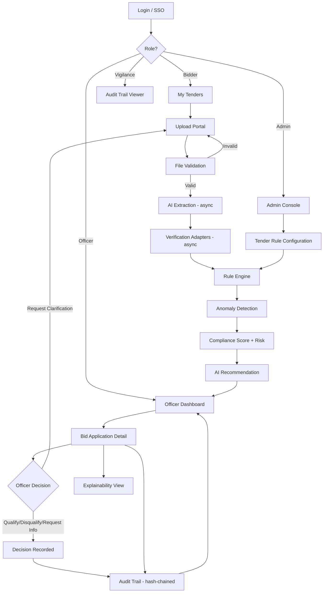

# Pramaan — Complete App Flow Document
### AI-Powered Bid Compliance Verification Platform for GeM
**Version:** 1.0 · **Status:** Implementation-ready · **Platform:** Web (responsive, tablet-capable) · **Source:** Pramaan PRD v1.0 (CPCL / MoPNG, SIH 2026, PS ID 26100)

---

## 0. How to Read This Document

This document translates the Pramaan PRD into the concrete screen-by-screen, action-by-action journey every user type takes through the product. It is written so that:

- A **UI/UX designer** can design every screen and state without guessing.
- A **frontend developer** can implement routing, components, and states.
- A **backend developer** can see which screen triggers which API/pipeline stage.
- A **QA engineer** can turn every flow into test cases.

Two architectural facts from the PRD shape almost every flow below and are repeated because they are load-bearing, not decorative:

1. **AI never adjudicates.** Every screen that shows an AI output is labeled "AI-drafted" and blocks any status change until a human officer acts.
2. **Everything is asynchronous and logged.** Document upload, extraction, adapter verification, and scoring are background pipeline stages — no screen ever blocks waiting on them; every stage transition is an audit event.

---

## 1. App Flow Overview

```text
Landing / SSO Login
      ↓
Role Routing (Officer | Admin | Bidder | Vigilance)
      ↓
   ┌──────────────┬──────────────┬──────────────┬──────────────┐
   ↓              ↓              ↓              ↓
Officer         Admin         Bidder        Vigilance
Dashboard      Console       Upload Portal   Audit Viewer
   ↓              ↓              ↓
Bid Application  Tender Rule   Document
   Detail        Configuration   Upload
   ↓                              ↓
Evidence Review               AI Extraction (async)
   ↓                              ↓
Officer Decision              Verification Adapters (async)
   ↓                              ↓
Audit Event Logged             Rule Engine + Anomaly Detection
   ↓                              ↓
Case Closed / Bidder Notified  Compliance Score + AI Recommendation
                                   ↓
                              Appears on Officer Dashboard
```

**Plain-language summary:** A bidder uploads certificates once, guided by a checklist. In the background, Pramaan reads the documents, checks them against the tender's rules and (via adapters) against government-source data, and flags anything inconsistent — always citing evidence, never guessing. The officer opens one dashboard, sees a score and risk level per bidder, inspects the evidence behind any flag, and records the qualify/disqualify/request-info decision themselves. Every step — extraction, check, AI output, officer action — is written to an immutable, hash-chained audit trail that a vigilance officer or auditor can reconstruct later without asking anyone what happened. Nothing changes a case's legal status except a logged, authenticated officer action.

---

## 2. User Roles

| Role | Purpose | Main Permissions | Main Screens |
|---|---|---|---|
| **Bidder / MSME Vendor** | Submits documents against a tender | Upload/replace own documents; view own checklist status and (post-decision) own check results | Bidder Upload Portal, Document Status, Notification Center |
| **Procurement/Tender Evaluation Officer** | Reviews compliance and makes the qualify/disqualify call | View assigned tenders' cases; open evidence; record decisions; request clarification from bidder | Officer Dashboard, Bid Application Detail, Explainability View, Notification Center |
| **Admin (Procurement Systems Admin)** | Configures the system per tender/category | Create/edit tender eligibility rule sets; toggle adapter mock/live; manage check-type catalog | Tender Rule Configuration, Admin Console |
| **Vigilance / Audit (read-only)** | Reconstructs what happened, after the fact | Read-only access to audit trail, decisions, evidence across all cases | Audit Trail Viewer, Analytics/MIS |
| **CPCL Management (read-only, aggregate)** | Oversight and reporting | View aggregate analytics only, no case-level PII by default | Analytics / MIS Dashboard |

Roles are enforced at the API layer via RBAC (Keycloak/OIDC), not only hidden in the UI — a role without permission for an action never sees a 200 response for it, only a 403.

---

## 3. Information Architecture

```text
PRAMAAN
│
├── PUBLIC / AUTH
│   ├── Login (SSO/OIDC)
│   └── Session Expired / Re-auth
│
├── BIDDER AREA
│   ├── My Tenders (bids in progress)
│   ├── Document Upload Checklist
│   ├── Document Status & Extraction Confidence
│   └── Notifications
│
├── OFFICER AREA
│   ├── Officer Dashboard (tender → bidder case list)
│   │   ├── Case Table (score, risk, status badges)
│   │   └── Filters (risk level, status, tender)
│   ├── Bid Application Detail
│   │   ├── Document Checklist & Extracted Fields
│   │   ├── Per-Check Pass/Fail/Pending List
│   │   ├── AI Recommendation Panel (labeled)
│   │   └── Decision Panel
│   ├── Explainability View ("Why this score")
│   ├── Multi-Bidder Bulk Comparison (P1)
│   └── Notifications
│
├── ADMIN AREA
│   ├── Tender Rule Configuration
│   │   ├── Rule Builder (condition + threshold)
│   │   └── Adapter Source Toggle (mock/live)
│   └── Check-Type / Catalog Management
│
├── VIGILANCE AREA
│   ├── Audit Trail Viewer
│   └── Analytics / MIS (shared with Management, read-only)
│
└── SYSTEM
    ├── Error (generic)
    ├── Access Denied (403)
    ├── Not Found (404)
    └── Maintenance / Offline
```

**Relationships:** Bidder and Officer areas are two sides of the same Bid Application record — a bidder's upload triggers the pipeline that populates the officer's case view. Admin's rule configuration is a prerequisite input consumed by the Rule Engine for every case in Officer/Bidder areas. Vigilance and Management never write anything; they only read what Officer/Admin/Bidder actions have already produced.

---

## 4. Screen Inventory

| ID | Screen | Role(s) | Purpose | Entry Point | Exit Point | Priority |
|---|---|---|---|---|---|---|
| SCR-001 | Login / SSO | All | Authenticate, route by role | Direct URL, deep link redirect | Role home screen | P0 |
| SCR-002 | Officer Dashboard | Officer | List bidder cases needing review | Login, notification link | Bid Application Detail | P0 |
| SCR-003 | Bid Application Detail | Officer | Core review screen | Dashboard row click | Decision recorded → Dashboard | P0 |
| SCR-004 | Explainability View | Officer | Show score breakdown | "Why this score" link on SCR-003 | Back to SCR-003 | P1 |
| SCR-005 | Multi-Bidder Bulk Comparison | Officer | Compare bidders side-by-side | Dashboard "Compare" action | Bid Application Detail | P1 |
| SCR-006 | Bidder — My Tenders | Bidder | List bids in progress | Login | Upload Checklist | P0 |
| SCR-007 | Bidder Upload Portal | Bidder | Guided document submission | My Tenders → tender select | Document Status | P0 |
| SCR-008 | Document Status | Bidder | Track extraction/checklist status | Upload Portal submit | My Tenders, Notifications | P0 |
| SCR-009 | Tender Rule Configuration | Admin | Define eligibility rules per tender | Admin Console | Confirmation → Console | P1 |
| SCR-010 | Admin Console (home) | Admin | Entry point for config tasks | Login | Rule Configuration | P1 |
| SCR-011 | Audit Trail Viewer | Vigilance, Officer (own cases) | Reconstruct case history | Case detail "View Audit Trail" link | Bid Application Detail | P0 |
| SCR-012 | Analytics / MIS | Management, Vigilance | Aggregate trends and metrics | Nav menu | — | P1 |
| SCR-013 | Notification Center | All | Alerts, reminders, status changes | Bell icon, email/SMS deep link | Relevant case/document screen | P1 |
| SCR-014 | Access Denied (403) | All | Blocked-action feedback | Any unauthorized attempt | Previous screen | P0 (system) |
| SCR-015 | Not Found (404) | All | Invalid resource | Broken/expired link | Home / Search | P0 (system) |
| SCR-016 | Session Expired | All | Re-auth prompt | Token expiry mid-session | Login → return to original page | P0 (system) |
| SCR-017 | Generic Error / Offline | All | Unhandled failure, connectivity loss | Any failed request | Retry / Home | P0 (system) |

---

## 5. Screen-by-Screen Flow (Core Screens)

### SCR-001 — Login / SSO

**Purpose:** Authenticate the user and route them to their role's home screen.
**User:** All roles.
**Entry Points:** Direct navigation; redirect from a protected/deep link when unauthenticated.

**UI Elements:** Organization logo/header, "Sign in with SSO" button (Keycloak/OIDC), optional MFA prompt for Officer/Admin/Vigilance, error banner region.

**Primary Action:** Sign in via SSO.
**Secondary Actions:** None (no local password reset UI — delegated entirely to Keycloak's own flow).

**System Behavior:** On click, redirects to the OIDC provider; on successful callback, a signed session token is issued and the user's role claim determines the landing route. If the login was triggered by a deep link, the original URL is preserved and used as the post-login redirect target (see §26).

**Navigation:** Success → role home screen (SCR-002 Officer / SCR-006 Bidder / SCR-010 Admin / SCR-011 Vigilance). Failure → stays on SCR-001 with an inline error.

**Validation:** Handled by the IdP; Pramaan validates the returned token signature and role claim before establishing a session.

**Loading State:** Spinner during OIDC redirect/callback exchange, capped at a few seconds before showing a "taking longer than usual" message.

**Empty State:** N/A.

**Error State:** Invalid credentials/MFA failure → IdP-standard error message, retry allowed; account not provisioned in Pramaan (valid SSO but no role mapping) → explicit "Your account isn't set up for Pramaan yet — contact your administrator" message, not a silent blank dashboard.

**Success State:** Redirect to role home (or original deep-linked page).

**Permissions:** Open to anyone with a valid organizational SSO identity; role mapping determines what they see next.

---

### SCR-002 — Officer Dashboard

**Purpose:** The officer's single entry point — every bidder case across their assigned tenders, with score and risk visible at a glance.
**User:** Officer.
**Entry Points:** Login, notification link, "Back to Dashboard" from any officer screen.

**UI Elements:** Tender selector/dropdown, case table (columns: Bidder name, Compliance Score, Risk badge [Low/Medium/High/Incomplete], Status [Pending/In-Review/Decided], AI Recommendation summary), filters (risk level, status, tender category), search-by-bidder-name, "Compare selected" bulk action, pending-cases count badge.

**Primary Action:** Click a case row to open Bid Application Detail (SCR-003).
**Secondary Actions:** Filter/sort the table; select multiple bidders for bulk comparison (SCR-005); open Notification Center.

**System Behavior:** On load, fetches `GET /api/v1/bid-applications?tender_id=...` with live status; rows update as pipeline stages complete (e.g., a case moves from "Processing" to "Score: 82, Low Risk" without a page refresh, via polling or a live update channel).

**Navigation:** Row click → SCR-003. Compare action → SCR-005. Bell icon → SCR-013.

**Exit Points:** Bid Application Detail, Bulk Comparison, Notification Center, logout.

**Validation:** N/A (read screen); tender selector restricted to tenders the officer is assigned to.

**Loading State:** Skeleton table rows while the case list loads; a subtle "processing" indicator on any row whose pipeline hasn't finished (never a raw spinner with no label).

**Empty State:** "No bidders have submitted documents for this tender yet" with a short explanation of what will appear here once bidders upload.

**Error State:** If the case-list API fails, an inline "Couldn't load cases — retry" banner replaces the table, not a blank page.

**Success State:** Fully populated, sortable table.

**Permissions:** Only tenders/cases assigned to this officer (or officer's department) are visible.

---

### SCR-003 — Bid Application Detail

**Purpose:** The core review screen — everything the officer needs to make a defensible decision, in one place.
**User:** Officer.
**Entry Points:** Officer Dashboard row click; deep link from a notification (e.g., "case ready for review").

**UI Elements:**
- Header: bidder name, tender name, overall Compliance Score, Risk badge.
- Document checklist with extracted-field viewer, shown **side-by-side with the source document image** so every field is verifiable against its origin.
- Per-check list: each configured rule with its Pass / Fail / Pending status and a link to the underlying evidence (adapter response or extracted field).
- AI Recommendation panel, visually distinct (e.g., a bordered "AI-drafted" card) with the recommendation text and a link to every check/anomaly it's based on.
- Anomaly flags list (from F5), each with a plain-language explanation and a citation to the specific documents/fields compared.
- "Request Clarification" action (sends a message/notification to the bidder without closing the case).
- Decision Panel: Qualify / Disqualify / Request More Information buttons, remarks text field (mandatory if overriding the AI recommendation), Submit Decision button.
- "View Audit Trail" link (→ SCR-011, scoped to this case).
- "Why this score" link (→ SCR-004).

**Primary Action:** Record a decision (Qualify / Disqualify / Request More Information).
**Secondary Actions:** Request clarification from bidder; drill into any single check's evidence; open Explainability View; open Audit Trail.

**System Behavior:** Loading the screen calls `GET /api/v1/bid-applications/{id}` for full case detail. Requesting clarification triggers a notification to the bidder and logs an audit event but does not change case status. Submitting a decision calls `POST /api/v1/bid-applications/{id}/decision`.

**Navigation:** Submit Decision → back to Officer Dashboard, case now shown as "Decided." Request Clarification → stays on this screen with a confirmation toast. "Why this score" → SCR-004. "View Audit Trail" → SCR-011.

**Exit Points:** Officer Dashboard, Explainability View, Audit Trail Viewer.

**Validation:**
- Decision cannot be submitted with an empty `decision_value`.
- `remarks` is **required** whenever the officer's decision differs from the AI-drafted recommendation (`overrode_ai_recommendation = true`).
- A case with any check still "Pending" can still be decided (officer discretion), but the UI surfaces a visible warning ("2 checks still pending — decide anyway?") rather than silently allowing it.

**Loading State:** Section-level skeletons — document viewer, check list, and AI panel each load independently since they come from different pipeline stages; a check still mid-pipeline shows "Processing — usually under 2 minutes," never a bare spinner.

**Empty State:** If a bidder hasn't uploaded a required document yet, that row appears with "Not yet submitted" rather than being omitted — the gap must be visible, not hidden.

**Error State:** A specific adapter/source failure is shown per-check ("EPFO — source unreachable, last attempted [time]"), never rolled up into a generic error or silently treated as pass.

**Success State:** After decision submission, a confirmation banner ("Case closed — Qualify recorded") and the case disappears from the dashboard's "pending" filter.

**Permissions:** Only the assigned officer (or another officer with case-reopen authority) can submit a decision; Vigilance sees an equivalent read-only view with no Decision Panel.

---

### SCR-004 — Explainability View

**Purpose:** Let the officer (or an auditor) drill from the single Compliance Score number down to every contributing check, weight, and severity — so the score is never a black box.
**User:** Officer, Vigilance (read-only).
**Entry Points:** "Why this score" link on SCR-003.

**UI Elements:** Score breakdown chart/table (check name, weight, result, contribution to score), anomaly severity list, link back to each check's raw evidence.

**Primary Action:** Drill into any single component of the score.
**System Behavior:** Reads the stored `score_breakdown` JSON on the Compliance Score record — nothing is recomputed live, so what the officer sees matches exactly what was logged.

**Navigation:** Back to SCR-003.
**Empty/Error State:** If the score is "Incomplete" (pending checks), this view explicitly labels which components are missing rather than showing a partial score as if it were final.

**Permissions:** Read-only for everyone who can reach it.

---

### SCR-007 — Bidder Upload Portal

**Purpose:** Guided, checklist-driven document submission against one tender's actual eligibility requirements.
**User:** Bidder.
**Entry Points:** "My Tenders" (SCR-006) → select a tender.

**UI Elements:** Required-document checklist (derived live from the tender's configured eligibility rules — F12), per-document upload widget (drag-drop + file picker), extraction-confidence indicator per uploaded document ("Udyam certificate read successfully" / "Please check this — low confidence"), missing/expiring-document warnings, Submit button.

**Primary Action:** Upload each required document.
**Secondary Actions:** Replace/resubmit a document; view why a document was flagged.

**System Behavior:** Each upload triggers `POST /api/v1/bid-applications/{id}/documents`, then an async `POST /api/v1/documents/{id}/extract`. The checklist re-renders live as extraction confidence returns.

**Navigation:** Submit (once mandatory documents are uploaded, even if some are only "flagged, not blocking" per F1) → SCR-008 Document Status; case moves into the officer queue.

**Exit Points:** Document Status, My Tenders.

**Validation:** File type allow-list (PDF/JPEG/PNG), size cap, malware scan before anything reaches OCR. A missing mandatory document does **not** block submission — it is flagged as a gap the officer will see, per F1's explicit edge-case handling — but the UI still visibly warns the bidder before they submit.

**Loading State:** Per-file upload progress bar; "Extraction in progress" label while the async pipeline runs, never a page-blocking spinner.

**Empty State:** Before any upload, each checklist item shows "Not yet uploaded" with a short note on what's required and why (linked to the tender's rule).

**Error State:** Corrupted/unsupported file → immediate rejection with a specific reason ("File type not supported — please upload a PDF, JPG, or PNG") and a resubmission prompt; never a generic "upload failed."

**Success State:** "Documents received — under review" confirmation once submitted.

**Permissions:** A bidder can only see and upload against their own bid applications.

---

### SCR-009 — Tender Rule Configuration (Admin)

**Purpose:** Let an admin define which checks and thresholds apply to a tender/category, without a code deployment.
**User:** Admin.
**Entry Points:** Admin Console.

**UI Elements:** Tender/category selector, rule builder (condition + threshold picker, e.g., `udyam_category IN [Micro, Small]`), adapter source toggle per check (mock/live), Save & Validate button, list of currently active rule sets.

**Primary Action:** Save a rule set.
**Secondary Actions:** Toggle a source between mock and live; duplicate an existing rule set for a similar tender category.

**System Behavior:** `POST /api/v1/tenders/{id}/eligibility-rules`; validated server-side for conflicting/incomplete rules **at save time**, not at evaluation time (per F4's explicit design choice).

**Navigation:** Save success → confirmation, rule set becomes active immediately for all future evaluations on that tender. Save failure (conflict) → inline errors on the specific conflicting rule.

**Validation:** No two rules may contradict on the same field/threshold without an explicit precedence; a rule referencing a check with no adapter configured is allowed but flagged as "will show as Not Evaluated until an adapter is assigned."

**Edge Case — mid-tender changes:** If a tender already has active bid applications, any rule change requires a second-approver confirmation and is logged immutably (per §15 insider-misuse mitigation) — the UI surfaces this requirement rather than allowing a silent single-admin edit.

**Permissions:** Admin only.

---

### SCR-011 — Audit Trail Viewer

**Purpose:** Reconstruct exactly what happened on a case, for vigilance, audit, or legal-challenge defense — by someone who was not involved in the original review.
**User:** Vigilance (all cases), Officer (own cases, read view from SCR-003).

**UI Elements:** Chronological event list (actor, action, before/after state, timestamp), hash-chain integrity indicator (green "chain intact" / red "chain broken — flagged" per F11's failure condition), filter by case/actor/date, export action.

**Primary Action:** Search/filter and inspect events.
**System Behavior:** `GET /api/v1/audit/{application_id}`; every row is read-only and rendered directly from the append-only `AUDIT_EVENT` store — nothing here can be edited or deleted, by design.

**Error State:** If a hash-chain break is detected, the viewer refuses to render the chain as trustworthy past that point and shows a high-severity banner — this is treated as a system-level incident, never quietly hidden.

**Permissions:** Read-only for all roles that can reach it; no role has write/delete access to this screen or its underlying data.

---

## 6. Authentication Flow

### Existing User (Officer / Admin / Vigilance / Bidder)
```text
Login (SSO)
↓
OIDC redirect → IdP authenticates → MFA (Officer/Admin/Vigilance only)
↓
Token issued, role claim read
↓
Role Home Screen
```

### New Bidder (first time on Pramaan)
Bidders do not "sign up" separately — they use their **existing GeM seller account** identity (per PRD §4, no separate registration required). First login simply provisions a Pramaan session against that identity:
```text
GeM bid submission flow
↓
Redirected/linked into Pramaan Bidder Portal
↓
SSO (existing GeM identity)
↓
First-time: brief checklist explainer (not a lengthy onboarding)
↓
My Tenders (SCR-006)
```

### Forgot Password / Account Recovery
Delegated entirely to Keycloak's standard recovery flow (per §15) — Pramaan does not implement its own credential storage or reset UI:
```text
Login → "Trouble signing in?" → IdP recovery flow → Reset → Login
```

### Authentication Failure
```text
Login attempt
↓
Invalid credentials / MFA failure (IdP-standard error)
↓
Retry, or escalate to IdP recovery flow
```

### Session Expiration
```text
Active session, token expires mid-use
↓
Next API call returns 401
↓
Session Expired screen (SCR-016): "Your session has ended, please sign in again"
↓
Re-authenticate
↓
Return to the exact page/action the user was on (deep-link preserved)
```

### Account Lockout
Handled by Keycloak's brute-force detection policy; Pramaan surfaces the IdP's lockout message as-is rather than implementing separate lockout logic.

### MFA
Required for Officer, Admin, and Vigilance roles (decision-making and audit-sensitive roles); not required for Bidder (lower-risk, upload-only actions), per §15.

### Logout
```text
Any screen → Logout action
↓
Session/token invalidated at IdP and locally
↓
Login screen
```

---

## 7. Onboarding Flow

Onboarding is deliberately minimal — this is an internal/B2G tool for people with an existing job to do, not a consumer app needing engagement-building.

**Officer onboarding (first login only):**
1. Welcome — one short screen: what Pramaan replaces (manual cross-portal checking) and what it doesn't replace (the officer's decision).
2. A single guided walkthrough on **one sample case** (using seeded/dummy data, not a live bidder) showing: dashboard → case detail → evidence → decision.
3. First real use — officer opens their first actual assigned tender.

All three steps are skippable after the first login; none are mandatory gates before reaching the real dashboard.

**Bidder onboarding (first upload only):**
1. Welcome message embedded directly in the Upload Portal's checklist header (no separate screen).
2. Product introduction is the checklist itself — bidders learn by seeing exactly what's required for their tender.

No permissions/preferences step is needed for either role beyond the standard SSO/role assignment already handled by the Admin.

---

## 8. Core Feature Flow — End-to-End Bid Compliance Verification

This is Flow A from the PRD (§8), the system's primary journey.

```text
Start: Bid submission closes on GeM
↓
Bidder documents uploaded into Pramaan (SCR-007)
↓
Input validated (file type/size/malware) — [Frontend + Backend]
↓
AI Document Extraction (F2) — [AI Layer, async]
   - OCR + schema-constrained LLM extraction
   - Output: structured fields + confidence + evidence pointer
   - Failure → "extraction failed, manual entry required" (never a silent guess)
↓
Verification Adapters run (F3) — [Backend, async]
   - Mock (MVP) or live (Phase 2) per source
   - Output: {source, status, matched_fields, raw_evidence_ref, checked_at}
   - Failure → "Pending — source unreachable" (never defaults to pass)
↓
Deterministic Rule Engine evaluates (F4) — [Backend]
   - Every configured rule → explicit pass/fail/pending
   - Rule with no adapter configured → "Not Evaluated" (visible gap, not hidden)
↓
AI Anomaly Detection (F5) — [AI Layer]
   - Cross-checks documents for inconsistencies
   - Every flag must cite specific fields/documents (schema-enforced)
   - Uncited flag → discarded, logged, never shown
↓
Compliance Score + Risk Level computed (F6) — [Backend, deterministic formula]
   - All-pending case → "Incomplete", never a false high score
↓
AI Recommendation drafted (F7) — [AI Layer]
   - Synthesizes F4/F5/F6 only, never invents new checks
   - Always labeled "AI-drafted, officer decision required"
↓
Case appears on Officer Dashboard (SCR-002)
↓
Officer opens Bid Application Detail (SCR-003), reviews evidence
↓
[Optional] Officer requests clarification from bidder → bidder notified → resubmits → re-triggers F2–F7 for the changed document only
↓
Officer records decision: Qualify / Disqualify / Request More Info (F10)
   - Remarks mandatory if overriding AI recommendation
↓
Decision + full evidence trail written to Audit Trail (F11), hash-chained
↓
Case Closed → Bidder notified
```

**Per-step technical detail:**

| Step | User Action | UI | System Action | Backend/DB | API | Failure Mode | Next Screen |
|---|---|---|---|---|---|---|---|
| Upload | Bidder uploads file | SCR-007 | Malware/type/size check | `Document` row created | `POST /bid-applications/{id}/documents` | Corrupted file → rejected immediately | SCR-008 |
| Extract | (automatic) | Confidence indicator updates | OCR + LLM extraction | `extracted_fields`, `extraction_confidence` updated | `POST /documents/{id}/extract` | Illegible scan → flagged for manual entry | SCR-008 / SCR-003 |
| Verify | (automatic) | Per-check status updates | Adapter call (mock/live) | `VERIFICATION_SOURCE_LOG` row | internal (triggered by `POST .../verify`) | Timeout → "Pending" + retry with backoff | SCR-003 |
| Evaluate | (automatic) | Per-check pass/fail badges | Rule engine run | `COMPLIANCE_CHECK` rows | internal | Missing adapter → "Not Evaluated" | SCR-003 |
| Detect | (automatic) | Anomaly flags list | LLM anomaly comparison | logged as part of check evidence | internal | Uncited flag → discarded | SCR-003 |
| Score | (automatic) | Score + risk badge | Weighted formula | `COMPLIANCE_SCORE` row | `GET .../compliance-score` | Pending checks → "Incomplete" | SCR-002, SCR-003 |
| Recommend | (automatic) | AI panel text | LLM synthesis | stored with score | internal | Schema-invalid → "Analysis unavailable" | SCR-003 |
| Decide | Officer clicks Qualify/Disqualify/Request Info | Decision Panel | Validates remarks-if-override | `DECISION` row | `POST .../decision` | Missing remarks on override → blocked client + server side | SCR-002 |
| Audit | (automatic) | Audit Trail Viewer | Hash-chain append | `AUDIT_EVENT` row | `GET /audit/{id}` | Audit service unreachable → **the triggering action itself is blocked**, never allowed to complete without its audit event | SCR-011 |

---

## 9. Feature-Specific Flows

### Feature — Bidder Document Upload & Case Intake (F1)
```text
Bidder Upload Portal
↓
Select tender → checklist derived from tender's eligibility rules
↓
Upload each document → validation (type/size/malware)
↓
Case created, status "Intake Complete" (or "Incomplete" if a mandatory doc is missing)
↓
Officer sees case appear automatically in their queue
```

### Feature — AI Document Extraction (F2)
```text
Document uploaded
↓
OCR pass
↓
Schema-constrained LLM extraction (per document-type schema)
↓
Confidence score + evidence pointer (source region of document) stored
↓
Low confidence / non-standard template → routed for officer confirmation
↓
Illegible / handwritten → flagged "manual entry required", never guessed
```

### Feature — Verification Adapter Cross-Check (F3)
```text
Rule engine requests a check for a source (e.g., GSTN)
↓
Adapter Layer routes to Mock (MVP) or Live (Phase 2) implementation
↓
Normalized result: {source, status, matched_fields, raw_evidence_ref, checked_at}
↓
Mismatch between bidder-declared and source-returned value → flagged as inconsistency (not auto-failed — name variants like "Ltd." vs "Limited" are common)
↓
Source unreachable/timeout → "Pending", retried with backoff
```

### Feature — Blacklist / Debarment Check (F8)
```text
Bidder PAN/CIN submitted
↓
Lookup against curated registry (GeM suspended-seller list + CPCL past-vendor records)
↓
Match found → high-severity flag surfaced to officer (never auto-disqualify)
↓
No match → check passes, "last refreshed" timestamp shown regardless, so currency is always visible
```

### Feature — Admin Rule Configuration (F12)
```text
Admin Console
↓
Select tender category
↓
Pick applicable checks (Udyam category, GST active status, blacklist, etc.)
↓
Set thresholds
↓
Save → server-side conflict/completeness validation
↓
Rule set active for every bidder on that tender
```

### Feature — Officer Override Workflow (F10, Flow C)
```text
Officer opens case, sees AI recommendation "Qualify"
↓
Officer inspects underlying document, disagrees
↓
Selects "Disqualify"
↓
System requires a remarks field before allowing submission
↓
Decision + remarks + which AI output was overridden → logged
↓
Override event feeds periodic AI/rule review (§11 of PRD)
```

---

## 10. AI Flow

Pramaan uses AI in exactly three bounded places — document extraction (F2), cross-document anomaly detection (F5), and recommendation drafting (F7) — never for the eligibility decision itself.

```text
User-visible flow:
Document uploaded / case ready for scoring
↓
"Processing..." indicator shown to bidder/officer
↓
[AI happens invisibly here — see internal flow below]
↓
Result appears: extracted fields (bidder side) or anomaly flags + recommendation (officer side)
↓
Every AI-authored item is labeled "AI-drafted" / carries a citation link
↓
User (officer) reviews, may click through to the cited evidence
↓
Officer decision — AI plays no further role
```

```text
Internal AI processing (not shown to the user as steps):
Structured input assembled (extracted fields for this case + active tender rules
+ prior flags for this case only — no cross-case memory)
↓
LLM call (Claude Sonnet 5 for extraction/anomaly/recommendation;
Claude Haiku 4.5 as a cheap first pass, escalating to Sonnet 5 on low confidence)
↓
Output required to conform to a strict per-task JSON schema, including
mandatory evidence citation (field, value, source_document_id, bounding_box/page_ref)
↓
Schema validation
   ├─ Pass → stored, surfaced to officer/bidder
   └─ Fail → retry once → still fails → "Analysis unavailable — manual review
     required" (never a partially-parsed guess reaches the user)
↓
Deterministic rule engine result always wins over any AI-authored eligibility
judgment; a disagreement between the two is logged and surfaced, never
silently resolved
```

**AI failure / hallucination handling:**
- An uncited claim is discarded before it ever reaches a screen.
- A user can flag "this recommendation seemed wrong" (feeds the periodic override review, per §11).
- There is no "regenerate" button that lets a user re-roll an eligibility judgment — regeneration only applies to extraction retries on a technical failure (e.g., re-attempting OCR on a blurry scan), never to re-asking the AI for a different eligibility opinion.
- Human review is not optional at any point — every case requires an officer decision before it can close (F10).

**Source/citation display:** Every AI-authored flag or recommendation shows, inline, which document(s)/field(s) it is based on, clickable through to the source-document viewer (SCR-003's side-by-side extracted-field view).

---

## 11. Admin Flow

```text
Admin Login (SSO, MFA)
↓
Admin Console (SCR-010)
↓
 ┌───────────────────────┬───────────────────────────┐
 ↓                       ↓                            ↓
Tender Rule           Check-Type / Catalog        Adapter Source
Configuration          Management                  Toggle (mock/live)
(SCR-009)
↓
Select tender/category → build rule set → validate → save
↓
Rule set active immediately for all bidders on that tender
```

Admin permissions are scoped to configuration only — an admin cannot open a bidder's case, see evidence, or record a decision; that separation is intentional (configuration and adjudication are different responsibilities, and mixing them would undermine the audit story). Rule changes on a tender with already-active bid applications require a second-approver confirmation (§15 insider-misuse mitigation) and are themselves audit-logged.

---

## 12. Notification Flow

| Event | Trigger | Recipient | Message Purpose | Action |
|---|---|---|---|---|
| Document extraction complete | F2 pipeline finishes | Bidder | Confirm document was read successfully / flag low confidence | Open Document Status (SCR-008) |
| Document nearing expiry | Scheduled check on extracted validity dates | Bidder | Prompt renewal before tender close | Open Upload Portal (SCR-007) |
| Case ready for review | F6/F7 pipeline finishes | Officer | New case needs attention | Open Bid Application Detail (SCR-003) |
| Clarification requested | Officer action on SCR-003 | Bidder | Explain what's needed and why | Open Upload Portal (SCR-007) |
| Case decided | Officer submits decision (F10) | Bidder | Inform of outcome | Open Document Status / result view |
| Pending cases near tender close | Scheduled reminder | Officer | Avoid missed deadlines | Open Officer Dashboard (SCR-002) |
| Adapter source degraded | Adapter failure/timeout | Officer, Ops | Explain why a check is "Pending" | Open Bid Application Detail (SCR-003) |
| Audit chain anomaly detected | Hash-chain break (should never occur) | Vigilance, Ops | High-severity security alert | Open Audit Trail Viewer (SCR-011) |

```text
Trigger event
↓
Notification generated (in-app + email; SMS for time-critical bidder reminders)
↓
Recipient opens notification (in-app bell or external link)
↓
Deep-linked directly to the relevant case/document screen
```

---

## 13. Search & Filter Flow

Search/filter exists on the Officer Dashboard (by bidder name, tender, risk level, status) and the Audit Trail Viewer (by case, actor, date).

```text
Officer Dashboard
↓
Enter search term / apply filter (risk level, status, tender)
↓
Table re-queries (client-side for the current tender's small case set; server-side filter params for cross-tender search)
↓
Results update in place
↓
No results → "No cases match these filters" with a "Clear filters" action
↓
Select a row → Bid Application Detail
```

Given the realistic scale (hundreds of bidders per tender, not millions of records), heavy pagination/infinite-scroll machinery is intentionally avoided for the officer's own tender's case list — full sortable table is sufficient — while the Audit Trail Viewer, which can span many cases over time, does support pagination and date-range filtering.

---

## 14. Form Flow

### Decision Form (Bid Application Detail — F10)
```text
Officer opens Decision Panel
↓
Selects Qualify / Disqualify / Request More Information
↓
Client validation: if selection differs from AI recommendation, remarks field becomes required
↓
Submit
↓
Server validation: decision_value present; remarks present if overrode_ai_recommendation=true; case not already closed
↓
Success → case closed, audit event written
↓
Error → inline message, form retains entered remarks (no data loss on failure)
```

- **Required fields:** decision_value; remarks (conditional on override).
- **Optional fields:** none beyond remarks when not overriding.
- **Unsaved changes:** navigating away with an unsaved decision selection prompts a confirmation ("You have an unsaved decision — leave anyway?").
- **Duplicate submission:** the Submit button disables immediately on click and the API is idempotent per case — a double-click cannot produce two decisions.

### Rule Configuration Form (Admin — F12)
```text
Admin opens Rule Builder
↓
Adds condition (field, operator, threshold)
↓
Client validation: no empty condition rows, valid operator/value types
↓
Save
↓
Server validation: conflict/completeness check across the whole rule set
↓
Success → rule set active / Error → specific conflicting rule highlighted inline
```

---

## 15. Error Flows

### Network Error
```text
Any action requiring network
↓
Request fails to reach server
↓
"Connection lost — check your network" banner
↓
Retry button
↓
Success → resumes normal flow / Failure → stays in error state, no partial state applied
```

### Server Error (5xx)
```text
Request reaches server, server fails
↓
Friendly error: "Something went wrong on our end — please try again"
↓
Retry / "Contact support" link (routes to L1 helpdesk per §40 of PRD)
```

### Authentication Error (401)
```text
Any API call with an expired/invalid token
↓
Redirect to Session Expired (SCR-016)
↓
Re-authenticate
↓
Return to the exact screen/action in progress
```

### Authorization Error (403)
```text
Action outside the user's role permissions (e.g., bidder viewing another bidder's case)
↓
Access Denied (SCR-014)
↓
Logged as a security event (per §15 of PRD)
↓
Back to previous authorized screen
```

### Not Found (404)
```text
Invalid/expired resource ID (e.g., a deleted or never-existed case)
↓
Not Found (SCR-015)
↓
"Back to Dashboard" / "Search" action
```

### Adapter / Third-Party Source Failure
```text
Verification adapter call
↓
Timeout / 5xx from aggregator or API Setu
↓
Check marked "Pending — source unreachable"
↓
Automatic retry with backoff
↓
Ops alert raised; officer dashboard shows exactly which source is degraded
↓
Still unresolved at decision time → officer sees the pending flag explicitly, decides with that context
```

### AI Failure
```text
LLM call fails or returns schema-invalid output
↓
Retry once
↓
Still invalid → "Analysis unavailable — manual review required"
↓
Officer/bidder never sees a partially-parsed guess
```

### Rate Limit
```text
Internal or external (aggregator) rate limit hit
↓
Request queued, retried within policy
↓
User sees "Processing" (not an error) for a transient limit
```

### Duplicate Submission
```text
Bidder resubmits a document already uploaded
↓
New version created, prior version retained (never overwritten)
↓
Latest version supersedes for evaluation, re-triggers F2–F7 for that document only
```

### Corrupted Audit Record (should never occur)
```text
Hash-chain verification fails on read
↓
System refuses to treat the chain as valid past that point
↓
High-severity security alert raised to Vigilance/Ops
```

---

## 16. Empty States

| Screen | Why Empty | What User Sees | Primary CTA |
|---|---|---|---|
| Officer Dashboard | No bidders have submitted yet for the selected tender | "No bidder cases yet for this tender." | (none needed — waiting on bidders) |
| Bid Application Detail — document row | Bidder hasn't uploaded a required document | "Not yet submitted" with the document name and why it's required | (bidder-facing reminder sent automatically) |
| Bidder Upload Portal — checklist | First visit, before any upload | Checklist items all show "Not yet uploaded" | [Upload Document] per item |
| Audit Trail Viewer | Case has just been created, no events yet (rare, momentary) | "No events recorded yet" | (auto-populates as pipeline runs) |
| Analytics / MIS | No tenders onboarded yet | "No data yet — onboard a tender to see trends here." | [Go to Admin Console] (Admin only) |
| Notification Center | No unread/active notifications | "You're all caught up." | (none) |

---

## 17. Loading States

| Context | Treatment |
|---|---|
| Initial dashboard/page load | Skeleton rows/cards matching final layout |
| Document upload | Per-file progress bar |
| AI extraction (F2) | Confidence indicator area shows "Extraction in progress" text, not a bare spinner |
| Adapter verification (F3) | Per-check row shows "Checking [source]..." |
| Full pipeline (score/recommendation) | Case row on dashboard shows "Processing — usually under 2 minutes" (per §16 NFR target) |
| Button-triggered actions (e.g., Submit Decision) | Button enters a disabled/spinner state immediately on click to prevent double-submit |
| Search/filter | Inline table skeleton, not a full-page reload |

No screen ever shows an unexplained spinner with no label — every async wait states what is happening and, where relevant, a rough expected duration.

---

## 18. Success Flows

```text
Bidder uploads document
↓
Processing (extraction)
↓
Success: "Udyam certificate read successfully" confirmation
↓
Stays on Upload Portal, checklist item marked complete
```

```text
Officer submits a decision
↓
Processing (brief — synchronous write)
↓
Success: "Case closed — [Qualify/Disqualify/Request Info] recorded" confirmation
↓
Returns to Officer Dashboard, case removed from "pending" filter
↓
Bidder receives a notification of the outcome
```

```text
Admin saves a rule set
↓
Validation passes
↓
Success: "Rule set active for [tender name]" confirmation
↓
Stays on Rule Configuration, ready to configure another tender/category
```

---

## 19. Navigation Rules

- **Top navigation:** persistent header with role-appropriate nav items (Dashboard, Notifications, Audit Trail if permitted, Profile/Logout).
- **No bottom nav** — this is a desktop-first, dashboard-heavy tool; mobile use is read/review-only (see §27).
- **Breadcrumbs:** used within Admin (Console → Rule Configuration → [Tender Name]) and Bid Application Detail (Dashboard → [Bidder Name]).
- **Back button:** standard browser back is supported and safe everywhere except mid-form (Decision Panel, Rule Builder), where an unsaved-changes confirmation intercepts it.
- **Deep links:** notification links, shared audit-trail links, and direct case URLs all resolve to the correct screen post-authentication (see §26).
- **Protected routes:** every screen except SCR-001 (Login) requires an authenticated session; role-specific screens (Admin Console, Audit Trail Viewer, Officer Dashboard) additionally require the matching role claim, enforced server-side.
- **External links:** none required in the core flow; any future GeM-portal cross-links open in a new tab, not embedded.

---

## 20. State Management

**Bid Application (case) states:**
```text
INTAKE_PENDING
↓
INTAKE_COMPLETE (some docs may still be missing/flagged)
↓
PROCESSING (extraction/verification/scoring in flight)
↓
READY_FOR_REVIEW (score + recommendation available)
↓
IN_REVIEW (officer has opened it)
↓
CLARIFICATION_REQUESTED ⇄ PROCESSING (loops back on resubmission)
↓
DECIDED → CLOSED
```

**Per-check state:**
```text
NOT_EVALUATED → PENDING → (PASS | FAIL | PENDING-source-unreachable)
```

**Per-document extraction state:**
```text
UPLOADED → EXTRACTING → (EXTRACTED | EXTRACTION_FAILED-manual-entry-required)
```

**AI output state:**
```text
GENERATING → (VALIDATED | SCHEMA_INVALID → RETRY → ANALYSIS_UNAVAILABLE)
```

No case can move from any state directly to `CLOSED` except via an explicit, logged officer decision — there is no code path that shortcuts this (per F10 and the F11 acceptance criteria).

---

## 21. Permission Flow

```text
User authenticates
↓
Role claim read from token
↓
Permission check on every API call (not just UI hiding)
↓
Allowed → feature/data returned
↓
Denied → 403 → Access Denied screen (SCR-014), logged as a security event
```

**What each role can/cannot do:**

| Action | Bidder | Officer | Admin | Vigilance |
|---|---|---|---|---|
| Upload own documents | ✅ | ❌ | ❌ | ❌ |
| View own case status | ✅ | ❌ (only assigned tenders' cases) | ❌ | ❌ |
| View any bidder's evidence | ❌ | ✅ (assigned tenders only) | ❌ | ✅ (all, read-only) |
| Record a decision | ❌ | ✅ | ❌ | ❌ |
| Configure eligibility rules | ❌ | ❌ | ✅ | ❌ |
| View audit trail | ❌ (own outcome only, not full trail) | ✅ (own cases) | ❌ | ✅ (all) |
| View aggregate analytics | ❌ | ❌ | ❌ | ✅ |

---

## 22. Data Flow

For the primary compliance-check workflow:

```text
Bidder (Frontend: Upload Portal)
↓ [file + metadata]
API Gateway/BFF
↓ [authenticated request]
Case & Workflow Service (Backend)
↓ [document reference]
Document Ingestion Service → OCR/Document AI → Structured Field Extraction
↓ [extracted fields + confidence]
PostgreSQL (Document, Case tables)
↓ [extracted fields]
Verification Adapter Layer → Mock/Live source
↓ [normalized verification result]
Deterministic Rule Engine
↓ [pass/fail/pending per check]
AI Reasoning Layer (anomaly detection, recommendation) — reasons only over
already-validated internal data (get_extracted_document, get_rule_engine_result,
get_prior_case_notes tools), never raw external API responses directly
↓ [score, risk, AI recommendation]
Case & Workflow Service
↓ [full case state]
API Gateway/BFF
↓ [case detail JSON]
Officer (Frontend: Bid Application Detail)
↓ [decision]
API Gateway/BFF → Case & Workflow Service → Audit Log Service (hash-chained)
↓
PostgreSQL / Audit Event Store
```

Every arrow that crosses a service boundary is also, independently, an audit-loggable event (per F11) — the data flow and the audit trail are two views of the same underlying event stream.

---

## 23. App Flow Diagram (Mermaid)



---

## 24. Detailed User Journey — Officer, Primary Flow

| Step | User Action | Screen | System Action | Result | Next Step |
|---|---|---|---|---|---|
| 1 | Log in via SSO | Login | Authenticate, read role | Session established | Dashboard |
| 2 | Select tender | Officer Dashboard | Load case list | Table populated with scores/risk | View a case |
| 3 | Click a bidder row | Officer Dashboard | Fetch full case detail | Bid Application Detail loads | Review evidence |
| 4 | Inspect a flagged anomaly | Bid Application Detail | Load cited documents/fields | Side-by-side evidence shown | Decide or request clarification |
| 5a | Request clarification | Bid Application Detail | Notify bidder, log event | Case stays open, bidder notified | Await resubmission |
| 5b | Record decision | Bid Application Detail | Validate remarks-if-override, save | Decision saved, audit event written | Case closed |
| 6 | Return to dashboard | Bid Application Detail | Refresh case list | Case no longer in pending filter | Review next case |
| 7 | (Later) Open Audit Trail for this case | Bid Application Detail | Fetch audit events | Full reconstructable history shown | End |

---

## 25. Screen Transition Matrix

| Current Screen | Action | Condition | Next Screen |
|---|---|---|---|
| Login | Submit SSO | Valid credentials + role mapped | Role Home Screen |
| Login | Submit SSO | Valid credentials, no role mapped | Login + "not provisioned" error |
| Login | Submit SSO | Invalid credentials | Login + IdP error |
| Officer Dashboard | Click case row | Case exists, officer assigned | Bid Application Detail |
| Officer Dashboard | Click case row | Case reassigned/removed | Not Found (404) |
| Bid Application Detail | Submit Decision | Valid, remarks present if override | Officer Dashboard (case closed) |
| Bid Application Detail | Submit Decision | Override without remarks | Stays on screen, inline validation error |
| Bid Application Detail | Submit Decision | Case already closed (race condition) | Error: "Case already decided" + refreshed state |
| Bid Application Detail | Request Clarification | Case open | Stays on screen, confirmation toast, bidder notified |
| Upload Portal | Submit | All mandatory docs uploaded | Document Status |
| Upload Portal | Submit | Mandatory doc missing | Stays on screen, warning shown, submit still allowed (flag persists to officer) |
| Upload Portal | Upload file | Valid file | Extraction triggered, checklist updates |
| Upload Portal | Upload file | Invalid file (type/size/corrupt) | Inline rejection, resubmission prompt |
| Rule Configuration | Save | No conflicts | Admin Console + confirmation |
| Rule Configuration | Save | Conflicting rules | Stays on screen, conflicting rule highlighted |
| Any authenticated screen | Session expires | Token invalid | Session Expired → re-auth → return to same screen |
| Any screen | Unauthorized action | Role lacks permission | Access Denied (403) |
| Any screen | Invalid resource ID | Resource missing/expired | Not Found (404) |

---

## 26. Deep Link & Redirect Behavior

```text
User clicks a protected link (e.g., a case detail URL from a notification email)
↓
Not authenticated?
   ↓ Yes
   Redirect to Login, original URL preserved
   ↓
   Successful login
   ↓
   Redirect to the originally requested page (not a generic dashboard)
   ↓ No (already authenticated)
   Load the page directly
```

- **Expired resource** (e.g., a case that's been archived/reopened under a new ID): Not Found (404) with a "search for this bidder" fallback.
- **Browser refresh:** all screens are safely refreshable — case state, filters (via URL query params), and form drafts (decision remarks, rule builder rows) are preserved client-side where feasible; a refresh mid-Decision-Form prompts the same unsaved-changes warning as manual navigation.
- **Shared audit-trail link:** resolves for Vigilance/Officer roles with access; for anyone else, Access Denied — never a partial/redacted render.
- **Notification link:** always deep-links to the specific case/document, not just the general dashboard.

---

## 27. Mobile / Tablet Responsiveness

Pramaan is **desktop-first**, per the PRD's explicit NFR (§14, §16): rule configuration and heavy document-comparison review are desktop-only tasks. Read/review use is supported down to tablet width.

| Aspect | Desktop | Tablet | Mobile (out of MVP scope, F20 future) |
|---|---|---|---|
| Officer Dashboard | Full table, all columns | Condensed table, secondary columns collapse into a row-expand | Card-per-case list (future) |
| Bid Application Detail | Side-by-side document/field viewer | Stacked viewer (document above extracted fields) | Not supported in v1 |
| Decision Panel | Inline buttons + remarks field | Same, full-width | Not supported in v1 |
| Rule Configuration | Full rule builder | Not optimized — admin directed to use desktop | Not supported |
| File Upload (Bidder) | Drag-drop + picker | Tap-to-upload, camera capture option | Not in MVP; camera capture is the most valuable future mobile addition for bidders photographing paper certificates |

Tables never simply shrink — columns are prioritized (Bidder name, Score, Risk always visible; secondary detail collapses) rather than rendering an unreadable, horizontally-scrolling shrink of the desktop layout.

---

## 28. Accessibility Flow

- **Keyboard navigation:** every interactive element (table rows, decision buttons, upload widgets, rule builder rows) is reachable and operable via keyboard alone; focus order follows visual order.
- **Screen readers:** risk level is conveyed with an icon **and** a text label ("High Risk"), never color alone (per §14 of PRD); form fields have explicit labels, not placeholder-only text.
- **Focus management:** opening a modal (e.g., a confirmation dialog) moves focus into it and returns focus to the triggering element on close.
- **Error announcements:** validation errors are announced to assistive tech (e.g., `aria-live` regions) at the moment they appear, not only shown visually.
- **Color contrast:** meets WCAG 2.1 AA; risk badges use both hue and shape/pattern differentiation.
- **Alternative text:** all icons (risk badges, status indicators) carry accessible text equivalents.
- **Language:** English + Hindi labels at minimum for the pilot (F19 extends further, P2).
- **Reduced motion:** loading/progress animations respect `prefers-reduced-motion`.

---

## 29. Analytics Events

| Event ID | Event | Trigger | Data Captured | Purpose |
|---|---|---|---|---|
| USER_LOGIN | User authenticates | Successful SSO | role, timestamp | Usage tracking |
| BID_APPLICATION_CREATED | Case intake starts | Bidder's first upload for a tender | tender_id, bidder_id (no doc content) | Activation metric |
| DOCUMENT_UPLOADED | File submitted | Upload action | doc_type, application_id | Pipeline funnel |
| EXTRACTION_COMPLETED | F2 pipeline finishes | Async job completes | confidence, doc_type | Extraction accuracy tracking |
| EXTRACTION_FAILED | F2 pipeline fails | Illegible/unsupported doc | doc_type, failure_reason | Quality monitoring |
| VERIFICATION_CHECK_RUN | F3 adapter call completes | Adapter response received | source, status, is_mock | Adapter reliability |
| RULE_EVALUATED | F4 completes for a case | Rule engine run | rule_count, pass/fail/pending counts | Pipeline funnel |
| ANOMALY_FLAGGED | F5 produces a flag | Anomaly detection run | severity, cited_field_count | AI value tracking |
| SCORE_COMPUTED | F6 completes | Scoring run | score, risk_level | North Star input |
| RECOMMENDATION_DRAFTED | F7 completes | Recommendation generated | recommendation_type | AI value tracking |
| CASE_OPENED_BY_OFFICER | Officer views a case | SCR-003 load | application_id, officer_id | Activation/engagement |
| DECISION_RECORDED | F10 decision submitted | Decision submit | decision_value, overrode_ai_recommendation | North Star, agreement-rate |
| CLARIFICATION_REQUESTED | Officer requests more info | Decision Panel action | application_id | Cycle-time tracking |
| AUDIT_TRAIL_VIEWED | Any audit view opened | SCR-011 load | application_id, actor_role | Compliance-usage tracking |

Only operational/pipeline metadata is captured — no document content, no free-text remarks content beyond what's already in the audit store for its intended purpose, and no unnecessary personal data (per the master prompt's own instruction and PRD §18).

---

## 30. QA Flow Requirements

**Flow: Officer reviews and decides on a bid application**
- **Happy path:** all documents valid and consistent → high score, low risk → officer qualifies, matching AI recommendation.
- **Alternate path:** officer disagrees with AI recommendation → override with mandatory remarks captured.
- **Error path:** an adapter source is unreachable during evaluation → check shows "Pending," officer still able to decide with that context visible.
- **Edge case:** all checks pending (e.g., every adapter down) → score shows "Incomplete," never a false pass/fail.

**Flow: Bidder uploads documents**
- **Happy path:** valid file, high-confidence extraction → checklist item completes.
- **Alternate path:** low-confidence extraction → flagged for officer confirmation, bidder still allowed to submit.
- **Error path:** corrupted/unsupported file → immediate rejection with specific reason.
- **Edge case:** bidder resubmits after a decision is already recorded → blocked by default, requires an explicit, logged case-reopen by an authorized officer.

**Flow: Admin configures a rule set**
- **Happy path:** valid, non-conflicting rules → saved, active immediately.
- **Alternate path:** duplicate an existing rule set for a similar category → pre-filled builder, edited, saved as new.
- **Error path:** conflicting thresholds on the same field → save blocked, conflict highlighted.
- **Edge case:** rule change on a tender with active bid applications → second-approver confirmation required.

**Flow: AI anomaly detection**
- **Happy path:** genuine name mismatch across two certificates → flagged with a citation to both documents/fields.
- **Alternate path:** benign name variant (Pvt. Ltd. vs Private Limited) → flagged at low severity, non-blocking.
- **Error path:** model produces a flag with no resolvable citation → discarded before reaching the officer, logged internally.
- **Edge case:** schema-invalid AI output → retried once, then "Analysis unavailable — manual review required."

**Cross-cutting audit test:** for every one of the above flows, confirm a corresponding `AUDIT_EVENT` is written and hash-chains correctly to the prior event for that case; confirm that if the audit write itself fails, the triggering action is rolled back rather than left in an inconsistent state.

---

## 31. MVP App Flow

**MVP (ships first):**
- Login/SSO with role routing (Officer, Admin, Bidder; Vigilance can follow shortly after).
- Bidder Upload Portal + checklist (F1).
- AI Extraction (F2) against dummy documents.
- Mock Verification Adapters for all sources (F3).
- Deterministic Rule Engine (F4).
- AI Anomaly Detection with mandatory citation (F5).
- Compliance Scoring + Risk (F6).
- AI Recommendation (F7), always labeled and non-authoritative.
- Blacklist check against a curated dummy registry (F8).
- Officer Dashboard (F9) and Bid Application Detail with Decision Panel (F10).
- Immutable, hash-chained Audit Trail (F11), with an Audit Trail Viewer for at least Officer-own-case read access.
- Basic Tender Rule Configuration (F12) — enough for an admin to stand up a demo tender category.

**V2 (Phase 2 — real pilot):**
- Live adapters for PAN/GSTN/Udyam/MCA21 via a commercial aggregator or API Setu.
- Notification & Reminder System (F13) fully built out (email/SMS).
- Multi-Bidder Bulk Comparison (F14).
- Analytics/MIS Reporting (F15).
- Full Role-Based Access Control including Vigilance read-only across all cases (F16).
- Explainability View as a dedicated screen (may exist as a simpler inline panel in MVP).

**V3 (Phase 3+ — scale):**
- Live DigiLocker consent-based fetch (F17).
- Multilingual UI beyond English/Hindi (F19).
- Multi-tenant / multi-CPSU rule and data isolation.
- Predictive risk scoring from historical GeM performance.
- Field/Mobile Officer View (F20).

Nothing in V2/V3 is allowed to complicate the MVP's core promise: a bidder can upload, the system can score and flag with cited evidence, and an officer can decide — end to end, on dummy data, in one sitting.

---

## 32. Final App Flow Map

```text
PRAMAAN
│
├── PUBLIC / AUTH
│   ├── Login (SSO/OIDC)
│   └── Session Expired
│
├── ONBOARDING
│   ├── Officer: one-time sample-case walkthrough
│   └── Bidder: embedded checklist explainer
│
├── MAIN APP — BIDDER
│   ├── My Tenders
│   ├── Upload Portal (checklist-driven)
│   ├── Document Status
│   └── Notifications
│
├── MAIN APP — OFFICER
│   ├── Officer Dashboard
│   ├── Bid Application Detail
│   │   ├── Evidence Viewer
│   │   ├── AI Recommendation Panel
│   │   └── Decision Panel
│   ├── Explainability View
│   ├── Multi-Bidder Comparison
│   └── Notifications
│
├── ADMIN
│   ├── Admin Console
│   └── Tender Rule Configuration
│
├── VIGILANCE / MANAGEMENT (read-only)
│   ├── Audit Trail Viewer
│   └── Analytics / MIS
│
└── SYSTEM
    ├── Access Denied (403)
    ├── Not Found (404)
    ├── Generic Error / Offline
    └── Maintenance
```

---

## 33. Final Implementation Checklist

### UX
- [x] All major user journeys defined (Bidder, Officer, Admin, Vigilance)
- [x] Navigation and protected-route rules defined
- [x] Empty states defined for every data-bearing screen
- [x] Loading states defined, none unexplained
- [x] Error states defined per failure category
- [x] Success states defined with clear next-step guidance

### Frontend
- [x] All screens identified with unique IDs (SCR-001–017)
- [x] Routes and role-guards defined
- [x] Key components identified (case table, evidence viewer, decision panel, rule builder)
- [x] State transitions defined (case, check, document, AI-output states)

### Backend
- [x] API endpoints mapped to screens/actions (§13 of PRD, cross-referenced here)
- [x] Authentication/authorization flows defined (OIDC + RBAC, enforced server-side)
- [x] Permission matrix defined per role
- [x] Error responses defined per failure mode (adapter timeout, schema-invalid AI, audit-write failure)

### Database
- [x] Data requirements identified (Bidder, Tender, Bid Application, Document, Check, Score, Decision, Audit Event)
- [x] Create/update/delete flows identified, including document versioning and audit append-only behavior

### AI
- [x] AI interaction flow defined, clearly separated from user-visible flow
- [x] AI failure/hallucination handling defined (citation enforcement, schema validation, deterministic-wins rule)
- [x] Output validation defined (retry once → manual-review fallback)
- [x] Human-in-the-loop enforced architecturally (no code path from AI output to case status)

### QA
- [x] Happy paths defined for every major flow
- [x] Alternate paths defined
- [x] Error paths defined
- [x] Edge cases defined, including the planted-inconsistency and audit-integrity scenarios

---

## Open Items to Flag (per PRD §0 and §34–40 addendum)

These are not contradictions in the flow above, but real dependencies that affect when certain screens/flows can go live with **real** (non-dummy) data:

1. **Live adapter screens (F3 live branch)** cannot go live until CPCL/MoPNG secures real aggregator or API Setu access — the MVP flow above is fully functional on mock adapters in the meantime.
2. **Cross-border AI data transfer** (PRD §34) is a go/no-go gate for Phase 2 — the AI Flow (§10 above) should not process real bidder PAN/GST data until field-minimization/tokenization safeguards are in place.
3. **DPDP grievance officer and consent-record UI** (PRD §35) is a screen/flow not yet detailed above (a "Consent & Privacy" panel on the Bidder Portal, and a Grievance Officer contact surfaced there) — should be added before any real-data pilot.
4. **Vigilance role's exact screen set** is assumed here to mirror the Officer's read-only view plus the Audit Trail Viewer; confirm this against CPCL's actual vigilance-workflow expectations before build.
