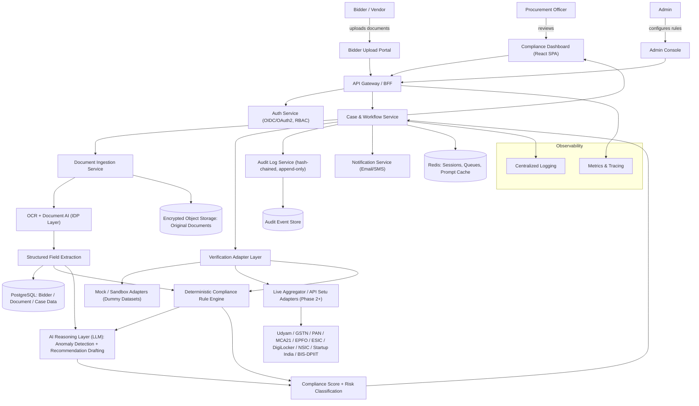
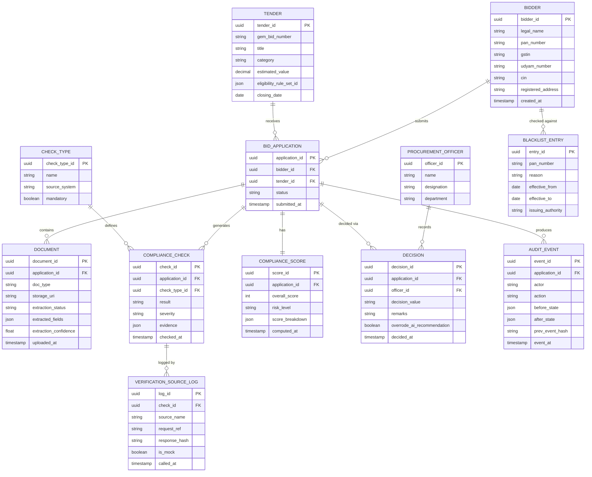

# Pramaan — AI-Powered Bid Compliance Verification Platform for GeM

**Implementation-Ready Product Requirements Document**

**Problem Statement:** SIH 2026 · PS ID 26100 · Category: Software · Theme: Smart Automation

| Field | Value |
|---|---|
| Organization / Department | Ministry of Petroleum & Natural Gas — Chennai Petroleum Corporation Limited (CPCL) |
| Document Owner | Product/Engineering Team |
| Status | Draft v1.0 — ready for build |

> **Product name meaning:** Pramaan (प्रमाण) is Hindi/Sanskrit for "proof," "certification," or "standard of evidence" — the system's job in one word.

---

## 0. Critical Analysis of the Original Problem Statement

The problem is real and worth solving, but the statement as written asks for something that cannot be honestly built as a live system in a hackathon or even a first production release. Before writing the rest of this PRD, here is what would break if it were taken literally — and what has been changed.

1. **"Integrate with 11+ government portals" is not a coding task, it's a procurement and legal process.** Udyam, GSTN, PAN/Income Tax, MCA21, EPFO, ESIC, DigiLocker, NSIC, Startup India and BIS/DPIIT each expose data only through a licensed channel: MeitY's API Setu (200+ KYC APIs, but every one of them "require[s] approval from the principal departments of each respective API"), a commercial KYC/KYB aggregator (Setu, Decentro, Karza, Surepass, Gridlines, Cashfree Verification), or a signed DigiLocker Partner Organisation agreement. None of these can be wired up by a development team over a weekend, and several (EPFO/ESIC in particular) have no clean self-serve API at all. Treating "integrate with the GeM portal ecosystem" as a sprint task is the single biggest way this project could quietly fail.

   **Change made:** the architecture is built around a Verification Adapter interface. For the MVP and demo, adapters call mock/sandbox implementations backed by dummy bidder and tender datasets (explicitly permitted by the problem statement's own dataset note). Every mock adapter has the exact request/response shape a real-aggregator or API Setu integration would have, so swapping in a live source later is a configuration change, not a rewrite. Real integration is sequenced by how accessible each source actually is (see §21 MVP Definition and §22 Roadmap) — PAN, GSTN, Udyam and MCA21 first (mature commercial aggregator APIs exist today), EPFO/ESIC/DigiLocker/NSIC/Startup India later, once CPCL/MoPNG formally sponsors the necessary approvals or MoUs.

2. **"AI Verification Engine... generates an overall compliance assessment" is dangerous if the AI is allowed to decide anything.** A government bid qualification/disqualification is a decision with legal and financial consequences for a real business. An LLM asked "is this bidder compliant?" over a stack of scanned certificates will occasionally hallucinate a pass or a fail with total confidence. Building a system where that hallucination silently becomes the outcome would be a serious failure mode, not a minor bug.

   **Change made:** AI is scoped to what it is actually good at — reading messy documents and flagging inconsistencies in plain language — and kept away from the actual eligibility logic. Every compliance rule ("Is GSTIN status Active," "Is Udyam category ≤ Small," "Is the bidder on the debarment list") is evaluated by a deterministic rule engine, not the LLM. The AI layer explains, summarizes and drafts a recommendation on top of deterministic results, every AI-authored claim must cite the specific document or check it came from, and — critically — the system never auto-disqualifies or auto-qualifies anyone. A human Procurement Officer signs every decision. This matches the problem statement's own instruction that "the final decision... shall remain with the Procurement Officer," but that instruction needs to be enforced architecturally, not just described in a UI label.

3. **"Blacklisting/debarment status" implies one clean government database. It doesn't exist.** GeM maintains its own suspended/blacklisted-seller list; individual ministries and the CVC handle debarment and Integrity Pact violations separately; there is no single unified public API for "is this PAN debarred anywhere in India."

   **Change made:** modeled as a curated, periodically-refreshed registry (seeded from GeM's public suspended-seller data and CPCL's own past-vendor records for MVP/demo), with a clear data-lineage note in the UI ("last refreshed on...") rather than a false promise of real-time completeness.

4. **The stated "60–80% reduction in verification effort" is a target to validate, not a fact to assume.** It is kept in this PRD as the pilot success hypothesis (§29 Success Criteria), measured against a real before/after time study during the CPCL pilot — not stated as an already-achieved result.

5. **What was not changed:** the core idea — a single dashboard that pulls scattered statutory-compliance information into one compliance score, one risk level, and one evidence trail, while leaving the decision to a human — is sound, valuable, and worth building exactly as described. The rest of this document is written around that core, with the above four corrections baked into the architecture rather than left as caveats.

---

## 1. Executive Summary

**Product name:** Pramaan

**One-line description:** An AI-assisted, human-in-the-loop platform that verifies GeM bidders' statutory and eligibility compliance across multiple government sources and gives procurement officers one auditable compliance score instead of a dozen manual lookups.

**Problem being solved:** Evaluating a single GeM bid today means an officer manually opening the bidder's Udyam certificate, GST certificate and return-filing status, PAN/ITR records, MCA21 company data, EPFO/ESIC registration, Startup India/NSIC/OEM authorization letters, and checking blacklist status — often across five or more different browser tabs and PDF documents per bidder, repeated for every bidder on every tender. It is slow, inconsistent between officers, and easy to get wrong under deadline pressure.

**Proposed solution:** Bidders upload their documents once through a guided portal. Pramaan's AI document layer extracts structured fields from each certificate, a configurable rule engine checks them against the tender's specific eligibility criteria and (via pluggable Verification Adapters) against portal-derived data, and an AI layer cross-checks for inconsistencies (mismatched names, expired certificates, format errors) and drafts a plain-language recommendation. The officer sees one Compliance Dashboard — score, risk level, per-check status, evidence, and recommendation — and makes the final call. Every step is logged immutably.

**Target users:** Procurement/tender evaluation officers at CPSUs (initial deployment: CPCL), bidders/MSME vendors submitting to GeM tenders, CPCL vigilance/audit stakeholders, and platform administrators who configure tender-specific rules.

**Why this problem matters:** GeM is no longer a marginal channel — cumulative transactions have crossed roughly ₹18.4 lakh crore, with over ₹5 lakh crore transacted in FY 2025-26 alone and MSEs alone completing 68% of orders that year. At that volume, even small per-bid verification delays compound into a systemic drag on public procurement, and manual cross-portal checks are also where inconsistent, error-prone eligibility decisions are most likely to happen.

**Why the solution is valuable:** it turns a repetitive, error-prone, multi-portal manual task into a single reviewed screen, without removing the human accountability that a public-sector qualification decision legally requires.

**What makes this different from existing options:** generic KYC/KYB verification APIs (Setu, Decentro, Karza and similar) check one credential at a time and have no concept of tender-specific eligibility or GeM-specific schemes (Udyam category thresholds, Make in India/local-content clauses, OEM authorization requirements). Pramaan is purpose-built around a configurable eligibility rule engine, an India-government-scheme-aware AI layer, and a CVC/GFR-friendly audit trail — while keeping a human as the only party who can actually qualify or disqualify a bidder.

---

## 2. Problem Analysis

**Symptom:** Tender evaluation at CPCL (and CPSUs generally) takes longer than it should, and officers occasionally miss an inconsistency (an expired Udyam certificate, a GSTIN that has gone inactive, a name mismatch between PAN and GST records) that a bidder's documents didn't make obvious.

**Root cause:** Statutory eligibility evidence for a single bidder is scattered across ~10 independent government systems, each with its own document format, portal, and update cadence, with no single interface that shows "is this bidder eligible for this tender, right now, with evidence."

**Actual problem:** There is no compliance-verification layer between "bidder submits documents" and "officer decides," so the entire burden of retrieval, cross-checking, and consistency detection falls on a human working against a tender deadline.

**Who experiences it:**
- Procurement/tender evaluation officers — direct manual burden.
- Bidders, especially MSMEs without dedicated compliance staff — rejected or delayed for paperwork issues they didn't know were wrong.
- CPCL management and vigilance — harder to audit why a bidder was qualified or disqualified after the fact.

**How frequently it occurs:** Every bid, on every tender, for every bidder — i.e., a recurring operational cost, not an occasional one. GeM's FY 2025-26 volume (₹5 lakh crore+ transacted, 11 lakh+ MSEs registered) shows the scale this repeats at across the ecosystem, even though any single CPSU's own tender volume is a small slice of that.

**Current solutions:**
1. Fully manual cross-checking by the officer (status quo at most CPSUs).
2. Generic commercial KYC/KYB verification APIs used ad hoc for one-off checks (not tender-eligibility-aware, no compliance scoring, no officer workflow).
3. Private "GeM consultant" services that help bidders prepare paperwork (helps bidders, does nothing for the buyer-side verification burden).

**Problems with current solutions:** manual checking doesn't scale and is inconsistent between officers; generic KYC APIs answer "is this PAN valid" but not "is this bidder eligible for this tender"; consultants address the bidder's side of the process, not the procurer's.

**Consequences of doing nothing:** slower tender award cycles, continued risk of inconsistent eligibility decisions across officers, weaker audit trails if a disqualification is later challenged, and no structural defense against bid manipulation (e.g., look-alike shell bidders) beyond individual officer vigilance.

**Unmet needs:** a single, evidence-backed, per-tender compliance view; consistency across officers and tenders; an audit trail that survives scrutiny (RTI requests, CVC review, court challenge) without depending on one officer's memory of what they checked.

**Opportunity:** verification is a well-bounded, rules-heavy, document-heavy task — exactly the kind of problem where a deterministic rule engine plus a narrowly-scoped AI reading layer can remove most of the manual burden without removing human judgment from the actual decision.

### Symptom → Root Cause → Actual Problem → Proposed Solution

| Symptom | Root Cause | Actual Problem | Proposed Solution |
|---|---|---|---|
| Slow bid evaluation | Compliance evidence scattered across ~10 disconnected government systems | No verification layer exists between document submission and officer decision | Pramaan: unified intake → AI extraction → rule engine → adapter-based cross-check → officer decision, all logged |
| Inconsistent eligibility calls between officers | No standard, shared checklist tied to each tender's actual eligibility clauses | Eligibility logic lives in officers' heads / static PDFs, not in a system | Configurable, tender-specific eligibility rule engine, same rules applied to every bidder on that tender |
| Weak audit trail if a decision is challenged | Verification steps aren't systematically recorded | No reliable record of what was checked, when, against what evidence | Immutable, evidence-linked audit trail for every check and every officer decision |

---

## 3. User Research & Personas

### Primary Persona 1 — Procurement/Tender Evaluation Officer

**Name:** Rajesh Kumar
**Role:** Senior Manager, Materials & Contracts, CPCL

- **Goals:** Close tender evaluation within the target cycle time; be confident every qualified bidder is genuinely eligible; avoid decisions that get challenged later.
- **Pain points:** Manually opening and reading certificates from many sources per bidder; no single view of "is this bidder OK for this tender"; pressure to move fast without cutting corners.
- **Technical ability:** Comfortable with GeM portal and standard office software; not a developer.
- **Current workflow:** Downloads bidder documents from GeM, opens each government portal separately to cross-check, manually notes discrepancies in a spreadsheet or file note, prepares an evaluation report.
- **Frustrations:** Repetition across bidders; documents in inconsistent formats/quality; no memory of what was checked for a similar bidder last time.
- **Expected benefits:** A single dashboard with score, risk, and evidence per bidder; faster evaluation; a defensible audit trail.
- **Why they'd use it:** It removes the most tedious and error-prone part of their job while leaving them in control of the actual decision.

### Primary Persona 2 — Bidder / MSME Vendor

**Name:** Priya Sharma
**Role:** Proprietor, small industrial-supplies manufacturing unit (Udyam-registered Micro enterprise)

- **Goals:** Win government contracts without losing bids over paperwork technicalities she didn't know about.
- **Pain points:** Uncertainty about which documents are required for a given tender; rejections after the fact with little explanation; no dedicated compliance staff.
- **Technical ability:** Basic smartphone/web use; not comfortable with complex forms.
- **Current workflow:** Uploads whatever documents GeM's own bid process requests, hopes for the best.
- **Frustrations:** Finding out about a missing/expired document only after losing the bid.
- **Expected benefits:** A clear, guided checklist of exactly what's needed and why, and early feedback on issues (e.g., "your Udyam certificate is due for renewal") before the deadline.
- **Why they'd use it:** It's presented as part of the standard GeM bid submission flow, and it reduces the chance of a surprise rejection.

### Secondary Persona — Vigilance / Compliance Officer

**Name:** Anitha Reddy, Chief Vigilance Officer's team, CPCL

- **Goals:** Be able to reconstruct, for any awarded tender, exactly what was verified and why a bidder was qualified.
- **Pain points:** Manual file notes are inconsistent and hard to audit at scale.
- **Expected benefits:** Structured, timestamped, evidence-linked audit trail for every case.

### Administrator Persona

**Name:** IT/Procurement Systems Admin, CPCL

- **Goals:** Configure eligibility rules per tender/category without needing a developer; manage which verification sources are active (mock vs. live).
- **Expected benefits:** A rule-configuration UI instead of hardcoded logic per tender.

**Stakeholders:** CPCL management (needs MIS visibility into evaluation cycle times and risk trends); MoPNG (interested in a template CPSUs can standardize on); GeM itself (potential future integration partner, not a build dependency for this project).

- **Primary users:** Procurement/tender evaluation officers.
- **Secondary users:** Bidders, vigilance/audit staff.
- **Administrators:** CPCL procurement-systems admin.
- **Stakeholders:** CPCL management, MoPNG, GeM (future).

---

## 4. User Journey

**Officer journey (primary):**
Before using the product → officer manually cross-checks bidders across multiple portals, taking hours per tender → **Discovery:** introduced to Pramaan as the new step after bid submission closes on GeM → **Onboarding:** SSO login, a 10-minute walkthrough of the dashboard and one sample case → **First use:** opens a real (or pilot) tender, sees bidder cases already populated from uploaded documents → **Core workflow:** reviews compliance score/risk per bidder, opens flagged inconsistencies, checks the underlying evidence, requests clarification from a bidder if needed → **Result:** records qualify/disqualify/request-more-info decision, generated automatically into the evaluation file → **Feedback:** can flag an AI recommendation as wrong, which is captured for model/rule tuning → **Long-term usage:** becomes the default first step of every tender evaluation; rule configuration reused across similar tenders.

**Friction points eliminated:** no more opening 5+ separate portals per bidder; no more manually re-deriving the same eligibility checklist per tender; no more losing track of what was already checked when a bidder resubmits a corrected document.

**Bidder journey (secondary):** Before → uncertain what's required → **Discovery:** sees the compliance checklist as part of GeM bid submission → **Registration/Onboarding:** none required beyond existing GeM seller account → **First use:** uploads documents against a clear checklist → **Core workflow:** gets real-time feedback on missing/expiring documents before the deadline → **Result:** submission goes to officer review with fewer avoidable errors → **Feedback:** can see (post-decision) which checks passed/failed, for future tenders → **Long-term usage:** fewer repeat mistakes across tenders.

---

## 5. Product Vision

**Vision:** Every GeM bid is evaluated against the same, evidence-backed, auditable standard — regardless of which officer or which day.

**Mission:** Give procurement officers a single trustworthy view of bidder compliance so they can spend their judgment on decisions, not document hunting.

**Product philosophy:** AI reads and organizes; rules decide what's checkable; humans decide what matters. Never let the system quietly become the decision-maker.

**Core value proposition:** Turn a multi-portal, multi-hour manual verification task into a single reviewed screen, without removing human accountability.

**Product principles:**
1. Deterministic where possible, AI only where genuinely needed (document reading, language, anomaly explanation).
2. Every AI claim must point to evidence — no unattributed assertions.
3. The system recommends; the officer decides. Always.
4. Every action is logged, immutably, from day one.
5. Build for CPCL's real scale first; design (not build) for CPSU-wide scale later.

**One-line value proposition:** "One dashboard, one score, one audit trail — for every GeM bid, every time."

---

## 6. Goals & Non-Goals

### Goals (MVP/Pilot, measurable)

- Reduce average manual verification time per bid application by a targeted 40–60% in the CPCL pilot (validated against a real before/after time study, not assumed).
- Achieve ≥90% field-extraction accuracy on the golden dummy-document test set for the six priority certificate types (Udyam, GST, PAN, MCA21 extract, EPFO/ESIC registration, blacklist record).
- 100% of qualify/disqualify decisions have a complete, evidence-linked audit trail.
- Zero instances of the system auto-qualifying or auto-disqualifying a bidder without an officer decision.

### Non-Goals (explicitly out of scope for v1)

- Live, production integration with all ten-plus government sources on day one (phased — see §21, §22).
- Replacing GeM's own seller-registration verification (Pramaan verifies per-tender, not seller onboarding).
- Automating the qualify/disqualify decision itself.
- Multi-CPSU / multi-tenant rollout (designed for, not built for, v1).
- A public-facing bidder mobile app (web portal only for v1).
- Legal determination of fair-use/eligibility disputes — Pramaan surfaces evidence; disputes still go through existing grievance channels.

---

## 7. Functional Requirements

Each feature is classified P0 (Critical) / P1 (Important) / P2 (Nice to Have) / P3 (Future).

### F1 — Bidder Document Upload & Case Intake — P0
- **Purpose:** Single guided entry point for a bidder's documents against a specific tender.
- **User:** Bidder (upload), Officer (case appears automatically).
- **Problem solved:** Scattered document submission, unclear requirements.
- **User flow:** Bidder selects tender → sees required-document checklist (derived from tender's configured eligibility rules) → uploads each document → system confirms receipt.
- **Inputs:** PDF/JPEG/PNG certificates, tender ID, bidder ID.
- **Processing:** File type/size/malware validation; creates a Bid Application case record.
- **Outputs:** Case record with document list and status "Intake Complete."
- **Edge cases:** Missing mandatory document (flagged, not blocking submission — officer sees it as a gap); corrupted file (rejected with a clear resubmission prompt); duplicate submission (versioned, latest supersedes).
- **Dependencies:** Tender eligibility rule configuration (F12) must exist first.

### F2 — AI Document Extraction (Intelligent Document Processing) — P0
- **Purpose:** Turn scanned/photographed certificates into structured, checkable fields.
- **User:** System (invisible to end users, but its confidence/output is visible to the officer).
- **Problem solved:** Manual reading and re-typing of certificate data.
- **User flow:** Triggered automatically on upload → OCR → field extraction (name, registration number, validity dates, category, etc.) → stored against the document record.
- **Inputs:** Document image/PDF.
- **Processing:** OCR + LLM-assisted structured extraction against a per-document-type schema.
- **Outputs:** JSON of extracted fields + confidence score + pointer to the source region of the document (for evidence display).
- **Edge cases:** Illegible scan (flagged "extraction failed — manual entry required," never silently guessed); non-standard certificate template (lower confidence, routed for officer confirmation); handwritten annotations (lowest priority, flagged for manual review).
- **Dependencies:** F1.

### F3 — Verification Adapter Layer (mock + live) — P0 for the interface, P1/P2 per live source
- **Purpose:** Cross-check extracted bidder data against Udyam, GSTN, PAN, MCA21, EPFO, ESIC, DigiLocker, NSIC, Startup India, Make in India/BIS-DPIIT — via a swappable adapter per source.
- **User flow:** Rule engine requests a check → Adapter Layer routes to the mock (dummy dataset) or live (aggregator/API Setu) implementation for that source → normalized result returned.
- **Processing:** Each adapter returns a common schema: `{source, status: pass/fail/unavailable, matched_fields, raw_evidence_ref, checked_at}`.
- **Edge cases:** Source unavailable/timeout (marked "Pending — source unreachable," never silently treated as pass); data mismatch between bidder-declared and source-returned values (flagged as an inconsistency, not auto-failed, since real name variants — Ltd. vs Limited — are common).
- **Dependencies:** F2 (needs extracted bidder-declared values to compare against).

### F4 — Deterministic Compliance Rule Engine — P0
- **Purpose:** Evaluate tender-specific eligibility criteria against verified/extracted data using explicit, auditable logic (not LLM judgment).
- **User flow:** Runs automatically once F2/F3 results are available → produces a pass/fail/pending per configured rule.
- **Processing:** Rules expressed as structured conditions (e.g., `udyam_category IN [Micro, Small]`, `gstin_status == 'Active'`, `pan_name MATCHES gstin_legal_name (fuzzy ≥ 90%)`).
- **Edge cases:** Conflicting rule configuration (validated at admin save-time, not at run-time); rule references a source with no adapter configured yet (marked "Not Evaluated," visible to the officer as a gap, not hidden).
- **Dependencies:** F3, F12.

### F5 — AI Cross-Document Consistency & Anomaly Detection — P0
- **Purpose:** Catch things a rules list won't, like a name that's spelled differently across two certificates, or a date pattern that looks altered.
- **User flow:** Runs after F2/F4 → produces a list of flagged anomalies, each with a plain-language explanation and a link to the exact fields/documents involved.
- **Processing:** LLM compares structured extractions pairwise/collectively; every flag must cite the specific fields compared (enforced by output schema validation).
- **Edge cases:** Legitimate name variants (Pvt. Ltd. vs Private Limited) — flagged at low severity, not blocking; the model produces a flag with no valid evidence citation — rejected by the validation layer and logged, never shown to the officer.
- **Dependencies:** F2.

### F6 — Compliance Scoring & Risk Classification — P0
- **Purpose:** Summarize F4 + F5 results into one number and one risk band (Low/Medium/High) the officer can scan quickly.
- **Processing:** Deterministic weighted formula over rule pass/fail/pending counts and anomaly severity (weights configurable by admin, not by AI).
- **Edge cases:** All-pending case (score explicitly shown as "Incomplete — N checks pending," never a false high score).
- **Dependencies:** F4, F5.

### F7 — AI Recommendation Engine — P0
- **Purpose:** Draft a short, plain-language summary and suggested next step ("Recommend: Qualify, pending EPFO confirmation" / "Recommend: Request clarification on GST return filing gap") for the officer.
- **Processing:** LLM synthesis over F4/F5/F6 outputs only — never invents new checks. Output is always labeled "AI-drafted, officer decision required."
- **Dependencies:** F6.

### F8 — Blacklist / Debarment Check — P0
- **Purpose:** Flag bidders on GeM's suspended-seller list or CPCL's internal past-debarment records.
- **Processing:** Lookup against the curated registry (§0, item 3) by PAN/CIN.
- **Edge cases:** Registry not yet refreshed for today (shows "last refreshed" timestamp so the officer knows the currency of the check).
- **Dependencies:** None (independent lookup).

### F9 — Compliance Dashboard — P0
- **Purpose:** The officer's single screen — list of bidders per tender with score/risk/status, and a per-bidder detail view.
- **Dependencies:** F6, F7.

### F10 — Officer Decision & Override Workflow — P0
- **Purpose:** Capture the human decision (Qualify / Disqualify / Request More Information), with mandatory remarks if the decision disagrees with the AI recommendation.
- **Edge cases:** Officer decision required before a case can be marked "Closed" — no auto-closing.
- **Dependencies:** F9.

### F11 — Immutable Audit Trail & Evidence Vault — P0
- **Purpose:** Every check, extraction, adapter call, AI output and officer action is recorded, hash-chained, and never editable after the fact.
- **Dependencies:** Cross-cutting; touches every other feature.

### F12 — Tender-Specific Eligibility Rule Configuration — P1
- **Purpose:** Let an admin define which checks and thresholds apply to a given tender/category without code changes.

### Remaining Features

- **F13 — Notification & Reminder System** — P1 — e.g., bidder's Udyam certificate nearing expiry, officer has pending cases near tender close.
- **F14 — Multi-Bidder Bulk Comparison View** — P1 — side-by-side score/risk comparison for large tenders with many bidders.
- **F15 — Analytics & MIS Reporting** — P1 — cycle-time trends, common failure reasons, for CPCL management.
- **F16 — Role-Based Access Control** — P1 — Officer / Admin / Vigilance-read-only / Bidder roles, each with distinct permissions.
- **F17 — Live DigiLocker Consent-Based Fetch** — P2 — Phase 2, requires DigiLocker Partner Organisation onboarding.
- **F18 — Explainability View ("Why this score")** — P1 — breakdown of every point in the compliance score back to its source check.
- **F19 — Multilingual UI (English/Hindi/Tamil)** — P2.
- **F20 — Field/Mobile Officer View** — P3.

---

## 8. Core User Flows

### Flow A — End-to-end bid compliance verification (primary flow)

```
Bid submission closes on GeM
 → Bidder documents sync into Pramaan (or are uploaded directly, MVP)
 → AI extraction runs per document (F2)
 → Verification adapters run per configured check (F3)
 → Deterministic rule engine evaluates tender eligibility (F4)
 → AI anomaly detection cross-checks documents (F5)
 → Compliance score + risk level computed (F6)
 → AI recommendation drafted (F7)
 → Officer opens Compliance Dashboard (F9)
 → Officer reviews evidence, may request clarification from bidder
 → Officer records decision: Qualify / Disqualify / Request More Info (F10)
 → Decision + full evidence trail written to audit log (F11)
 → Case closed / bidder notified
```

### Flow B — Bidder document upload & guided checklist

```
Bidder logs in → selects tender → sees required-document checklist
 → uploads each document → system runs quick validation (file integrity, type)
 → AI extraction confidence shown ("Udyam certificate read successfully")
 → any obviously missing/expiring document flagged before deadline
 → bidder submits → case moves to officer queue
```

### Flow C — Officer disagrees with AI recommendation

```
Officer opens case → sees AI recommendation "Qualify"
 → officer inspects an underlying document and disagrees
 → officer selects "Disqualify" → system requires a remarks field
 → decision + remarks + which AI output was overridden logged
 → override event feeds the periodic model/rule review (§25 AI evaluation)
```

### Flow D — Admin configures tender-specific eligibility rules

```
Admin opens Tender Rule Configuration
 → selects tender category (e.g., Goods > ₹10 lakh, MSE-reserved)
 → picks applicable checks (Udyam category, GST active status, blacklist, etc.)
 → sets thresholds (e.g., Udyam category ∈ {Micro, Small})
 → saves → validation checks for conflicting/incomplete rules
 → rule set becomes active for all bidders on that tender
```

---

## 9. System Architecture

- **Frontend:** Officer Dashboard + Bidder Portal + Admin Console, all as a single React SPA with role-based routing.
- **Backend:** A Case & Workflow Service orchestrates the pipeline; a Document Ingestion Service handles OCR/extraction; a Verification Adapter Layer abstracts external sources; a Rule Engine evaluates eligibility; an AI Reasoning Layer handles anomaly detection and recommendation drafting.
- **Database:** PostgreSQL for structured case/bidder/check data; object storage for original documents; an append-only store for audit events.
- **APIs:** Versioned REST APIs (`/api/v1/...`) behind an API Gateway/BFF.
- **Authentication/Authorization:** OIDC/OAuth2 SSO (Keycloak) with RBAC (Officer/Admin/Vigilance/Bidder roles).
- **AI/ML layer:** LLM-based document extraction + anomaly detection + recommendation drafting, separated from the deterministic rule engine.
- **External services:** Verification Adapter Layer — mock adapters (MVP/demo) and, in later phases, live aggregator/API Setu integrations for Udyam/GSTN/PAN/MCA21/EPFO/ESIC/DigiLocker/NSIC/Startup India/BIS-DPIIT.
- **Storage:** Encrypted object storage for uploaded documents, separate from the metadata database.
- **Caching:** Redis for session state, job queues, and LLM prompt-cache bookkeeping.
- **Notifications:** Async notification service (email/SMS) for expiry reminders and status changes.
- **Monitoring:** Centralized logging, metrics, and tracing across every service.
- **Deployment:** Containerized services, deployable on a MeitY-empanelled cloud for any real CPCL pilot (see §26).



**Why each major component is required:**

- **Verification Adapter Layer** is the single most important design decision in this system: it means the demo, the pilot, and the eventual production rollout all use the same interface, with only the implementation behind it changing.
- **Separating the Rule Engine from the AI Reasoning Layer** is what keeps eligibility decisions deterministic and explainable, while still getting AI's benefit on the genuinely unstructured parts (reading documents, spotting inconsistencies, writing summaries).
- **Audit Log Service as its own component** (not just database rows) ensures the audit trail can be hash-chained and made tamper-evident independently of the operational database.
- **Object storage separate from the metadata database** keeps large binary documents out of the transactional database and makes encryption-at-rest and access-control policy easier to apply consistently.

---

## 10. Technology Stack

| Layer | Recommendation | Why suitable | Alternatives |
|---|---|---|---|
| Frontend | React + TypeScript + Tailwind | Fast to build a dashboard-heavy UI; large ecosystem; team familiarity likely high for a student/hackathon team | Vue, Angular |
| Backend (API + orchestration) | Python (FastAPI) | Best ecosystem for OCR/NLP/AI pipelines; async-friendly; typed with Pydantic for strict schema validation (important for the rule engine and AI-output validation) | Node.js (NestJS), Java (Spring Boot) |
| Primary database | PostgreSQL | Relational integrity for case/rule/audit data; mature, well-understood, free; pgvector extension covers embeddings without extra infra | MySQL, MongoDB |
| Object storage | S3-compatible (MinIO self-hosted for MVP; empanelled-cloud object storage for pilot) | Documents are large binaries; keeps DB lean; supports encryption-at-rest natively | Local filesystem (MVP-only, not viable beyond demo) |
| Cache / queue | Redis | Sessions, background job queues (document extraction is async), prompt-cache bookkeeping | RabbitMQ + separate cache |
| Auth | Keycloak (OIDC/OAuth2) | Open-source, supports SSO, RBAC, and can federate with a government SSO/DSC-based login later | Auth0, AWS Cognito |
| Document AI / OCR | Tesseract (MVP) → cloud Document AI (AWS Textract / Google Document AI) for pilot | Tesseract is free and enough for the clean dummy dataset used in the demo; production needs to handle real scan quality/handwriting variance | Google Document AI, AWS Textract, Azure Form Recognizer |
| LLM (reasoning layer) | Claude Sonnet 5 (Anthropic API) | Strong instruction-following and structured-output reliability for the "cite your evidence" constraint this system depends on; current pricing $2/$10 per million input/output tokens | Claude Haiku 4.5 (cheaper, for high-volume first-pass extraction), GPT-4 class models |
| Embeddings / vector search | pgvector on the existing PostgreSQL instance, with an open embedding model | Avoids a whole extra database just for a modest amount of tender-clause text | Pinecone, Weaviate, Milvus |
| Cloud (pilot/production) | MeitY-empanelled cloud (AWS Mumbai/Hyderabad, Azure, or GCP — all currently empanelled) | CPCL is a CPSU; hosting bidder PII (PAN, GST, EPFO data) for a real pilot legally should sit on empanelled, India-resident infrastructure | NIC data centers |
| DevOps / CI-CD | Docker + GitHub Actions (MVP) → Kubernetes (scale phase) | Simple, free, well-documented for a small team; Kubernetes only once there's an actual multi-service, multi-tenant need | GitLab CI, Jenkins |
| Monitoring | Prometheus + Grafana, structured JSON logs (Loki/ELK) | Free, standard, works well with containerized services | Datadog, New Relic |
| Testing | pytest (backend), Playwright (E2E), k6 (load) | Free, mature, good coverage across unit/integration/E2E/load | Cypress, Locust |

Technologies were chosen for what this specific project actually needs (document-heavy AI pipelines, strict auditability, government hosting constraints) rather than for popularity — e.g., Kubernetes and a dedicated vector database are both deliberately deferred rather than adopted by default.

---

## 11. AI Strategy

**Where AI is used:**
1. Document field extraction from certificates of varying templates and scan quality (F2).
2. Cross-document consistency/anomaly detection in plain language (F5).
3. Drafting a plain-language recommendation summary for the officer (F7).

**Why AI is necessary here:** certificate layouts vary (different states' Udyam formats, different GST portal export styles), so rigid template-matching breaks constantly; an LLM-based extractor generalizes across formats far better than brittle regex/template rules, and is genuinely better than a human at noticing a subtle inconsistency across six different documents in seconds.

**Which tasks should NOT use AI:**
- Evaluating whether a bidder meets tender eligibility criteria (deterministic rule engine — §4, Feature F4).
- Computing the compliance score (deterministic weighted formula — Feature F6).
- Deciding qualify/disqualify (always a human — Feature F10).
- Blacklist/debarment lookup (a simple, deterministic registry match — Feature F8).

AI explains and drafts; it never adjudicates.

**Recommended models:**
- Claude Sonnet 5 for document extraction, anomaly detection, and recommendation drafting — the tasks need reliable structured output and good instruction-following on a "cite your evidence" constraint.
- Claude Haiku 4.5 as a cheaper first pass for high-volume, low-ambiguity extraction (e.g., a clearly-formatted PAN card), escalating to Sonnet 5 only when confidence is low or the document is a certificate type the model hasn't seen a clean example of.

> Pricing changes over time — re-verify current Anthropic API rates before finalizing a budget; as of this writing, Sonnet 5 is $2/$10 per million input/output tokens and Haiku 4.5 is $1/$5.

**Model alternatives:** GPT-4-class models or open-weight vision-language models (e.g., Qwen-VL) could substitute for the extraction step; the architecture keeps the LLM call behind a single internal interface so the model can be swapped without touching the rule engine or UI.

**Prompt architecture:** Each extraction/anomaly-detection call receives: (a) the specific document-type schema to extract into, (b) the tender's active eligibility rules (so anomaly detection knows what matters), (c) a strict instruction to output only fields it can point to evidence for, and (d) a required-citation output format (`field, value, source_document_id, bounding_box_or_page_ref`).

**RAG requirements:** Limited — tender-specific eligibility clauses are stored as structured rules (Feature F12), not free text needing retrieval. A small RAG layer over GFR/CVC procurement-guideline text is a reasonable future enhancement to help admins draft rule sets, but is not required for the core verification flow.

**Embeddings / vector database:** pgvector on the primary PostgreSQL instance is sufficient for the modest volume of reference text (tender clauses, guideline excerpts) this project needs — a dedicated vector database is not justified at this scale.

**Function/tool calling:** The AI Reasoning Layer calls internal tools (not the government sources directly) — `get_extracted_document(doc_id)`, `get_rule_engine_result(check_id)`, `get_prior_case_notes(case_id)` — so it only ever reasons over already-validated internal data, never raw external API responses directly.

**Agent architecture:** Deliberately a bounded pipeline, not a free-roaming autonomous agent: intake → extract → adapter-check → rule-evaluate → anomaly-detect → score → recommend, in that fixed order. This is a legal-risk-sensitive process; an agent that can decide its own next action is the wrong shape for it.

**AI memory:** None persisted across cases — each case's AI reasoning is scoped strictly to that case's own documents and that tender's own rules, to avoid one bidder's data ever leaking into another's analysis and to avoid building an unaccountable "reputation memory" that isn't visible in the audit trail.

**Context management:** Each AI call's context window is explicitly assembled (extracted fields + active rules + prior flags for this case only), not an open-ended chat history — keeps costs predictable and outputs reproducible.

**Hallucination prevention:** (1) mandatory evidence citation on every AI-authored claim, enforced by schema validation — an unattributed claim is discarded, not shown; (2) the rule engine's deterministic result always wins over any AI-authored eligibility judgment; disagreement between the two is logged and surfaced to the officer, never silently resolved.

**Output validation:** Every AI response is required to conform to a strict JSON schema (per-task); a response that fails schema validation triggers a retry, then falls back to "extraction/analysis failed — manual review required" rather than partially-parsed guesses reaching the officer.

**Human-in-the-loop:** Enforced at the architecture level, not just the UI: there is no code path from an AI output directly to a "Qualified"/"Disqualified" case status — that transition requires an authenticated officer action (Feature F10).

**Evaluation methodology:** A golden test set of dummy bidder documents (with known ground-truth fields) is used to measure extraction precision/recall before each release; in the pilot, a periodic sample of officer overrides is reviewed to track how often officers disagree with AI recommendations and why, feeding back into rule/prompt tuning.

**AI cost optimization:** prompt caching for the parts of the prompt that repeat across many bidders on the same tender (the tender's rule set); Haiku 4.5 for a cheap first extraction pass, escalating to Sonnet 5 only on low confidence; batching non-urgent extraction jobs; hard output-token limits per call. At an estimated ~20,000 input / ~2,000 output tokens per bid application, Sonnet 5 pricing works out to roughly $0.06 per case before caching — trivial at CPCL's realistic pilot volume (see §27 for the full breakdown, and re-verify pricing before budgeting).

---

## 12. Database Design

**Core entities:** Bidder, Tender, Bid Application, Document, Check Type, Compliance Check, Verification Source Log, Compliance Score, Procurement Officer, Decision, Blacklist Entry, Audit Event.



**Indexes/constraints (key ones):** unique index on `BIDDER.pan_number`; composite index on `BID_APPLICATION(tender_id, bidder_id)`; index on `COMPLIANCE_CHECK(application_id, check_type_id)`; `AUDIT_EVENT.prev_event_hash` chains each event to the previous one per application (tamper-evidence); foreign keys enforce that a `DECISION` cannot exist without a `BID_APPLICATION`, and a `COMPLIANCE_SCORE` cannot exist without at least one `COMPLIANCE_CHECK`.

**Data lifecycle:**
- **Create:** Bid Application created on intake; Documents/Checks/Scores created as the pipeline runs.
- **Read:** Officer dashboard and reports read continuously; audit queries read historically.
- **Update:** A bidder resubmitting a corrected document creates a new Document version (old version retained, not overwritten) and re-triggers F2–F7 for that document only.
- **Delete:** Never hard-deleted while a case is active or within the statutory retention window; DPDPA-driven erasure requests are handled as a flagged, reviewed exception process (a real legal question for actual deployment — government procurement records typically carry their own retention mandates under GFR/CVC rules that can supersede an individual erasure request, and this needs sign-off from CPCL's legal/vigilance team before go-live, not a purely technical decision).
- **Archive:** After the tender's record-retention period, case data (not audit events, which are retained permanently in the append-only store) is moved to cold storage.

---

## 13. API Design

All APIs are versioned under `/api/v1/` and require an authenticated, role-scoped bearer token except where noted.

| Method | Endpoint | Purpose | Auth |
|---|---|---|---|
| POST | `/api/v1/bid-applications` | Create a new compliance case for a bidder + tender | Officer/System |
| GET | `/api/v1/bid-applications/{id}` | Get full case detail including score and checks | Officer |
| POST | `/api/v1/bid-applications/{id}/documents` | Upload a document against a case | Bidder/Officer |
| POST | `/api/v1/documents/{id}/extract` | Trigger (async) AI extraction for a document | System |
| POST | `/api/v1/bid-applications/{id}/verify` | Trigger the verification-adapter run across all applicable checks | System/Officer |
| GET | `/api/v1/bid-applications/{id}/compliance-score` | Get the current score and its breakdown | Officer |
| POST | `/api/v1/bid-applications/{id}/decision` | Officer records Qualify / Disqualify / Request-Info | Officer |
| GET | `/api/v1/tenders/{id}/eligibility-rules` | Fetch the configured rule set for a tender | Officer/Admin |
| POST | `/api/v1/tenders/{id}/eligibility-rules` | Admin configures/updates the rule set | Admin |
| GET | `/api/v1/audit/{application_id}` | Fetch the full audit trail for a case | Officer/Vigilance |
| GET | `/api/v1/blacklist/check?pan={pan}` | Blacklist/debarment lookup | System/Officer |

**Example — create a bid application:**

```
POST /api/v1/bid-applications
```
Request:
```json
{
  "tender_id": "b6b3...e21",
  "bidder_id": "a91f...c02"
}
```
Response:
```json
{
  "success": true,
  "application_id": "f21c...998",
  "status": "intake_pending"
}
```

**Example — officer records a decision:**

```
POST /api/v1/bid-applications/{id}/decision
```
Request:
```json
{
  "decision_value": "disqualify",
  "remarks": "GSTIN status returned inactive; bidder unable to provide updated filing within tender timeline.",
  "overrode_ai_recommendation": true
}
```
Response:
```json
{
  "success": true,
  "decision_id": "77ab...110",
  "case_status": "closed"
}
```

**Example — error response (adapter source unavailable):**

```json
{
  "success": false,
  "error": {
    "code": "SOURCE_UNAVAILABLE",
    "message": "EPFO verification source did not respond within timeout.",
    "check_id": "c410...ee2",
    "retryable": true
  }
}
```

---

## 14. UI/UX Requirements

| Screen | Purpose | Key components | User actions | System response |
|---|---|---|---|---|
| Login / SSO | Authenticate officer/admin/bidder | SSO button, role-aware redirect | Sign in | Routes to role-appropriate home screen |
| Officer Dashboard | List bid applications needing review | Tender selector, case table with score/risk badges, filters | Select tender, open a case, filter by risk level | Loads case list with live status |
| Bid Application Detail | Core review screen | Document checklist, extracted-field viewer (side-by-side with source image), per-check pass/fail/pending list, AI recommendation panel (labeled "AI-drafted"), decision panel | Inspect evidence, request clarification, record decision | Updates case status, writes audit event |
| Explainability View | Show why the score is what it is | Score breakdown by check, weight, and severity | Drill into any component of the score | Displays underlying check + evidence |
| Bidder Upload Portal | Guided document submission | Requirement checklist, upload widgets, extraction confidence indicator | Upload/replace documents | Confirms receipt, flags missing/expiring items |
| Tender Rule Configuration (Admin) | Define eligibility rules per tender/category | Rule builder (condition + threshold), source toggle (mock/live) | Add/edit/save rules | Validates for conflicts before activation |
| Audit Trail Viewer | Reconstruct exactly what happened on a case | Chronological event list, hash-chain integrity indicator | Search/filter by case, actor, date | Read-only, exportable |
| Analytics / MIS | Management visibility | Cycle-time trend charts, common failure-reason breakdown | Filter by date range/tender category | Aggregated, cached reporting queries |
| Notification Center | Surface reminders and status changes | List of alerts (document expiring, decision needed) | Dismiss, jump to case | Marks as read |

**States covered for every data-bearing screen:** loading (skeleton/spinner while extraction or adapter calls are in flight — these are not instant), empty (no cases yet / no documents yet, with a clear next action), error (adapter/source failure shown explicitly, never silently retried into a false pass), success (clear confirmation with the resulting state, e.g. "Document uploaded — extraction in progress").

**Mobile responsiveness:** Officer Dashboard and case detail are responsive down to tablet width for read/review use; full editing (rule configuration) is desktop-first, since it's an infrequent admin task.

**Accessibility:** Targets WCAG 2.1 AA / GIGW guidelines expected of Indian government-facing software — risk levels are conveyed with icon + text label, not color alone; all interactive elements are keyboard-navigable and screen-reader labeled; English + Hindi labels at minimum for the pilot (F19 extends this further).

---

## 15. Security & Privacy

| Area | Approach |
|---|---|
| Authentication | OIDC/OAuth2 via Keycloak; MFA for officer/admin roles |
| Authorization / RBAC | Officer, Admin, Vigilance (read-only), Bidder — enforced at the API layer, not just the UI |
| Password security | Delegated to Keycloak's standard hashing (Argon2/bcrypt); no custom credential storage |
| API security | All traffic over TLS 1.2+; short-lived, signed access tokens; per-endpoint rate limiting |
| Encryption | AES-256 at rest for the database and object storage; TLS in transit everywhere; field-level encryption/tokenization for PAN and any Aadhaar-linked identifiers |
| Input validation | Strict schema validation on every API input; file-type/size checks and malware scanning (e.g., ClamAV) on every upload |
| Rate limiting | Per-user and per-adapter rate limits — both to stop abuse and to stay within external aggregator/API Setu usage quotas |
| SQL injection | Parameterized queries only (ORM-enforced); no raw string-built SQL |
| XSS / CSRF | Framework-level escaping (React) + CSRF tokens on state-changing requests; strict Content-Security-Policy headers |
| Secure file uploads | Type allow-list, size caps, storage under randomized non-guessable keys, virus scan before it ever reaches the extraction pipeline |
| Secrets management | Cloud KMS / HashiCorp Vault — no secrets in code or config files |
| Logging | Structured logs with PII redaction by default; full values only in the access-controlled audit store, not general application logs |
| Audit trails | Immutable, hash-chained AUDIT_EVENT records for every check, extraction, adapter call, AI output and officer decision |
| Privacy / DPDPA | Purpose limitation (data used only for the compliance-check purpose it was collected for); consent capture wherever a live DigiLocker/Aadhaar-linked fetch is used in later phases; the Digital Personal Data Protection Rules, 2025 were notified in November 2025 with full compliance obligations phasing in through May 2027 — this system should treat DPDPA obligations (consent, breach notification, data-principal rights) as binding from day one of any real pilot, not deferred |
| Data retention | Aligned to CVC/GFR procurement record-retention norms; erasure requests handled as a reviewed legal exception (see §12), not an automatic delete |
| AI data privacy | No bidder document content is used to train or fine-tune any model; LLM calls should use a provider configuration with no data retention for training purposes; each case's AI context is isolated (§11) |
| Hosting compliance | Any real CPCL pilot handling bidder PII should run on MeitY/GI Cloud (MeghRaj)-empanelled infrastructure, with a CERT-In-empanelled auditor conducting a pre-go-live penetration test |

**Potential attack vectors and mitigations:**
- **Malicious document upload** (embedded malware/exploit in a "certificate" PDF): mitigated by type allow-listing, size caps, and mandatory malware scanning before the file ever reaches OCR/extraction.
- **Prompt injection** via a document's text content trying to manipulate the AI Reasoning Layer's output: mitigated by strict output-schema validation and by never letting AI output directly change a case's eligibility status (§11) — even a successfully injected instruction can, at worst, produce a flagged-and-discarded malformed response.
- **Insider misuse** (an admin quietly relaxing a rule to qualify a specific bidder): mitigated by requiring a second approver for rule changes on any tender that already has active bid applications, and logging every rule change immutably.
- **Credential compromise** of an officer account: mitigated by MFA, short token lifetimes, and anomaly alerts on unusual access patterns (e.g., a login from an unrecognized location reviewing an unusually high volume of cases).
- **Data exfiltration** via bulk API access: mitigated by per-user rate limiting and audit alerts on abnormal export volumes.

---

## 16. Non-Functional Requirements

Targets are sized to CPCL's realistic pilot scale, not an inflated hypothetical — a company-wide CPSU tender-evaluation tool, not a public-internet-scale consumer product.

| Category | Target |
|---|---|
| Performance | Dashboard reads < 500ms (p95); document upload acknowledgment < 2s; full AI extraction + verification pipeline for one bid application < 2 minutes (async, with visible progress — not a blocking synchronous call) |
| Scalability | Support at least 500 concurrent bid applications in flight during a peak tender-closing window at CPCL's current scale; architecture should not need a redesign to add more CPSUs later (multi-tenant-ready, not multi-tenant-built for v1) |
| Availability | 99.5% during business hours for the pilot (single-organization internal tool) — not an inflated 99.99% claim that doesn't match the deployment's actual criticality |
| Reliability | No case is ever silently lost between pipeline stages; every stage transition is logged; failed stages retry with backoff, then surface explicitly to the officer rather than looping silently |
| Security | See §15 in full |
| Accessibility | WCAG 2.1 AA / GIGW-aligned for all officer- and bidder-facing screens |
| Maintainability | Rule configuration changes require no code deployment; each Verification Adapter is independently swappable (mock → live) without touching the rule engine or UI |
| Observability | Every pipeline stage emits structured logs and metrics; dashboards for extraction success rate, adapter availability, and officer override rate |
| Compatibility | Modern evergreen browsers (Chrome, Edge, Firefox); no dependency on a specific OS for officer/admin use |

---

## 17. Edge Cases & Failure Handling

| Scenario | System response |
|---|---|
| Invalid/corrupted document upload | Reject at upload with a clear reason; no partial/garbled extraction attempted |
| Missing mandatory document | Case proceeds to intake but is flagged "Incomplete"; officer sees the exact gap, never a silently-passed check |
| Duplicate document submission | Latest version supersedes for evaluation; prior versions retained (not deleted) for audit |
| Network failure calling a verification adapter | Check marked "Pending — source unreachable"; automatic retry with backoff; never defaults to pass or fail |
| External aggregator/API Setu failure or quota exceeded | Same as above, plus an ops alert; officer dashboard shows which specific source is degraded |
| AI extraction failure (illegible scan, unsupported format) | Document flagged "Extraction failed — manual entry required"; officer can manually key in fields, logged as a manual override |
| AI output fails schema validation | Discarded, retried once, then falls back to "Analysis unavailable — manual review required"; never shown as a partially-parsed guess |
| Database failure mid-pipeline | Transaction rolled back; case stage does not advance until a consistent write succeeds; no case is left in an ambiguous state |
| Authentication failure | Standard OIDC error flow; no partial session state created |
| Unauthorized access attempt (e.g., bidder trying to view another bidder's case) | 403 response, logged as a security event |
| Timeout on long-running extraction | Async job pattern with polling/webhook — the officer's UI never blocks; a stuck job past a threshold triggers an alert to ops |
| Rate limit hit (internal or external) | Queued and retried within policy; officer sees "processing" rather than an error for a transient limit |
| Corrupted/tampered audit record detected (hash-chain break) | System refuses to treat the chain as valid past that point and raises a high-severity security alert — this should never happen in normal operation |
| Unexpected bidder behavior (e.g., resubmitting after officer decision already recorded) | Blocked by default; requires an explicit case-reopen action by an authorized officer, itself logged |

---

## 18. Analytics & Metrics

**North Star Metric:** Median time from bid-submission-close to officer decision, per bid application (target: material reduction from the pre-Pramaan baseline, measured in the CPCL pilot).

**User Metrics**
- **Acquisition:** Number of tenders onboarded onto Pramaan per month.
- **Activation:** % of onboarded tenders where the officer actually opens the Compliance Dashboard before making a decision (vs. bypassing it).
- **Engagement:** Average number of cases reviewed per officer per week.
- **Retention:** % of tenders in month N+1 that continue using Pramaan after first adoption.
- **Conversion (bidder side):** % of bidders who complete the guided upload checklist without a resubmission.

**Technical Metrics**
- API latency (p50/p95/p99) per endpoint.
- Error rate per pipeline stage (extraction, adapter call, rule evaluation).
- AI extraction accuracy against the golden dummy-document test set (precision/recall per field).
- AI recommendation agreement rate with final officer decision (tracked, not optimized toward — a falling agreement rate is a prompt/rule quality signal, not necessarily a problem to "fix" by making AI agree more).
- System uptime.
- Median end-to-end processing time per bid application.

**How measured:** latency/error/uptime via standard APM instrumentation (Prometheus/Grafana); extraction accuracy via a maintained golden test set run on every release; recommendation-agreement and time-to-decision via structured fields already captured on the DECISION and AUDIT_EVENT records — no extra tracking infrastructure needed beyond what the core data model already logs.

---

## 19. Competitive Analysis

| Product / Approach | Strengths | Weaknesses | Our Advantage |
|---|---|---|---|
| Fully manual officer verification (status quo) | Full human judgment; no new system to trust | Slow, inconsistent between officers, weak audit trail | Pramaan keeps the human judgment but removes the repetitive lookup burden and adds a consistent, auditable trail |
| Generic KYC/KYB verification APIs (Setu, Decentro, Karza, Surepass, Gridlines) | Mature, reliable single-document verification (PAN, GST, Udyam individually) | No concept of tender-specific eligibility, no compliance scoring, no officer workflow, not GeM/GFR-aware | Pramaan can use these as adapters, but adds the eligibility-rule layer, scoring, and audit workflow they don't provide |
| GeM's own seller-registration verification | Verifies identity/eligibility once at seller onboarding | Doesn't re-verify per-tender or catch a lapse after registration (e.g., a Udyam certificate that has since expired, a GSTIN that has gone inactive) | Pramaan verifies at the point that matters most — per bid, per tender — not just once at signup |
| Private "GeM consultant" services | Human expertise, helps bidders prepare correctly | Manual, slow, addresses the bidder's side only, does nothing for the buyer's verification burden | Pramaan addresses the procurement-officer side of the problem directly |
| Generic international e-procurement compliance SaaS | Broad workflow features | Not aware of Indian schemes (Udyam, GST, EPFO, Make in India) or GeM-specific processes | Pramaan is built around the exact Indian statutory-compliance landscape GeM bidders operate in |

**Unique Selling Proposition (USP):** Pramaan is the only option that combines (a) a configurable, tender-specific eligibility rule engine, (b) an India-government-scheme-aware AI document layer, and (c) a CVC/GFR-aligned audit trail with a hard architectural guarantee that AI never adjudicates — a combination none of the generic KYC APIs or manual processes provide together.

---

## 20. Innovation Opportunities

- **MVP Innovation:** AI-driven cross-document consistency detection (Feature F5) — catching a name/date/registration-number mismatch across several certificates is more novel and higher-value than plain OCR extraction, and is genuinely hard to do reliably by hand across a stack of documents under time pressure.
- **Advanced Innovation:** Predictive risk scoring that incorporates a bidder's historical GeM performance (delivery timeliness, past disputes) alongside paperwork compliance — moving from "is the paperwork in order" to "is this bidder actually a good risk," while keeping this signal clearly separated from and secondary to the hard compliance checks.
- **Future Innovation:** Network-based bid-rigging/cartel detection — flagging patterns like multiple "independent" bidders on the same tender sharing a registered address, mobile number, or beneficial owner. This is a well-documented failure mode in public procurement and a genuinely valuable differentiator, but it is explicitly a future-phase capability: it requires a larger cross-tender dataset than a single-CPSU pilot will have, and any output from it should be treated as an investigative lead for vigilance staff, never as an automated disqualification signal.

Each of these creates genuine user value (faster, more consistent, harder-to-fool evaluation) rather than being included for demo novelty alone.

---

## 21. MVP Definition

**Must-have features:** F1 (intake), F2 (AI extraction), F3 (adapter layer — mock implementations for all sources, using the provided dummy datasets), F4 (deterministic rule engine), F5 (anomaly detection), F6 (scoring), F7 (recommendation), F8 (blacklist check against a curated dummy registry), F9 (dashboard), F10 (decision workflow), F11 (audit trail) — for a single CPSU (CPCL) and a small number of representative tender categories.

**Features explicitly removed from MVP:** any live government/aggregator API integration (F3 ships mock-only for MVP; live wiring is Phase 2, see §22); multi-tenant/multi-CPSU support; mobile app (F20); multilingual UI beyond basic English/Hindi labels (F19 deferred); DigiLocker consent-based live fetch (F17, needs a signed Partner Organisation agreement first).

**MVP user flow:** exactly Flow A in §8, running end-to-end against dummy bidder and tender datasets, demonstrating the full pipeline from document upload through officer decision and audit trail — with the Verification Adapter Layer visibly architected to support a live-source swap later (an important thing to be able to show, not just claim, to judges/evaluators).

**MVP architecture:** the full architecture in §9, minus the "Live Aggregator / API Setu Adapters" branch, which exists as an interface and is stubbed rather than wired to a real external call.

**MVP success criteria:**
1. A complete, correctly-scored case can be produced end-to-end for a representative dummy bidder in under 2 minutes of processing time.
2. Every officer decision has a complete audit trail reconstructable after the fact.
3. At least one deliberately-planted inconsistency in the dummy dataset (e.g., a mismatched name across two certificates) is correctly caught and explained by Feature F5.
4. Zero cases where the system status changes to Qualified/Disqualified without a logged officer action.

---

## 22. Future Roadmap

- **Phase 1 — MVP (hackathon + short build window):** Full pipeline on mock adapters and dummy datasets, single CPSU, core dashboard and audit trail, as defined in §21.
- **Phase 2 — Pilot with real integration (post-hackathon, ~3–6 months):** Replace mock adapters with live sources for the most commercially accessible checks first — PAN, GSTN, Udyam, and MCA21 company master data, via an established KYC/KYB aggregator (e.g., Setu, Decentro) or a direct API Setu approval obtained with CPCL/MoPNG's institutional backing. Run a real before/after time-study against the §29 success hypothesis. Begin the DPDPA/CVC/legal sign-off process for handling real bidder PII in production.
- **Phase 3 — Scale across CPSUs (~6–12 months):** Multi-tenant architecture (tenant-isolated tender/rule/case data), STQC audit and MeitY-empanelled production hosting, rollout to additional CPSUs under MoPNG, and — where accessible — the harder integrations (EPFO, ESIC, DigiLocker via a formal Partner Organisation agreement, NSIC, Startup India).
- **Phase 4 — Advanced AI (~12–18 months):** Predictive risk scoring from historical GeM performance data; early-stage network-based cartel/bid-rigging detection (as an investigative-lead tool for vigilance staff, never an automated disqualification).
- **Phase 5 — Broader adoption (~18+ months):** Position Pramaan as a shared, GeM-adjacent compliance-verification service other ministries/CPSUs can adopt, potentially in coordination with GeM's own platform team rather than as a standalone parallel system.

---

## 23. Development Roadmap

This is sequenced for a realistic SIH-style team: a multi-week preparation window before the Grand Finale, then the 36-hour finale build itself, followed by a separate post-hackathon pilot roadmap (already covered in §22 as Phase 2+).

### Pre-Finale Preparation (weeks 1–4)

| Week | Task | Owner | Dependency | Expected output |
|---|---|---|---|---|
| 1 | Finalize architecture, data model, and dummy dataset design (bidders, tenders, planted inconsistencies) | Full team | This PRD | Approved architecture + seed dataset |
| 1 | Set up repo, CI, Docker Compose dev environment | Backend/DevOps | — | Working local dev stack |
| 2 | Build Case/Document/Bidder/Tender data model + core CRUD APIs | Backend | Week 1 | F1 backend complete |
| 2 | Build Officer Dashboard shell + Bidder Upload Portal shell | Frontend | Week 1 | Navigable UI skeleton |
| 3 | Build AI extraction pipeline (OCR + schema-constrained LLM extraction) against dummy documents | AI/ML | Week 2 | F2 working end-to-end on sample docs |
| 3 | Build mock Verification Adapter Layer + rule engine | Backend | Week 2 | F3/F4 working against dummy data |
| 4 | Build anomaly detection (F5), scoring (F6), recommendation drafting (F7) | AI/ML + Backend | Week 3 | Full pipeline produces a score + recommendation |
| 4 | Build decision workflow + audit trail (F10/F11); wire dashboard to real pipeline output | Frontend + Backend | Week 3 | End-to-end Flow A works in the demo environment |

### Grand Finale (36-hour build window)

1. Final integration pass — confirm the full pipeline runs against fresh judge-visible dummy data, not just dev-seeded data.
2. Polish the Explainability View and AI-recommendation labeling (judges will probe exactly how "AI-generated" outputs are controlled).
3. Rehearse Flow A live, including one deliberately-planted inconsistency case, so the demo shows F5 catching something real.
4. Prepare the demo narrative and fallback recorded video (see §31) in case of live-network issues.
5. Load-light stress test to ensure the demo doesn't stall under judges clicking around.
6. Final audit-trail walkthrough — this is the feature most likely to differentiate the team, so it should be demoed explicitly, not left implicit.

---

## 24. Team Structure

Assumes a team of 6 developers (typical SIH team size), each aligned to a clear ownership area so the pipeline can be built in parallel.

| Role | Person builds |
|---|---|
| Backend / Case & Workflow Lead | Case/Bidder/Tender data model, core APIs, rule engine, decision workflow |
| AI/ML Engineer | Document extraction pipeline, anomaly detection, recommendation drafting, prompt/schema design, golden-dataset evaluation |
| Frontend Lead | Officer Dashboard, Bid Application Detail, Explainability View |
| Frontend / Bidder Experience | Bidder Upload Portal, notifications, guided checklist UX |
| DevOps / Platform | CI/CD, Docker setup, database/object-storage setup, monitoring, deployment to demo environment |
| Product / QA / Demo Lead | Rule configuration UI, dummy dataset design (including planted inconsistencies), test strategy, demo narrative and judge Q&A prep |

---

## 25. Testing Strategy

| Test type | Coverage |
|---|---|
| Unit testing | Rule engine logic (every condition/threshold path), scoring formula, adapter response normalization |
| Integration testing | Full pipeline stage-to-stage (intake → extraction → adapter → rule engine → scoring → recommendation) against seeded dummy data |
| API testing | Every endpoint in §13 — success paths, auth failures, malformed input, adapter-unavailable scenarios |
| UI testing | Dashboard rendering across loading/empty/error/success states; accessibility checks (keyboard nav, screen-reader labels) |
| End-to-end testing | Full Flow A (§8) executed via Playwright against a running demo environment, including the planted-inconsistency case |
| Security testing | Upload validation (malicious file types), auth/RBAC boundary tests, dependency vulnerability scanning |
| Performance testing | k6 load test simulating a tender-closing spike (peak concurrent bid applications, per §16 targets) |
| AI evaluation | Golden dummy-document test set — extraction precision/recall per field per document type; schema-validation failure rate; anomaly-detection precision/recall against the planted-inconsistency cases; evidence-citation completeness (every AI claim must resolve to a real source) |
| User acceptance testing | Walkthrough with an actual (or role-played, if unavailable pre-pilot) procurement officer, focused on whether the dashboard genuinely reduces their manual cross-checking effort and whether the audit trail is legible to a non-developer |

**Key test cases include:** a bidder with all documents valid and consistent (expected: high score, low risk, "Recommend: Qualify"); a bidder with an expired Udyam certificate (expected: flagged, "Recommend: Request clarification," never silently passed); a bidder with a name mismatch between PAN and GST records (expected: F5 catches it with a cited comparison); a bidder on the blacklist registry (expected: high-severity flag, never auto-disqualified — officer still decides); an adapter source deliberately made unreachable (expected: "Pending," not a false pass); an officer overriding an AI recommendation (expected: mandatory remarks captured, logged as an override).

---

## 26. Deployment Strategy

**Environments:** Development (local Docker Compose) → Testing (shared containerized environment, seeded dummy data) → Staging (mirrors production configuration, still on dummy/synthetic data) → Production (real CPCL pilot, real bidder data).

**Hosting:**
- **Hackathon/demo:** any convenient free-tier host (e.g., Render, Railway, or a student-tier VM) is fine — no real bidder PII is involved.
- **Real CPCL pilot:** must move to a MeitY/GI Cloud (MeghRaj)-empanelled provider (AWS Mumbai/Hyderabad, Azure, or GCP regions are all currently empanelled) given the sensitivity of PAN/GST/EPFO-linked data — this is a hosting decision, not just a preference.

**CI/CD:** GitHub Actions — lint/test/build on every PR; automated deploy to Testing on merge to main; manual promotion gate to Staging and Production.

**Environment variables / secrets:** managed via the cloud provider's KMS/secrets manager (never committed to the repo); distinct credentials per environment.

**Database migrations:** versioned migration scripts (e.g., Alembic), applied automatically in CI/CD with a rollback script for every migration.

**Logging/monitoring:** centralized structured logging plus Prometheus/Grafana dashboards from Staging onward, so the pilot has real operational visibility from day one.

**Backups:** daily automated database backups with tested restore procedure; object storage versioning enabled so a document is never truly lost.

**Rollbacks:** every deploy is tagged and one-command revertible; database migrations are written to be reversible where feasible, with a documented manual procedure where they are not.

---

## 27. Cost Estimation

Figures below are engineering estimates for planning purposes — all usage-based items (LLM API, cloud hosting, KYC/KYB aggregator calls) should be re-verified against current published pricing before committing a real budget, since these rates change over time.

| Item | Free/Student MVP | Low-Cost Production (CPCL pilot, ~1,000 bid applications/month) | Scaled Production (multi-CPSU) |
|---|---|---|---|
| Compute/hosting | Free tier (Render/Railway/student credits) | ~₹15,000–40,000/month on a small MeitY-empanelled cloud instance tier | Scales with tenant count; needs current quote |
| Database | Free tier (Supabase/Neon Postgres, or self-hosted) | Managed Postgres, small instance, ~₹5,000–10,000/month | Scales with data volume |
| Object storage | Free tier / self-hosted MinIO | Usage-based, likely low (documents are small PDFs/images) — a few thousand rupees/month | Scales with document volume |
| AI/LLM API | A few hundred–low thousand rupees total for demo-scale testing | Estimated 20,000 input + 2,000 output tokens per case on Claude Sonnet 5 ($2/$10 per million tokens) ≈ $0.06/case → roughly $60/month at 1,000 cases/month (₹5,000/month at current exchange rates) before caching savings | Scales linearly with case volume; caching and Haiku 4.5 first-pass triage reduce this further |
| KYC/KYB aggregator calls (Phase 2 live sources) | N/A (mock adapters, no cost) | Usage-based per verification call across an aggregator (typically a few rupees per check); needs a current quote from the chosen provider (Setu/Decentro/etc.) once Phase 2 begins | Scales with case × source-check volume |
| Domain/SSL | Free (student-tier or Let's Encrypt) | ~₹1,000–2,000/year | Same |
| Monitoring | Free (self-hosted Prometheus/Grafana) | Free (self-hosted) or low-cost managed log storage | Scales with log volume |
| **Approximate total** | Near-zero (well under ₹10,000 for the full hackathon build/demo cycle) | Roughly ₹40,000–80,000/month during an initial CPCL pilot, dominated by cloud hosting rather than AI costs | Requires a fresh estimate once tenant/CPSU count is known |

The clearest cost-driver to flag: which services are usage-based — LLM API calls, cloud compute, and any live KYC/KYB aggregator calls all bill by volume, so cost scales with actual bid-application throughput rather than being a fixed monthly number. Hosting is the larger recurring cost at pilot scale, not AI — a useful thing to say plainly to reviewers who assume "AI-powered" automatically means an expensive AI bill.

---

## 28. Risks & Mitigation

| Risk | Probability | Impact | Severity | Mitigation |
|---|---|---|---|---|
| Live government/aggregator API access takes longer than expected to secure (legal/procurement process, not engineering) | High | High | High | Architecture never depends on it for the MVP (mock adapters); pursue at least one real integration (e.g., Setu PAN+GST) in parallel as a stretch goal, not a blocker |
| AI hallucination in document extraction or anomaly detection | Medium | High (a wrong flag could unfairly affect a real bidder) | High | Mandatory evidence citation, schema validation, deterministic rule engine always wins over AI judgment, human decision always required |
| Officers over-rely on the AI recommendation without reviewing evidence ("automation bias") | Medium | Medium–High | Medium | UI design keeps "AI-drafted, review required" prominent; track and periodically review officer agreement rates; UAT specifically probes for this behavior |
| Wrongful disqualification leads to legal challenge | Low–Medium | High | High | Human-in-the-loop is architecturally enforced, not just a UI label; full evidence-linked audit trail supports defensibility; legal/vigilance sign-off before real deployment |
| Poor scan quality on real bidder documents degrades extraction accuracy in production (vs. clean dummy data in demo) | Medium | Medium | Medium | Document-quality check at upload with re-upload prompts; escalate low-confidence extractions to manual entry rather than guessing |
| DPDPA / data-retention compliance gaps | Medium | High (penalties up to ₹250 crore under the Act for serious non-compliance) | High | Treat DPDPA obligations as binding from day one of any real pilot; involve CPCL legal/compliance team before handling real bidder PII |
| KYC/KYB aggregator or cloud costs scale unpredictably with volume | Low–Medium | Medium | Medium | Usage monitoring/alerting from day one of Phase 2; caching and cheaper-model triage to control AI spend; re-verify pricing before each budget cycle |
| Low officer adoption (preference for the familiar manual process) | Medium | Medium | Medium | UAT-driven UX, make the dashboard clearly faster than the manual alternative, position as an aid not a mandate initially |
| Single point of dependency on one LLM provider | Low | Medium | Low–Medium | AI Reasoning Layer is behind an internal interface, allowing a model/provider swap without touching the rest of the system |
| Blacklist/debarment registry becomes stale (no single live source exists) | Medium | Medium | Medium | Show a clear "last refreshed" timestamp; establish a periodic manual/semi-automated refresh process rather than implying real-time completeness |

---

## 29. Success Criteria

The project is not "done" because the pipeline runs — it is successful only if:

1. A real (or realistically role-played) procurement officer can complete a full bid compliance review through Pramaan in materially less time than their existing manual process, validated by an actual before/after comparison, not assumed.
2. The audit trail for any closed case can be fully reconstructed by someone who was not involved in the original review, without needing to ask anyone what happened.
3. At least one genuinely non-obvious inconsistency (planted in the dummy dataset, and — in the pilot — a real one) is caught that a manual review plausibly could have missed.
4. Zero cases in production history where a case's status changed to Qualified/Disqualified without a corresponding logged officer decision.
5. Officers report (via UAT feedback) that the tool reduced their effort and that they trust the evidence shown enough to act on it — not just that the software "worked."

---

## 30. Product Acceptance Criteria

### F1 — Bidder Document Upload & Case Intake

```
Given a bidder has an active GeM tender they are eligible to bid on
When they upload all required documents through the Pramaan portal
Then a Bid Application case is created with status "Intake Complete" and
     all documents visible to the reviewing officer

Given a bidder uploads a corrupted or unsupported file
When the upload is submitted
Then the system rejects it immediately with a clear, specific reason,
     and the case is not marked "Intake Complete" until a valid file is provided
```

### F4 — Deterministic Compliance Rule Engine

```
Given a tender has a configured eligibility rule set
When a bid application's extracted/verified data is evaluated against it
Then every rule returns an explicit pass, fail, or pending result, and
     no rule is silently skipped

Given a rule references a check for which no adapter is configured
When the rule engine runs
Then that rule is marked "Not Evaluated" and is visibly surfaced to the
     officer as a gap, not hidden from the score
```

### F5 — AI Cross-Document Consistency Detection

```
Given two of a bidder's documents contain a materially different legal
     name for the same entity
When anomaly detection runs
Then the discrepancy is flagged with a citation to both specific
     documents and fields, at a severity reflecting the size of the mismatch

Given the AI model produces a flag without a resolvable evidence citation
When schema validation runs
Then that flag is discarded and never shown to the officer
```

### F10 — Officer Decision & Override Workflow

```
Given an officer is viewing a case with an AI-drafted recommendation
When they record a decision that differs from the recommendation
Then the system requires a remarks field before the decision can be
     saved, and logs the override explicitly

Given a case has no recorded officer decision
When any process attempts to close the case
Then the system blocks the closure — a case cannot reach "Closed" status
     without a human decision
```

### F11 — Immutable Audit Trail

```
Given any check, extraction, adapter call, AI output, or officer action
     occurs on a case
When it completes
Then an audit event is written, hash-chained to the previous event for
     that case

Given an attempt is made to modify or delete a past audit event
When the system detects the hash chain no longer resolves
Then it flags the case's audit trail as compromised and raises a
     high-severity alert — this state must never occur in normal operation

Failure condition: if the audit service itself is unreachable when a
state-changing action occurs, the triggering action must not complete
either — a state change without a corresponding audit event is treated
as a system failure, not an acceptable degradation.
```

---

## 31. Demo Strategy

**30-second pitch:** "Every GeM bid needs a bidder's paperwork checked across ten different government systems — by hand, every time. Pramaan reads the documents, checks them against the tender's own rules, flags anything that doesn't add up, and hands the officer one score, one risk level, and full evidence — while the officer still makes every decision."

**2-minute demo:** Open a tender with three dummy bidders already uploaded → show the dashboard's score/risk view → open the one bidder with a planted inconsistency → show the Explainability View catching a name mismatch across two certificates with the exact fields cited → officer records a decision → show the resulting audit trail entry appearing instantly.

**5-minute demo:** All of the above, plus: walk through the Bidder Upload Portal experience (what a vendor actually sees), show the Admin rule-configuration screen for a different tender category, and explicitly show the Verification Adapter Layer's mock-vs-live toggle in code/config to demonstrate that the architecture is production-shaped, not a demo-only shortcut.

**Problem → Solution → Demo → Impact storyline:** manual, scattered, error-prone verification today → one auditable pipeline with a human always in control → live walkthrough of the flagged-inconsistency case → faster, more consistent tender evaluation at GeM's scale (₹5 lakh crore+ transacted in FY 2025-26 alone), starting at CPCL and designed to extend across CPSUs.

**Most impressive feature:** the AI catching and explaining a cross-document inconsistency in seconds, with a citation an officer can immediately verify against the source document — this is the moment that shows AI adding real value without asking anyone to trust it blindly.

**Technical highlights:** the swappable Verification Adapter Layer (mock today, live tomorrow, same interface); the hard separation between the deterministic rule engine and the AI reasoning layer; the hash-chained audit trail.

**Business/social impact:** faster tender cycles, more consistent eligibility decisions across officers, better protection for genuine MSME bidders who lose bids over fixable paperwork issues, and a stronger audit trail for public procurement integrity.

**Likely judge questions and strong answers:**

- *"How do you actually get access to Udyam/GST/EPFO/DigiLocker data?"* → Honest answer: we don't claim to have live access today; the system is built around a swappable adapter interface so mock data (used for this demo) and real aggregator/API Setu access (a Phase 2 procurement step, not an engineering one) plug into the exact same pipeline.
- *"What stops the AI from getting it wrong and unfairly hurting a bidder?"* → The AI never decides anything; it only extracts, flags, and drafts a suggestion, every claim is cited, the deterministic rule engine's result always wins over AI judgment, and a human officer signs every qualify/disqualify decision.
- *"Is this specific to CPCL or can it scale?"* → Built single-tenant for the pilot deliberately, but the data model and adapter layer are designed to become multi-tenant across CPSUs without a rewrite (§22 Phase 3).
- *"What's the biggest risk to this actually getting used?"* → Getting real government/aggregator API access is a procurement and legal process outside engineering's control — mitigated by not depending on it for the core value the MVP already demonstrates.

---

## 32. Evaluation Against Project Quality

| Dimension | Score (1–10) | Rationale |
|---|---|---|
| Problem importance | 8 | Real, recurring operational cost at real scale (GeM's FY 2025-26 volume alone), affecting both procurement efficiency and MSME bidders directly |
| Innovation | 7 | The rule-engine/AI-reasoning split and evidence-citation enforcement are genuinely thoughtful, though document extraction + KYC verification individually are well-trodden ground |
| Technical feasibility | 8 (MVP) / 5 (full live-integration vision as originally stated) | MVP is fully buildable with mock adapters; the full 11-portal live-integration vision depends on external approvals outside the team's control |
| AI potential | 7 | Clear, bounded, defensible use of AI (extraction, anomaly explanation, summarization) rather than AI-does-everything overreach |
| UX | 7 | Dashboard-centric design is appropriate for the user (a busy procurement officer), though it needs real officer UAT to validate, not just internal assumptions |
| Scalability | 6 | Deliberately single-tenant for v1; multi-tenant path is designed, not proven |
| Security | 8 | Human-in-the-loop, audit hash-chaining, and DPDPA-aware data handling are treated as first-class from the start rather than bolted on |
| Cost | 8 | AI cost at pilot scale is genuinely trivial (~$60/month estimated); hosting is the real recurring cost, and even that is modest at CPCL's scale |
| Market potential | 7 | Strong initial fit (CPCL/MoPNG), credible expansion path to other CPSUs, though ultimate adoption depends on institutional buy-in, not just product quality |
| Competition | 7 | Clear differentiation from generic KYC APIs and manual process; the harder competitive question is whether GeM itself eventually builds this centrally |
| Demo potential | 8 | The planted-inconsistency catch is a genuinely compelling, easy-to-follow live demo moment |
| Implementation difficulty | 6 | MVP is realistic for a 6-person team in the stated timeframe; the temptation to over-promise live integrations is the main difficulty to actively resist |

**Three biggest weaknesses and how to fix them:**

1. **Dependence on external government/aggregator API access** is the single largest risk outside the team's control. *Fix:* never let the MVP's core value depend on it (already addressed via the mock-adapter architecture); pursue at least one real integration in parallel as a stretch goal.
2. **Using AI in a process with real legal/financial consequences for bidders** needs institutional (legal/vigilance) sign-off, not just good engineering. *Fix:* position and demo the tool explicitly as decision-support with a hard-enforced human-in-the-loop guarantee, and flag this sign-off need proactively to CPCL stakeholders rather than waiting to be asked.
3. **Real-world document quality** (poor scans, phone photos, non-standard templates) will be worse than the clean dummy dataset used for the demo. *Fix:* build the document-quality check and manual-entry fallback (already in F2's edge-case handling) as a first-class feature, not an afterthought, and test against deliberately degraded sample documents, not just clean ones.

---

## 33. Final Recommendation

1. **Should this project be built?** Yes — the underlying problem is real, recurring, and well-suited to the rule-engine-plus-bounded-AI approach described here.
2. **Why?** It removes a genuinely tedious, error-prone, multi-portal manual task without removing human accountability from a decision that legally requires it — a combination that is both useful and defensible.
3. **What should be changed (from the original problem statement)?** Treat the eleven-source integration as a phased roadmap, not a v1 requirement; treat "60–80% reduction in effort" as a hypothesis to validate in the pilot, not a stated fact; treat blacklist/debarment as a curated, refreshed registry, not a mythical unified live database.
4. **What should be removed?** Nothing from the core ask — only the assumption that everything ships live on day one.
5. **What should be added?** The cross-document anomaly-detection differentiator (F5) and, longer-term, the network-based cartel/bid-rigging detection idea (§20) as a genuine value-add beyond what the original statement asked for.
6. **What is the strongest differentiator?** The combination of a configurable, tender-specific eligibility rule engine with an India-scheme-aware AI document layer and a hard-enforced human-in-the-loop guarantee — none of the generic KYC/KYB alternatives offer all three together.
7. **What is the biggest technical risk?** Dependence on external government/aggregator API access for the live-integration phases — an institutional and legal process, not an engineering one, and explicitly designed around rather than assumed away.
8. **What is the fastest route to a working MVP?** Mock Verification Adapters over the provided dummy datasets, wired through the full pipeline (intake → extraction → rule engine → anomaly detection → scoring → recommendation → officer decision → audit trail) — this requires zero external approvals and is fully within the team's control.
9. **What could make this project exceptional?** Successfully securing even one real integration (e.g., PAN + GST via a commercial aggregator) before the Grand Finale demo, combined with a live, on-stage demonstration of the planted-inconsistency catch — showing judges both "this works today" and "this is production-shaped, not a mockup."

---

## BUILD THIS

**Project Name:** Pramaan — AI-Powered Bid Compliance Verification Platform for GeM

**One-Line Pitch:** One dashboard, one score, one audit trail — for every GeM bid, every time, with a human always making the final call.

**Core Problem:** Verifying a GeM bidder's statutory and eligibility compliance requires manually cross-checking documents across ~10 disconnected government systems, per bidder, per tender — slow, inconsistent, and hard to audit.

**Core Solution:** AI-assisted document extraction + a deterministic, tender-specific eligibility rule engine + AI-driven cross-document anomaly detection, unified into one Compliance Dashboard with a mandatory human decision and a hash-chained audit trail.

**Target Users:** GeM procurement/tender evaluation officers (starting at CPCL), bidders/MSME vendors, CPCL vigilance/audit staff, procurement-systems admins.

**Top 5 Features:**
1. AI document extraction across Udyam/GST/PAN/MCA21/EPFO-ESIC/blacklist certificate types (F2)
2. Deterministic, admin-configurable tender-specific compliance rule engine (F4, F12)
3. AI cross-document consistency & anomaly detection with mandatory evidence citation (F5)
4. Compliance Score + Risk Level + AI-drafted recommendation, always officer-reviewed (F6, F7, F10)
5. Immutable, hash-chained audit trail for every check and every decision (F11)

**Recommended Tech Stack:** React + TypeScript frontend; Python (FastAPI) backend; PostgreSQL (+ pgvector) primary database; Redis for cache/queues; Keycloak for auth/RBAC; S3-compatible object storage; Docker + GitHub Actions for CI/CD; MeitY-empanelled cloud for any real pilot.

**AI Components:** Claude Sonnet 5 (reasoning/extraction/recommendation drafting), Claude Haiku 4.5 (cheap first-pass extraction), Tesseract OCR (MVP) → cloud Document AI (production), pgvector for lightweight embeddings — all strictly bounded to reading/explaining, never deciding.

**MVP Scope:** Single CPSU (CPCL), mock Verification Adapters over provided dummy datasets, full pipeline from intake through officer decision and audit trail, no live external integrations yet.

**Estimated Development Time:** ~4 weeks pre-finale preparation + 36-hour Grand Finale build for the MVP; 3–6 months for a real CPCL pilot with at least partial live integration (Phase 2).

**Team Size:** 6 developers.

**Biggest Risk:** Dependence on external government/aggregator API access for live integration — an institutional/legal process outside engineering's control, deliberately designed around via the mock-adapter architecture.

**Biggest Competitive Advantage:** The only approach combining a tender-specific eligibility rule engine, India-scheme-aware AI document understanding, and a hard-enforced human-in-the-loop guarantee with full audit traceability — generic KYC/KYB APIs and manual processes each provide at most one of these.

**Why This Project Can Win:** It solves a problem judges will immediately recognize as real (public procurement is exactly the kind of document-heavy, rules-heavy domain AI genuinely helps with), it is honest about what can and can't be live on day one (which reads as maturity, not a weakness, to technically literate judges), and it has one clean, demoable "wow" moment — the AI catching a cross-document inconsistency with cited evidence in seconds — that doesn't require judges to take anything on faith.

### First 10 Development Tasks

1. Define and seed the dummy dataset: bidders, tenders, and certificate documents (Udyam, GST, PAN, MCA21 extract, EPFO/ESIC, blacklist entries), including at least 2–3 deliberately planted inconsistencies (name mismatch, expired certificate, blacklisted PAN) for later demo and testing.
2. Stand up the core data model in PostgreSQL for Bidder, Tender, Bid Application, Document, Check Type, Compliance Check, Compliance Score, Decision, Audit Event (§12), plus initial migrations.
3. Build the Case & Workflow Service's core CRUD APIs (`/bid-applications`, `/documents`, `/tenders/{id}/eligibility-rules`) per §13, with request/response schema validation.
4. Implement the Verification Adapter Layer interface and its mock implementations for each source (Udyam, GSTN, PAN, MCA21, EPFO, ESIC, blacklist), returning the common normalized schema against the seeded dummy dataset.
5. Implement the Document Ingestion + AI Extraction pipeline (upload → OCR → schema-constrained LLM field extraction → confidence scoring → evidence pointer to source document), tested against the seeded certificate documents.
6. Implement the Deterministic Compliance Rule Engine, configurable per tender category, evaluating extracted/verified fields against explicit conditions and producing pass/fail/pending results per check.
7. Implement AI Cross-Document Anomaly Detection with mandatory evidence citation and schema-validated output, tested specifically against the planted-inconsistency cases from Task 1.
8. Implement Compliance Scoring, Risk Classification, and AI Recommendation drafting, clearly labeled "AI-drafted, officer decision required" wherever surfaced.
9. Build the Officer Dashboard and Bid Application Detail screens, including the Explainability View, wired to the real pipeline output from Tasks 2–8 (not mocked frontend data).
10. Implement the Officer Decision workflow and the hash-chained Audit Trail service, and run the full Flow A end-to-end against the seeded dataset to confirm every stage is correctly logged and the planted-inconsistency case is caught and explained.

---

# Pramaan PRD Addendum: Sections 34–40 — Additional Essential Considerations

*Intended to be appended after Section 33 (Final Recommendation) of the main PRD v1.0*

The base PRD is already implementation-ready and covers privacy, AI safety, risk, testing and cost in depth. The sections below fill the remaining gaps that a reviewer or CPCL/MoPNG stakeholder is likely to raise: where the AI's underlying data actually travels, who a bidder complains to under law, whether officers will actually adopt the tool, what happens if the system goes down mid-tender, who owns the code, when a formal audit is required, and who supports it after launch.

## 34. AI Data Sovereignty and Cross-Border Data Transfer

This is the most consequential gap in the current draft: every LLM call in the AI Reasoning Layer (F2, F5, F7) sends extracted bidder data — potentially including PAN, GSTIN, Udyam number, and other identifiers — to a third-party API. Anthropic's Claude API is not guaranteed to process or retain that data on India-resident infrastructure. For a CPSU handling statutory identity data, this needs to be resolved explicitly before any real pilot, not left as an implicit assumption alongside the rest of §15's privacy section.

**Why it matters**

- DPDP Act 2023 and the associated 2025 Rules restrict or condition cross-border transfer of personal data; PAN/GST/Udyam-linked identifiers are exactly the class of data this applies to.
- Government data-handling norms generally expect PII belonging to Indian citizens/entities to stay within Indian jurisdiction, independent of the DPDP Act itself.
- A pilot that quietly sends real bidder PAN/GST data to a US-hosted model endpoint — even a reputable one — is a decision CPCL legal and MoPNG should sign off on explicitly, not discover after the fact.

**Mitigations to build in from day one**

- **Field-level minimization:** send the LLM only the specific fields a given extraction/anomaly task needs (e.g., a cropped certificate region), never the full document or full bidder record, so exposure is bounded per call.
- **Tokenization before the API call:** replace PAN/Aadhaar-linked identifiers with reversible tokens before they leave the system boundary where feasible, resolving them back only after the LLM response returns.
- **Provider data-processing terms:** confirm, in writing, the chosen LLM provider's data retention and training-use policy (already noted in §15 as "no training use"), and check whether an India-region or zero-retention enterprise agreement is available before the pilot, not the MVP.
- **Sovereign/on-prem fallback for production:** evaluate a self-hosted or India-hosted open-weight model for the specific extraction tasks touching the most sensitive fields once real bidder data is involved, even if Claude remains the choice for the MVP/demo where only dummy data is used.
- **Full logging:** every external LLM call — what was sent, when, to which provider — is itself an audit event, so a future review can show exactly what left the system boundary.

This should be treated as a go/no-go gate for Phase 2 (real pilot), resolved alongside the DPDPA and CVC/GFR sign-off already flagged in §12 and §15 — not a detail to defer until after real data is already flowing.

## 35. DPDP Act Institutional Compliance: Grievance Redressal

The PRD correctly treats DPDPA obligations as binding from day one (§15), but doesn't yet name the institutional mechanism the Act itself requires.

- **Data Protection/Grievance Officer:** a named point of contact (can be a CPCL role, not necessarily a new hire) published on the Bidder Upload Portal, responsible for responding to data-principal requests (access, correction, erasure) within a defined SLA.
- **Consent record, not just a consent screen:** every bidder consent capture (§15) should be stored as its own auditable record — what was consented to, when, under which version of the notice — since a consent screen without a stored record doesn't satisfy the Act's evidentiary expectation.
- **Breach notification workflow:** a documented internal process for detecting and notifying both the Data Protection Board of India and affected bidders within the Act's prescribed timelines, rehearsed at least once before go-live, not written down and left untested.
- **Escalation path:** bidders who are dissatisfied with the Grievance Officer's response need a documented next step (escalation to the Data Protection Board), stated on the portal rather than left implicit.

## 36. Change Management and Officer Training Plan

§28's risk table already flags "low officer adoption" as a real risk; this section is the plan to actually address it, since a UX that officers don't trust or don't use produces zero benefit regardless of how well the pipeline works.

- **Pilot cohort, not a big-bang rollout:** launch with a small group of CPCL officers on a limited set of tenders first, gather structured feedback, and only then expand — rather than switching every officer over on day one.
- **Hands-on onboarding session:** a guided walkthrough on real (or realistic) cases before an officer's first unsupervised use, not just a written manual.
- **"How to read this score" reference:** a short, concrete explainer — what the risk bands mean, what "AI-drafted" implies, how to open the Explainability View — kept close at hand (e.g., an in-app help panel), since officers won't trust a score they don't understand.
- **Standing feedback channel:** a lightweight, always-visible way for an officer to flag "this recommendation seemed wrong" that feeds directly into the AI-evaluation loop already described in §11, so early trust issues get fixed quickly rather than accumulating silently.
- **Position it as an aid, not a mandate, initially:** let officers keep their existing sign-off authority fully intact (already architecturally guaranteed) and frame the tool as removing lookup work, not replacing judgment — matching the adoption mitigation already noted in §28.

## 37. Disaster Recovery and Business Continuity

§26 covers backups and rollbacks; this section adds the recovery targets and the manual fallback an officer needs during an outage, which is especially important since tenders close on fixed statutory deadlines that don't move for a system outage.

| Metric | Target (pilot scale) |
|---|---|
| Recovery Time Objective (RTO) | Case/workflow service restored within 4 hours of a detected outage |
| Recovery Point Objective (RPO) | No more than 15 minutes of case data loss, given continuous database backups |
| Failover testing | DR runbook rehearsed at least twice a year, not just written and shelved |
| Backup geography | Backups held in a second, India-resident region/availability zone on the empanelled cloud |

- **Manual fallback SOP:** if Pramaan is unavailable during a tender-closing window, officers revert to the existing manual verification process for that window without losing any case progress already logged before the outage — this should be a written, rehearsed procedure, not an improvised response.

## 38. IP Ownership, Licensing, and Vendor Exit Strategy

- **Code and data ownership:** for a government-sponsored problem statement, clarify upfront whether the codebase and any curated datasets (e.g., the blacklist registry in F8) are owned by the building team, transferred to CPCL/MoPNG on pilot acceptance, or released under an open license — this affects both the team's IP claims and CPCL's ability to maintain the system independently later.
- **Open-sourcing the adapter framework:** the Verification Adapter Layer's mock/live interface (§9, §21) is generic enough to be useful beyond this one project; open-sourcing just that interface (not the CPCL-specific rule configurations or data) is a low-cost way to build credibility without exposing sensitive logic.
- **Vendor exit strategy:** because the architecture already keeps the LLM provider, cloud host, and verification adapters behind swappable interfaces (§9, §11), document explicitly what a provider switch would require in practice — this turns an architectural property into a concrete, demonstrable exit plan a government buyer will want to see before committing.

## 39. Certification and Security Audit Roadmap

§15 and §26 mention STQC and CERT-In individually; consolidating them into a timeline makes clear which audits gate which phase, rather than leaving them as background mentions.

| Phase | Certification / audit required |
|---|---|
| Phase 1 — MVP (dummy data only) | None required — no real bidder PII is processed |
| Phase 2 — CPCL pilot (real bidder PII) | CERT-In-empanelled penetration test; Data Protection Impact Assessment (DPIA) reviewed by CPCL legal/vigilance before go-live |
| Phase 3 — Multi-CPSU scale | Full STQC certification; formal empanelled-cloud hosting compliance review |

Treating this as a phase-gated roadmap (rather than a single future "we'll get certified eventually" line) makes it clear to reviewers exactly when each control becomes mandatory.

## 40. Post-Launch Support Model

Once Phase 2 is live with real officers and real bidders, someone needs to own production issues — this is a gap in the current roadmap, which stops at deployment (§26) without describing ongoing support.

| Tier | Handles | Target response |
|---|---|---|
| L1 — Helpdesk | Login issues, upload errors, basic usage questions from officers and bidders | Same business day |
| L2 — Technical support | Adapter failures, extraction errors, data discrepancies needing investigation | Within 1 business day |
| L3 — Engineering escalation | Bugs requiring a code fix, security incidents, audit-trail anomalies | Per severity; security incidents are immediate |

- **Release cadence:** a defined cadence (e.g., a fixed maintenance window every two weeks during the pilot) for shipping bug fixes and rule-configuration updates, so changes don't land ad hoc on a live procurement system.
