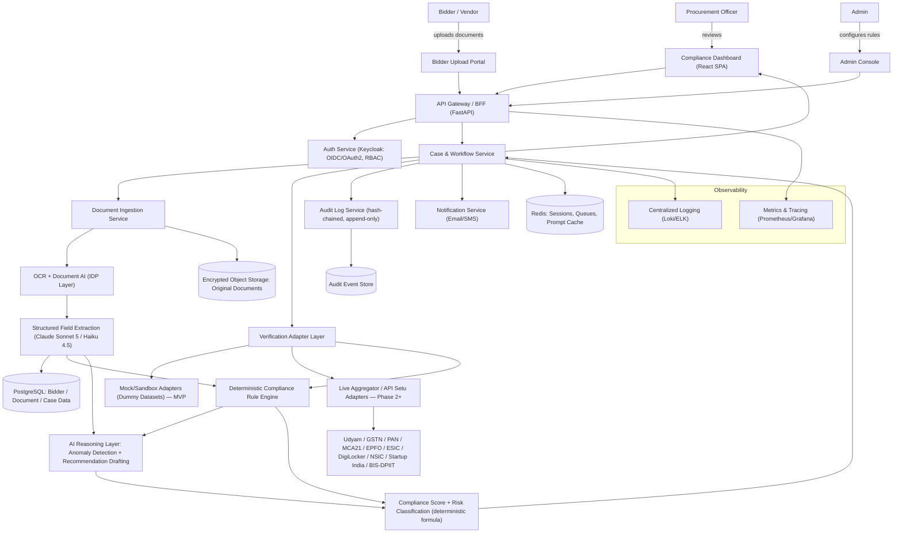
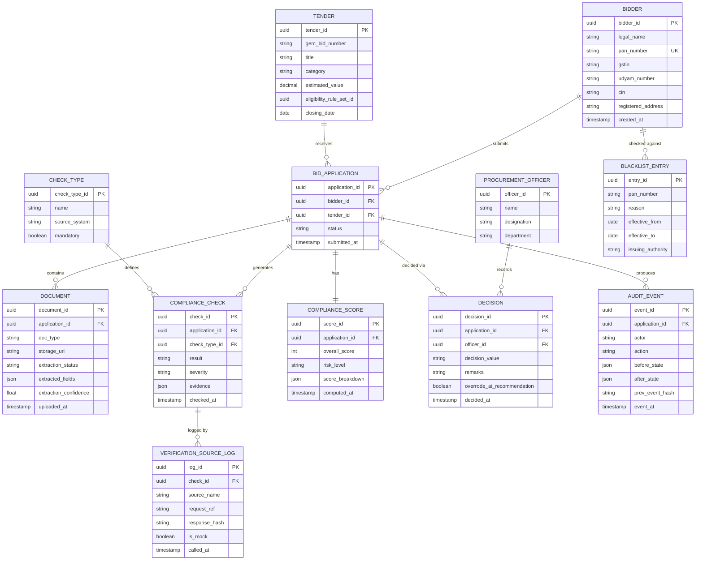
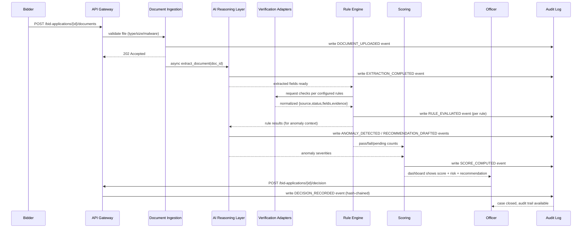
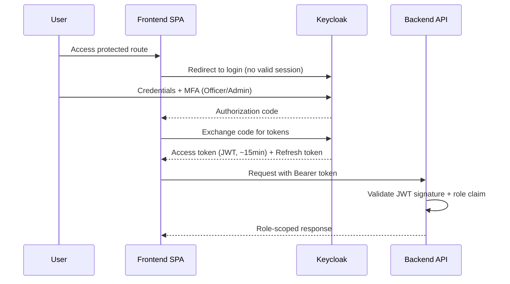

# Pramaan — Technical Requirements Document (TRD)
### AI-Powered Bid Compliance Verification Platform for GeM

---

## 1. Document Information

| Field | Value |
|---|---|
| Project Name | Pramaan |
| Document Name | Technical Requirements Document (TRD) |
| Version | 1.0 |
| Status | Draft — ready for build |
| Source PRD | Pramaan PRD v1.0 (SIH 2026, PS ID 26100) |
| Author | Engineering Team |
| Date | 2026-09-13 |
| Target Release | MVP (Hackathon Finale) → Phase 2 Pilot (CPCL) |

---

## 2. Executive Technical Summary

**In simple terms:** Pramaan takes documents a bidder uploads, reads them with AI, checks the extracted facts against a tender's eligibility rules using deterministic logic (not AI judgment), looks for things that don't add up across documents, and then shows a procurement officer one screen with a score and evidence. The officer — never the AI — presses "Qualify" or "Disqualify." Every step is written to a tamper-evident log.

**Architecture style:** Modular monolith for MVP/pilot (explicitly *not* microservices — see §6). Internally organized into clearly separated modules (Case/Workflow, Document Ingestion, Verification Adapters, Rule Engine, AI Reasoning, Audit) that communicate through in-process interfaces during MVP and can be split into services later without a rewrite, because each module already has an explicit contract.

**Major technologies:** React + TypeScript (frontend), Python/FastAPI (backend), PostgreSQL + pgvector (database), Redis (cache/queues), Keycloak (auth), S3-compatible object storage, Claude Sonnet 5 / Claude Haiku 4.5 (AI layer), Tesseract → cloud Document AI (OCR).

**Main components:** API Gateway/BFF → Case & Workflow Service → {Document Ingestion Service, Verification Adapter Layer, Deterministic Rule Engine, AI Reasoning Layer} → Compliance Scoring → Audit Log Service (hash-chained, append-only).

**AI components:** Bounded to three tasks only — document field extraction, cross-document anomaly detection, and recommendation drafting. AI never evaluates eligibility, never computes the score, and never changes case status. This is enforced in code, not just policy (§13).

**Database:** PostgreSQL as system of record for all structured data; pgvector extension for the small amount of embedding use (tender-clause reference text); S3-compatible object storage for binary documents, kept out of the relational database entirely; a dedicated append-only audit event table that is architecturally distinct from operational tables.

**Infrastructure:** Docker Compose for local dev; containers on a free-tier host for the hackathon demo; MeitY/GI Cloud (MeghRaj)-empanelled cloud (AWS Mumbai/Hyderabad, Azure, or GCP) for any real CPCL pilot, because the system will handle PAN/GST/EPFO-linked personal data.

**Deployment approach:** Four environments — Development → Testing → Staging → Production — with CI/CD via GitHub Actions, versioned reversible database migrations (Alembic), and a mock-only Verification Adapter Layer for MVP that becomes a live-adapter swap (config change, not code change) in Phase 2.

**Major technical risks:**
1. Live government/aggregator API access is a legal/procurement dependency, not an engineering one — mitigated by never letting MVP value depend on it.
2. AI hallucination in a legally consequential process — mitigated by mandatory evidence citation, schema validation, and a hard architectural rule that the deterministic engine always outranks AI output.
3. Cross-border data transfer of PAN/GST-linked PII to a third-party LLM API — a go/no-go gate for Phase 2, addressed via field-level minimization and tokenization (§13.6).

---

## 3. Requirement Traceability

| PRD Requirement | Technical Requirement | Component | Priority | Status |
|---|---|---|---|---|
| F1 — Document Upload & Case Intake | FR-001, API-001, DB-001, SEC-001 | Document Ingestion Service | P0 | Planned |
| F2 — AI Document Extraction | FR-002, AI-001, API-002 | AI Reasoning Layer (Extraction) | P0 | Planned |
| F3 — Verification Adapter Layer | FR-003, API-003, DB-002 | Verification Adapter Layer | P0 (interface) / P1-P2 (live sources) | Planned |
| F4 — Deterministic Rule Engine | FR-004, DB-003 | Rule Engine | P0 | Planned |
| F5 — AI Anomaly Detection | FR-005, AI-002 | AI Reasoning Layer (Anomaly) | P0 | Planned |
| F6 — Compliance Scoring | FR-006, DB-004 | Scoring Service | P0 | Planned |
| F7 — AI Recommendation Engine | FR-007, AI-003 | AI Reasoning Layer (Recommendation) | P0 | Planned |
| F8 — Blacklist/Debarment Check | FR-008, DB-005 | Blacklist Registry Service | P0 | Planned |
| F9 — Compliance Dashboard | FR-009, API-004 | Frontend — Officer Dashboard | P0 | Planned |
| F10 — Officer Decision Workflow | FR-010, API-005, SEC-002 | Case & Workflow Service | P0 | Planned |
| F11 — Immutable Audit Trail | FR-011, SEC-003, DB-006 | Audit Log Service | P0 | Planned |
| F12 — Tender Rule Configuration | FR-012, API-006 | Admin Console + Rule Engine | P1 | Planned |
| F13 — Notification & Reminders | FR-013 | Notification Service | P1 | Planned |
| F14 — Bulk Comparison View | FR-014 | Frontend | P1 | Planned |
| F15 — Analytics/MIS Reporting | FR-015, API-007 | Analytics Service | P1 | Planned |
| F16 — RBAC | FR-016, SEC-004 | Auth Service (Keycloak) | P1 | Planned |
| F17 — DigiLocker Live Fetch | FR-017 | Verification Adapter (Live) | P2 | Deferred (Phase 2+) |
| F18 — Explainability View | FR-018, API-008 | Frontend | P1 | Planned |
| F19 — Multilingual UI | FR-019 | Frontend i18n | P2 | Deferred |
| F20 — Field/Mobile Officer View | FR-020 | Frontend (responsive) | P3 | Deferred |

Every P0 feature above has a corresponding component, API contract, and database entity defined in §9–§13.

---

## 4. System Scope

### In Scope (MVP)
- Full pipeline: intake → OCR/extraction → adapter cross-check (mock) → deterministic rule evaluation → AI anomaly detection → scoring → AI recommendation → officer decision → hash-chained audit log, for a single organization (CPCL).
- Admin-configurable eligibility rules per tender category.
- Mock Verification Adapters with the exact request/response contract a live adapter would use.
- Web-based Officer Dashboard, Bidder Upload Portal, and Admin Console (single React SPA, role-routed).

### Out of Scope (MVP)
- Any live call to a government/aggregator API (Udyam, GSTN, PAN, MCA21, EPFO, ESIC, DigiLocker, NSIC, Startup India, BIS-DPIIT).
- Multi-tenant / multi-CPSU support (designed for, not built for).
- Native mobile app.
- Multilingual UI beyond basic English/Hindi labels.
- Automated qualify/disqualify decisioning.

### Assumptions
- The MVP operates entirely on synthetic/dummy bidder and tender data supplied or generated for the demo.
- The eventual Phase 2 pilot will run on MeitY-empanelled cloud infrastructure; MVP does not need to satisfy that hosting constraint.
- A small number of tender categories (not the full space of GeM categories) is sufficient to demonstrate the rule engine's generality.

### Constraints
- No live government API access is obtainable within the build timeline (legal/procurement, not technical).
- Team size: 6 developers; timeline: 4 weeks pre-finale + 36-hour finale build.
- AI provider is the Anthropic API; MVP demo data must never include real PII, since Claude API data-handling terms for the demo tier are not being specially negotiated.

### Dependencies
- Anthropic Claude API (Sonnet 5, Haiku 4.5).
- Keycloak (self-hosted, OSS).
- PostgreSQL 15+, pgvector extension.
- Redis 7+.
- S3-compatible object storage (MinIO for MVP).
- Tesseract OCR (MVP); AWS Textract / Google Document AI (production candidate, Phase 2).
- GitHub Actions for CI/CD.

---

## 5. System Architecture



### Component Explanations

| Component | Responsibility | Why it exists as a separate module |
|---|---|---|
| API Gateway/BFF | Single entry point; request routing, auth token validation, rate limiting | Decouples frontend from internal service boundaries; single place to enforce cross-cutting policy |
| Case & Workflow Service | Orchestrates the pipeline stage-by-stage; owns case state machine | Central coordinator — no other component is allowed to change case status directly |
| Document Ingestion Service | File validation, virus scan, storage, triggers OCR/extraction | Isolates file-handling risk (malicious uploads) from business logic |
| Verification Adapter Layer | Normalizes calls to 10 different external sources behind one interface | **Single most important architectural decision** — MVP mock and Phase 2 live share the same contract, so swapping is a config change |
| Deterministic Rule Engine | Evaluates explicit, auditable conditions — no LLM involved | Keeps eligibility decisions explainable and legally defensible |
| AI Reasoning Layer | Extraction, anomaly detection, recommendation drafting only | Deliberately walled off from the eligibility decision itself |
| Compliance Scoring | Deterministic weighted formula over rule + anomaly results | AI never computes the number the officer relies on |
| Audit Log Service | Hash-chained, append-only record of every state change | Independent of the operational DB so tampering is structurally harder and detectable |
| Object Storage | Encrypted storage for binary documents, separate from PostgreSQL | Keeps large binaries out of the transactional DB; simplifies encryption-at-rest policy |

---

## 6. Architecture Decisions

| Decision | Selected Approach | Reason | Alternative | Trade-off |
|---|---|---|---|---|
| Overall architecture style | Modular monolith (single deployable backend, internally modularized) | Team of 6, 4-week timeline; microservices add operational overhead (service discovery, distributed tracing, network failure modes) with no payoff at this scale | Microservices per component | Slower initial development, more infra to manage, no benefit until multi-CPSU scale (§26) |
| Verification source integration | Adapter interface with mock implementations for MVP | Live integration is a legal/procurement blocker (API Setu approvals, aggregator contracts), not something buildable in the timeline | Attempt live integration for at least one source immediately | Demo/pilot initially runs on synthetic data; mitigated by pursuing one real source (PAN+GST via aggregator) as a stretch goal |
| AI's role in the pipeline | AI restricted to extraction, anomaly detection, recommendation drafting; rule engine and scoring are 100% deterministic | A government qualify/disqualify decision has legal consequences; an LLM given that authority risks silent hallucination-driven harm | Let AI directly compute pass/fail or the score | Rejected outright — this is a hard architectural rule, not a preference |
| Vector database | pgvector on the existing PostgreSQL instance | Reference text volume (tender clauses) is small; a dedicated vector DB is unjustified infra for this scale | Pinecone / Weaviate / Milvus | Loses purpose-built ANN performance features not needed at this data volume |
| Backend language/framework | Python + FastAPI | Best ecosystem for OCR/NLP/AI pipeline code; async-native; Pydantic gives strict schema validation, which the rule engine and AI-output validation both depend on | Node.js/NestJS, Java/Spring Boot | Slightly weaker raw throughput per instance than compiled-language alternatives; irrelevant at pilot scale |
| Auth provider | Keycloak (self-hosted OIDC/OAuth2) | Open-source, no per-user licensing, self-hostable on empanelled cloud, supports future govt SSO federation | Auth0, AWS Cognito | Team must self-manage upgrades/patching vs. a managed SaaS |
| Object storage | S3-compatible (MinIO for MVP; empanelled cloud object storage for pilot) | Keeps large binaries out of the DB; native encryption-at-rest support; portable across cloud providers | Local filesystem | Local filesystem rejected outright beyond demo — not durable or portable |
| OCR/Document AI | Tesseract (MVP) → cloud Document AI (pilot) | Tesseract is free and adequate for clean dummy documents; production needs to handle real scan-quality variance that Tesseract handles poorly | AWS Textract, Google Document AI, Azure Form Recognizer from day one | Cloud Document AI costs money and adds a vendor dependency — deferred until real documents make it necessary |
| LLM provider | Claude Sonnet 5 (reasoning tasks), Claude Haiku 4.5 (cheap first-pass extraction) | Strong structured-output reliability, needed for the mandatory evidence-citation constraint; Haiku offers a cost-effective triage tier | GPT-4-class models, open-weight VLMs (Qwen-VL) | The AI Reasoning Layer sits behind a single internal interface specifically so this choice can change later without touching the rule engine or UI |
| CI/CD orchestration | Docker + GitHub Actions (MVP) → Kubernetes only at genuine multi-tenant scale | Simple, free, well-documented for a small team | Kubernetes from day one | Kubernetes deferred deliberately — no multi-service scaling need yet exists to justify its operational cost |

---

## 7. Technology Stack

### Frontend
- **Framework:** React 18 + TypeScript
- **UI library:** Tailwind CSS + a component primitive set (Radix UI) for accessible dashboard controls
- **State management:** React Query (server state/caching) + lightweight Zustand store (UI-local state) — avoids Redux boilerplate for a dashboard-class app
- **Form validation:** React Hook Form + Zod schemas (mirrors backend Pydantic schemas conceptually, reducing drift)
- **API client:** typed fetch wrapper generated from the backend's OpenAPI spec
- **Build system:** Vite

### Backend
- **Framework:** FastAPI (Python 3.11+)
- **API architecture:** REST, versioned under `/api/v1/`, OpenAPI-documented
- **Authentication:** OIDC token validation middleware (Keycloak-issued JWTs)
- **Validation:** Pydantic v2 models for every request/response and every AI-output schema
- **Background jobs:** Celery workers backed by Redis, for async OCR/extraction/adapter calls

### Database
- **Database:** PostgreSQL 15+
- **Extensions:** pgvector (embeddings for tender-clause reference text)
- **ORM:** SQLAlchemy 2.0 (async)
- **Migration system:** Alembic, every migration paired with a tested rollback
- **Indexing:** B-tree on all foreign keys and lookup columns (§12); GIN index on JSONB `extracted_fields` for admin search

### AI/ML
- **Model (reasoning/extraction):** Claude Sonnet 5 (Anthropic API)
- **Model (cheap first pass):** Claude Haiku 4.5, escalating to Sonnet 5 on low confidence
- **SDK:** Anthropic Python SDK, wrapped in an internal `LLMClient` interface (single point of provider substitution)
- **Embedding model:** open embedding model (e.g., a sentence-transformer) for tender-clause text, stored via pgvector
- **Vector database:** pgvector (no dedicated vector DB — see §6)
- **AI orchestration:** a fixed-order internal pipeline (not an autonomous agent) — intake → extract → adapter-check → rule-evaluate → anomaly-detect → score → recommend

### Infrastructure
- **Cloud provider (pilot):** MeitY/GI Cloud (MeghRaj)-empanelled — AWS Mumbai/Hyderabad, Azure, or GCP
- **Hosting (MVP/demo):** any free-tier host (Render/Railway) — no real PII involved
- **Containers:** Docker; Docker Compose for local/dev; single-node container orchestration for pilot (Kubernetes deferred, §6)
- **CI/CD:** GitHub Actions
- **Monitoring:** Prometheus + Grafana; structured JSON logs shipped to Loki/ELK

### Development Tools
- **VCS:** Git + GitHub, trunk-based with short-lived feature branches
- **Code quality:** ruff + mypy (Python), ESLint + Prettier (TypeScript)
- **Testing:** pytest, Playwright, k6 (see §24)
- **Documentation:** OpenAPI (auto-generated), ADRs (architecture decision records) for each major choice in §6

---

## 8. Frontend Technical Requirements

### Application Structure
Single React SPA, role-based routing (Officer / Bidder / Admin / Vigilance-read-only), resolved from the Keycloak JWT's role claim at login.

### Pages (per PRD §14)
- `/login` — SSO redirect
- `/dashboard` — Officer Dashboard (tender selector, case table)
- `/cases/:id` — Bid Application Detail (document viewer, per-check list, AI recommendation panel, decision panel)
- `/cases/:id/explain` — Explainability View
- `/upload/:tenderId` — Bidder Upload Portal
- `/admin/rules/:tenderId` — Tender Rule Configuration
- `/audit/:caseId` — Audit Trail Viewer
- `/analytics` — MIS Reporting
- `/notifications` — Notification Center

### State Management
- Server state (cases, documents, scores) via React Query with a 30s stale-time on dashboard list, immediate invalidation on any mutating action (upload, decision).
- No case data cached in localStorage/sessionStorage — refetched from API on load, since case data is sensitive and must always reflect the audited source of truth.

### API Communication
- All calls go through a typed client generated from the OpenAPI schema (§7); every mutating call requires a CSRF token header in addition to the bearer token.

### Form Handling & Validation
- Rule Configuration form and Decision form both validate client-side (Zod) before submit, but the backend re-validates identically — client validation is a UX convenience, never a trust boundary.

### Authentication Flow
1. User hits any protected route → redirected to Keycloak login if no valid session.
2. Keycloak issues an access token (short-lived, ~15 min) + refresh token.
3. Frontend silently refreshes via the OIDC library before expiry.
4. Role claim in the JWT determines which routes/components render.

### Error/Loading/Empty States
Every data-bearing screen implements all four states explicitly (loading skeleton, empty-with-next-action, explicit error — never silent retry-to-pass, success confirmation), per PRD §14.

### Accessibility
WCAG 2.1 AA / GIGW-aligned: risk levels shown as icon + text label (never color alone), full keyboard navigation, screen-reader labels, English + Hindi minimum label set.

### Browser Compatibility
Evergreen browsers only (Chrome, Edge, Firefox) — no legacy IE support required for an internal government tool.

### Suggested Folder Structure
```text
src/
├── components/       # shared UI primitives (Badge, ScoreGauge, RiskChip)
├── pages/            # one folder per route above
├── layouts/          # OfficerLayout, AdminLayout, BidderLayout
├── hooks/            # useCase, useTenderRules, useAuditTrail
├── services/         # typed API client wrappers
├── api/              # generated OpenAPI client
├── utils/            # formatters, permission checks
├── types/            # shared TS types mirroring backend Pydantic schemas
├── store/            # Zustand slices (UI-local state only)
└── assets/
```

---

## 9. Backend Technical Requirements

### Backend Architecture
Modular monolith with the following internal modules, each with an explicit Python package boundary and no cross-module DB access except through its own repository layer:

```text
case_workflow/       # orchestrates pipeline, owns case state machine
document_ingestion/  # upload handling, virus scan, OCR trigger
verification_adapters/ # adapter interface + mock/live implementations
rule_engine/          # deterministic rule evaluation
ai_reasoning/          # extraction, anomaly detection, recommendation (LLM calls)
scoring/              # deterministic scoring formula
audit/                # hash-chained audit event writer
notifications/
analytics/
```

### Request Flow Through the Backend
1. API Gateway validates JWT, extracts role and identity.
2. Request routed to the relevant module's controller.
3. Controller invokes a service method (business logic), never touches the DB directly.
4. Service calls its repository for persistence, and — where the action changes case state — calls the Audit module synchronously in the same transaction (§13.5 failure condition: no state change is allowed to commit without a corresponding audit event).
5. Response serialized via Pydantic model, returned through the Gateway.

### Backend Folder Structure
```text
src/
├── controllers/    # FastAPI routers, one per resource
├── routes/         # route registration
├── services/       # business logic (case orchestration, scoring, rules)
├── repositories/   # SQLAlchemy data access, one per aggregate
├── models/         # SQLAlchemy ORM models
├── middleware/      # auth, rate limiting, request logging
├── validators/      # Pydantic schemas (request/response/AI-output)
├── utils/
├── config/
└── jobs/            # Celery tasks (extraction, adapter calls)
```

### Case State Machine
```text
Intake Pending → Intake Complete → Extraction In Progress → Verification In Progress
→ Rules Evaluated → Scored → Awaiting Officer Decision → Closed (Qualified/Disqualified/More-Info-Requested)
```
Every transition is (a) triggered only by the Case & Workflow Service, (b) written to the audit log in the same DB transaction, (c) never skippable — e.g., "Closed" is unreachable without a `Decision` record existing (enforced by a DB foreign-key-backed check, not just application logic).

### Background Jobs
- `extract_document(document_id)` — OCR + LLM extraction, Celery task, retried up to 2x with backoff, then falls back to "manual entry required."
- `run_verification(application_id)` — fan-out to all applicable adapters in parallel, each with its own timeout.
- `run_rule_engine(application_id)` — synchronous once extraction + verification are complete.
- `run_ai_reasoning(application_id)` — anomaly detection + recommendation, after rule engine.
- `send_notification(user_id, template, payload)` — async email/SMS.

---

## 10. API Specification

Base path: `/api/v1/`. All endpoints require a bearer JWT except where noted; all mutating endpoints additionally require a CSRF token header. Standard error envelope defined in §17.

| API ID | Method | Endpoint | Purpose | Auth |
|---|---|---|---|---|
| API-001 | POST | `/bid-applications` | Create a case for bidder+tender | Officer/System |
| API-001b | GET | `/bid-applications/{id}` | Full case detail (score + checks) | Officer |
| API-001c | POST | `/bid-applications/{id}/documents` | Upload a document against a case | Bidder/Officer |
| API-002 | POST | `/documents/{id}/extract` | Trigger async AI extraction | System |
| API-003 | POST | `/bid-applications/{id}/verify` | Trigger verification-adapter run | System/Officer |
| API-004 | GET | `/bid-applications/{id}/compliance-score` | Current score + breakdown | Officer |
| API-005 | POST | `/bid-applications/{id}/decision` | Officer records decision | Officer |
| API-006 | GET / POST | `/tenders/{id}/eligibility-rules` | Fetch / configure rule set | Officer,Admin / Admin |
| API-007 | GET | `/audit/{application_id}` | Full audit trail for a case | Officer/Vigilance |
| API-008 | GET | `/blacklist/check?pan={pan}` | Blacklist/debarment lookup | System/Officer |

### API-001 — Create Bid Application
```text
POST /api/v1/bid-applications

Request:
{
  "tender_id": "uuid",
  "bidder_id": "uuid"
}

Validation:
- tender_id must reference an existing, open tender
- bidder_id must reference an existing bidder
- (tender_id, bidder_id) must not already have a non-closed application (409 on duplicate)

Response 201:
{
  "success": true,
  "application_id": "uuid",
  "status": "intake_pending"
}
```

### API-002 — Trigger Extraction
```text
POST /api/v1/documents/{id}/extract

Response 202 (async):
{
  "success": true,
  "job_id": "uuid",
  "status": "extraction_queued"
}

Errors:
- 404 DOCUMENT_NOT_FOUND
- 409 EXTRACTION_ALREADY_IN_PROGRESS
```

### API-005 — Officer Decision
```text
POST /api/v1/bid-applications/{id}/decision

Request:
{
  "decision_value": "qualify | disqualify | request_more_info",
  "remarks": "string (required if overrode_ai_recommendation OR decision_value=disqualify)",
  "overrode_ai_recommendation": true
}

Validation rules:
- remarks is mandatory when overrode_ai_recommendation = true
- application must be in status "awaiting_officer_decision"
- officer must hold role "officer" and be assigned to the tender's evaluation panel

Response 200:
{ "success": true, "decision_id": "uuid", "case_status": "closed" }
```

### API-006 — Configure Eligibility Rules (Admin)
```text
POST /api/v1/tenders/{id}/eligibility-rules

Request:
{
  "rules": [
    {
      "check_type": "udyam_category",
      "condition": "IN",
      "value": ["Micro", "Small"],
      "mandatory": true
    },
    {
      "check_type": "gstin_status",
      "condition": "EQUALS",
      "value": "Active",
      "mandatory": true
    }
  ]
}

Validation (at save-time, not runtime):
- No two rules reference the same check_type with contradictory conditions
- Every check_type referenced must exist in the CHECK_TYPE catalog
- If a required adapter for a check_type is not yet configured, the rule is saved but flagged "adapter_pending" — visible to admin, not silently accepted as fully wired
```

### Error Response (adapter unavailable — used across all pipeline stages)
```json
{
  "success": false,
  "error": {
    "code": "SOURCE_UNAVAILABLE",
    "message": "EPFO verification source did not respond within timeout.",
    "check_id": "uuid",
    "retryable": true
  }
}
```

Full OpenAPI 3.1 spec is generated automatically from FastAPI route definitions and published at `/api/v1/openapi.json`.

---

## 11. Database Design

### Entity list
Bidder, Tender, Bid Application, Document, Check Type, Compliance Check, Verification Source Log, Compliance Score, Procurement Officer, Decision, Blacklist Entry, Audit Event.



### Indexes & Constraints
- `UNIQUE INDEX` on `BIDDER.pan_number`.
- `UNIQUE INDEX` on `BID_APPLICATION(tender_id, bidder_id)` where `status != 'closed'` (prevents duplicate in-flight applications).
- `INDEX` on `COMPLIANCE_CHECK(application_id, check_type_id)`.
- `AUDIT_EVENT.prev_event_hash` chains each event to the previous event *for that application* — computed as `SHA-256(prev_event_hash || canonical_json(this_event))`, giving tamper-evidence without a blockchain.
- FK constraint: `DECISION` cannot exist without a `BID_APPLICATION`.
- FK constraint: `COMPLIANCE_SCORE` cannot exist without at least one `COMPLIANCE_CHECK` (enforced via an application-layer transaction check, since SQL cannot express "at least one related row exists before insert" declaratively).
- `GIN INDEX` on `DOCUMENT.extracted_fields` (JSONB) for admin/officer search.

### Data Lifecycle
- **Create:** `BID_APPLICATION` on intake; `DOCUMENT`/`COMPLIANCE_CHECK`/`COMPLIANCE_SCORE` created as the pipeline runs.
- **Update:** A resubmitted document creates a **new** `DOCUMENT` row (versioned); the old row is retained, never overwritten, and only the latest version feeds the rule engine.
- **Delete:** No hard deletes while a case is active or within the statutory retention window. DPDPA erasure requests are routed to a reviewed exception process, not an automatic delete (§14 privacy, §12 PRD).
- **Archive:** After the tender's retention period, case data (not `AUDIT_EVENT`, which is permanent) moves to cold storage.

---

## 12. Data Flow

### Core Workflow: Input → Validation → Processing → Database → AI/API → Output



### Authentication Flow
Standard OIDC authorization-code flow via Keycloak; role claim embedded in the JWT determines RBAC scope at the API Gateway.

### AI Workflow (detail)
```text
Document → OCR (Tesseract/Document AI) → schema-constrained LLM extraction (Claude)
→ structured JSON {fields, confidence, evidence_ref} → stored on DOCUMENT row
→ consumed by Rule Engine (facts) and AI Reasoning Layer (anomaly context)
```

### File Processing Workflow
Upload → type/size check → malware scan (ClamAV) → store in encrypted object storage → enqueue extraction job → OCR → LLM extraction → confidence-gated (low confidence → manual-entry flag, never a silent guess).

### Notification Workflow
Case/document state change → Notification Service checks subscription rules (e.g., "Udyam certificate expiring in 15 days") → async email/SMS dispatch → delivery status logged.

---

## 13. AI/ML Technical Architecture

### 13.1 AI Use Cases
1. **Document field extraction** (F2) — turn scanned/photographed certificates into structured, checkable fields.
2. **Cross-document anomaly detection** (F5) — flag inconsistencies (name mismatches, expired dates, altered-looking patterns) across a bidder's document set.
3. **Recommendation drafting** (F7) — synthesize rule-engine + anomaly results into a plain-language suggested next step for the officer.

**Explicitly not used for:** eligibility evaluation (F4), score computation (F6), the qualify/disqualify decision (F10), or blacklist lookup (F8) — all four are deterministic by hard architectural rule.

### 13.2 Model Selection
| Task | Model | Why |
|---|---|---|
| High-volume, low-ambiguity extraction (e.g., a clean PAN card) | Claude Haiku 4.5 | Cheap first-pass; escalate to Sonnet only on low confidence |
| Extraction from non-standard templates, low-confidence cases | Claude Sonnet 5 | Stronger instruction-following for the "cite your evidence" constraint |
| Anomaly detection | Claude Sonnet 5 | Requires reliable structured output across multiple documents at once |
| Recommendation drafting | Claude Sonnet 5 | Needs to synthesize multiple upstream results faithfully, without inventing new checks |

Pricing (subject to change — re-verify before budgeting): Sonnet 5 $2/$10 per million input/output tokens; Haiku 4.5 $1/$5.

### 13.3 Prompt Architecture
Each extraction/anomaly call receives, assembled explicitly per call (never an open-ended chat history):
1. The specific document-type schema to extract into (Pydantic-generated JSON schema).
2. The tender's active eligibility rules (so anomaly detection knows what's relevant).
3. A strict instruction to output only fields it can point to evidence for.
4. A required citation format: `{field, value, source_document_id, bounding_box_or_page_ref}`.

### 13.4 Context Management
Context is assembled fresh per call: extracted fields + active rules + prior flags for *this case only*. No cross-case memory is persisted (§13.7).

### 13.5 RAG
Not required for the core verification flow — tender eligibility clauses are structured rules (F12), not free text needing retrieval. A small pgvector-backed RAG layer over GFR/CVC guideline text is a plausible future enhancement to help admins draft rule sets, not part of MVP.

### 13.6 AI Guardrails

**Hallucination control:**
- Mandatory evidence citation on every AI-authored claim, enforced by JSON-schema validation at the API boundary — an unattributed claim is discarded before it ever reaches the officer.
- The Rule Engine's deterministic result always wins over any AI-authored eligibility judgment; a disagreement is logged and surfaced, never silently resolved.

**Input filtering / prompt injection protection:**
- The AI Reasoning Layer only ever reasons over already-validated internal data via three internal tool calls: `get_extracted_document(doc_id)`, `get_rule_engine_result(check_id)`, `get_prior_case_notes(case_id)` — it never receives raw external API responses or unvalidated document text directly, which bounds what a prompt-injection attempt embedded in a document could achieve.
- A successful injection can at worst produce a malformed/uncited response, which is then discarded by schema validation (§13.7) — it cannot change case status.

**Output validation:**
- Every AI response must conform to a strict per-task JSON schema (Pydantic).
- Failure → one retry → fallback to `"analysis_unavailable — manual review required"`. Partially-parsed guesses never reach the officer.

**Sensitive data handling (data sovereignty):**
- LLM calls receive only the minimum fields needed for the specific task (cropped certificate region, not the full document or full bidder record).
- Where feasible, PAN/Aadhaar-linked identifiers are tokenized before leaving the system boundary and resolved back only after the response returns.
- Provider is configured for zero data retention for training purposes (Anthropic API data-handling terms, confirmed in writing before Phase 2 pilot — see §15 for the sovereignty gate).
- Every external LLM call is itself an audit event: what was sent, when, to which provider.

### 13.7 Agent Architecture & Memory
Deliberately a **bounded, fixed-order pipeline**, not a free-roaming autonomous agent:
```text
intake → extract → adapter-check → rule-evaluate → anomaly-detect → score → recommend
```
No step can be skipped or reordered by the AI itself. No memory is persisted across cases — each case's AI reasoning is scoped strictly to that case's own documents and that tender's own rules, preventing cross-bidder data leakage and avoiding an unaccountable "reputation memory" outside the audit trail.

### 13.8 Human-in-the-Loop (architectural enforcement)
There is **no code path** from an AI output directly to a `Qualified`/`Disqualified` case status. That transition requires an authenticated `POST /bid-applications/{id}/decision` call from a user holding the `officer` role (§9 state machine, §10 API-005). This is enforced by the Case & Workflow Service's state machine, not by a UI convention.

### 13.9 AI Evaluation Methodology
- **Golden test set:** dummy bidder documents with known ground-truth fields, run before every release; measures per-field precision/recall for each of the six priority certificate types.
- **Officer override tracking:** every override is logged (`DECISION.overrode_ai_recommendation`); a periodic sample review feeds prompt/rule tuning. A falling agreement rate is treated as a signal to *investigate*, not a metric to *optimize toward* directly (optimizing toward agreement risks the AI just deferring to whatever officers already do).
- **Metrics tracked:** extraction accuracy (precision/recall per field), anomaly-detection precision/recall against planted-inconsistency cases, evidence-citation completeness rate, schema-validation failure rate, AI recommendation vs. officer-decision agreement rate (tracked, not gamed), latency (p50/p95), cost per case.

### 13.10 AI Cost Optimization
- Prompt caching for the portion of the prompt that repeats across bidders on the same tender (the tender's rule set).
- Haiku 4.5 first pass, escalating to Sonnet 5 only on low confidence.
- Batching non-urgent extraction jobs.
- Hard output-token limits per call.
- Estimated ~20,000 input / ~2,000 output tokens per case → ≈$0.06/case on Sonnet 5 pricing before caching (see §27 for full breakdown; re-verify pricing before budgeting).

---

## 14. Authentication & Authorization

**Authentication = Who are you?** Handled entirely by Keycloak (OIDC/OAuth2 authorization-code flow). MFA is enforced for `officer` and `admin` roles.

**Authorization = What are you allowed to do?** Enforced at the API layer via role claims in the JWT — never trusted from the frontend alone.

### Roles
| Role | Permissions |
|---|---|
| Bidder | Upload/view own documents; view own case status post-decision |
| Officer | View assigned tenders' cases; trigger verification; record decisions; view audit trail for own cases |
| Admin | Configure tender eligibility rules; toggle mock/live adapters; manage users |
| Vigilance | Read-only access to all cases and audit trails across the organization |

### Authentication Flow


### Session Management
- Access tokens: 15-minute lifetime.
- Refresh tokens: 8-hour lifetime, rotated on use.
- Anomaly alerts on unusual access patterns (e.g., login from an unrecognized location, unusually high case-review volume) feed the security monitoring pipeline (§15).

### RBAC enforcement point
Every controller method (§9) checks the caller's role and, for officer-scoped resources, their assignment to the relevant tender's evaluation panel — enforced server-side on every request, not cached client-side.

---

## 15. Security Requirements

| Area | Requirement |
|---|---|
| Transport security | TLS 1.2+ on all traffic, internal and external |
| Password security | Delegated entirely to Keycloak's Argon2/bcrypt hashing — no custom credential storage in the application |
| API security | Short-lived signed JWTs; per-endpoint and per-user rate limiting |
| Encryption at rest | AES-256 for database and object storage; field-level encryption/tokenization for PAN and Aadhaar-linked identifiers |
| Input validation | Pydantic schema validation on every API input; file type/size checks and ClamAV malware scan on every upload, before the file reaches OCR |
| SQL injection | Parameterized queries only, enforced via SQLAlchemy ORM — no raw string-built SQL permitted in code review |
| XSS/CSRF | React's default escaping + explicit CSRF tokens on all state-changing requests; strict Content-Security-Policy headers |
| CORS | Explicit allow-list of the frontend origin only |
| Rate limiting | Per-user and per-adapter limits — both anti-abuse and to respect external aggregator/API Setu quotas once live |
| Secrets management | Cloud KMS / HashiCorp Vault — no secrets in code or config files, ever |
| Audit logging | Hash-chained, append-only `AUDIT_EVENT` records for every check, extraction, adapter call, AI output, and officer action |
| Dependency vulnerabilities | Automated dependency scanning (e.g., `pip-audit`, `npm audit`) in CI, blocking merge on high/critical findings |
| AI security | See §13.6 guardrails |

### Threat → Risk → Mitigation

| Threat | Risk | Mitigation |
|---|---|---|
| Malicious document upload (embedded exploit in a "certificate" PDF) | Malware execution, system compromise | Type allow-list, size caps, mandatory ClamAV scan before the file reaches OCR/extraction |
| Prompt injection via document text | AI Reasoning Layer manipulated into a false claim | Strict output-schema validation; AI output can never directly change case status (§13.8) |
| Insider misuse (admin quietly relaxing a rule to favor a bidder) | Corrupted eligibility outcome | Second-approver requirement for rule changes on any tender with active bid applications; every rule change logged immutably |
| Credential compromise (officer account) | Unauthorized case access/decisions | MFA, short token lifetimes, anomaly alerts on unusual access patterns |
| Data exfiltration via bulk API access | Mass PII leak | Per-user rate limiting; audit alerts on abnormal export volumes |
| Cross-border LLM data transfer | DPDPA / sovereignty violation | Field-level minimization, tokenization before external calls, written provider data-handling confirmation (§13.6) — Phase 2 go/no-go gate |

---

## 16. Non-Functional Requirements

Targets are sized to CPCL pilot scale, not an inflated hypothetical.

| Category | Target |
|---|---|
| Performance | Dashboard reads < 500ms p95; upload acknowledgment < 2s; full AI extraction + verification pipeline per bid application < 2 minutes (async, visible progress) |
| Scalability | ≥500 concurrent bid applications in flight during a peak tender-closing window; no redesign needed to add more CPSUs later (multi-tenant-ready, not multi-tenant-built for v1) |
| Availability | 99.5% during business hours for the pilot (single-organization internal tool) |
| Reliability | No case silently lost between pipeline stages; every stage transition logged; failed stages retry with backoff, then surface explicitly rather than looping silently |
| Security | Per §15 |
| Maintainability | Rule configuration changes require no code deployment; each Verification Adapter independently swappable (mock → live) without touching the rule engine or UI |
| Accessibility | WCAG 2.1 AA / GIGW-aligned for all officer- and bidder-facing screens |
| Observability | Every pipeline stage emits structured logs and metrics; dashboards for extraction success rate, adapter availability, officer override rate |
| Compatibility | Modern evergreen browsers; no OS dependency for officer/admin use |

---

## 17. Error Handling

### Standard Error Response
```json
{
  "success": false,
  "error": {
    "code": "INVALID_INPUT",
    "message": "Invalid email address"
  }
}
```

### Error Categories & Handling

| Category | Code example | Handling |
|---|---|---|
| Validation errors | `INVALID_INPUT` | 400, field-level detail returned |
| Authentication errors | `UNAUTHENTICATED` | 401, standard OIDC error flow, no partial session created |
| Authorization errors | `FORBIDDEN` | 403, logged as a security event (e.g., bidder viewing another bidder's case) |
| Not found | `NOT_FOUND` | 404 |
| Conflict | `DUPLICATE_APPLICATION`, `DECISION_ALREADY_RECORDED` | 409 |
| Rate limit | `RATE_LIMITED` | 429, retry-after header |
| Server errors | `INTERNAL_ERROR` | 500, logged with correlation ID, generic message to client |
| External API failures | `SOURCE_UNAVAILABLE` | Check marked "Pending," automatic retry with backoff, never defaults to pass/fail |
| AI failures | `EXTRACTION_FAILED`, `ANALYSIS_UNAVAILABLE` | Falls back to manual-entry/manual-review flag, never a partial guess |
| Database failures | `TRANSACTION_FAILED` | Transaction rolled back; case stage does not advance until a consistent write succeeds |
| Network failures | `NETWORK_ERROR` | Async job pattern with polling; officer UI never blocks |

---

## 18. Logging & Monitoring

### Log Categories
- **Application logs** — structured JSON, PII-redacted by default.
- **API logs** — request/response metadata (not full payloads for sensitive endpoints), latency, status code.
- **Security logs** — auth failures, RBAC denials, anomaly-detected access patterns.
- **AI logs** — every LLM call: prompt template used (not full content if sensitive), token counts, latency, cost, confidence score, schema-validation outcome.
- **Database logs** — slow query log, connection pool saturation.

### What must never be logged
Full PAN/Aadhaar/GST numbers, raw document content, or full LLM prompts/responses in general application logs — full values exist only in the access-controlled audit store, never in general-purpose logs.

### Log Levels & Retention
- DEBUG (dev only) / INFO / WARN / ERROR / SECURITY (always captured regardless of level threshold).
- Application logs: 90-day retention. Audit events: permanent (append-only store, separate from log retention policy).

### Key Metrics
Request latency (p50/p95/p99) per endpoint; error rate per pipeline stage; CPU/memory per service; database query performance; API usage per role; AI token usage and cost per case; queue length (Celery); extraction success rate; adapter availability per source; officer override rate.

### Alerting
Alert on: adapter source down > 5 minutes; extraction failure rate > 10% in a rolling window; audit hash-chain break (P0, page immediately); queue backlog beyond SLA threshold; unusual access pattern flagged by security monitoring.

---

## 19. Caching & Performance Optimization

| What's cached | Technology | TTL | Invalidation |
|---|---|---|---|
| Session/auth state | Redis | Token lifetime | On logout/refresh |
| Tender rule set (used repeatedly across many bidders on the same tender) | Redis | 15 min | On admin rule save |
| LLM prompt-cache bookkeeping (the tender rule-set portion of prompts) | Anthropic prompt caching + Redis reference | Per Anthropic cache TTL | On rule change |
| Dashboard case list | React Query (client) | 30s stale-time | On any mutating action |

Additional optimizations: database indexing (§11), pagination on all list endpoints (case list, audit trail), lazy loading of document images in the evidence viewer, gzip/br compression at the gateway, no CDN needed at pilot scale (internal tool, not public-facing static assets beyond the SPA bundle itself, which is served compressed).

Caching is deliberately **not** introduced for compliance-check results themselves — a stale pass/fail on a legally consequential check is worse than the latency of recomputing it.

---

## 20. File & Media Handling

| Requirement | Specification |
|---|---|
| Accepted formats | PDF, JPEG, PNG |
| Maximum size | 10 MB per file |
| Upload mechanism | Direct-to-backend multipart upload (MVP); pre-signed URL to object storage (pilot, to offload bandwidth from the API tier) |
| Storage | S3-compatible object storage, encrypted at rest, randomized non-guessable object keys |
| Validation | MIME-type check + magic-byte verification (not just file extension) |
| Malware scanning | ClamAV scan before the file is queued for OCR |
| Processing pipeline | Upload → validate → scan → store → enqueue OCR/extraction |
| Access control | Signed, time-limited URLs for document viewing; RBAC-scoped to the case the document belongs to |
| Download mechanism | Officer/Vigilance can download original documents from the evidence viewer via signed URL |
| Retention | Per statutory retention window (§11 archive policy); prior versions retained, never overwritten |
| Deletion | No hard delete while a case is active; DPDPA erasure requests go through a reviewed exception process |

---

## 21. Third-Party Integrations

| Service | Purpose | API | Authentication | Failure Handling | Cost |
|---|---|---|---|---|---|
| Claude API (Anthropic) | Document extraction, anomaly detection, recommendation drafting | Anthropic Messages API | API key (Vault-managed) | Retry once → fallback to manual-review flag | Usage-based, ~$0.06/case estimated (§13.10, §27) |
| Keycloak | Auth/SSO/RBAC | OIDC/OAuth2 | Self-hosted, no external dependency | N/A (self-hosted, covered by own uptime SLO) | Free (OSS) |
| KYC/KYB Aggregator (Phase 2: Setu/Decentro/Karza) | Live PAN/GST/Udyam/MCA21 verification | Vendor REST API | Vendor API key | Adapter marked "source unavailable," never silent pass | Usage-based, per-check (Phase 2 only) |
| API Setu (Phase 2/3, harder sources) | EPFO/ESIC/DigiLocker/NSIC/Startup India verification | MeitY API Setu | Government-approved credentials | Same adapter pattern | Per approval terms |
| Email/SMS provider | Notifications (F13) | Provider REST API | API key | Retry with backoff, log delivery failure | Usage-based |

Only integrations with a clear, currently-necessary purpose are included — this table deliberately excludes anything not required for MVP or the immediate Phase 2 step.

---

## 22. Infrastructure

### Environments

| Environment | Purpose | Data |
|---|---|---|
| Development | Local Docker Compose | Synthetic/dummy |
| Testing | Shared containerized environment, CI-deployed | Seeded dummy data |
| Staging | Mirrors production configuration | Dummy/synthetic |
| Production | Real CPCL pilot | Real bidder data (Phase 2+) |

### Hosting
- **MVP/demo:** any free-tier host (Render/Railway/student VM) — no real PII involved.
- **Real pilot:** MeitY/GI Cloud (MeghRaj)-empanelled provider (AWS Mumbai/Hyderabad, Azure, or GCP) — a hosting *requirement*, not a preference, given PAN/GST/EPFO-linked data sensitivity.

### Infrastructure elements
- Frontend hosting: static SPA build served via CDN-fronted object storage or the same container host.
- Backend hosting: containerized FastAPI + Celery workers.
- Database hosting: managed PostgreSQL where available on the empanelled cloud, else self-managed with automated backups.
- Storage: S3-compatible bucket, versioning enabled.
- DNS/SSL: managed via the cloud provider; TLS certs auto-renewed (Let's Encrypt or cloud-native cert manager).
- Secrets: cloud KMS / HashiCorp Vault.
- Environment variables: per-environment, never committed to source control.
- Monitoring: Prometheus + Grafana from Staging onward.
- Backups: daily automated DB backups with a tested restore procedure; object storage versioning as a secondary safety net.

---

## 23. DevOps & CI/CD

```text
Developer
↓
Git (feature branch)
↓
Pull Request
↓
Automated Tests (pytest, Playwright)
↓
Linting (ruff, mypy, ESLint)
↓
Build (Docker images)
↓
Security Scan (dependency audit, container scan)
↓
Deploy to Testing (auto, on merge to main)
↓
Manual promotion gate
↓
Staging
↓
Approval
↓
Production
```

- **Branching strategy:** trunk-based, short-lived feature branches, PR review required before merge.
- **Code review:** minimum one approving review; CI must pass before merge is allowed.
- **Deployment:** every deploy tagged with a semantic version and git SHA; one-command revert to the previous tag.
- **Rollback:** database migrations (Alembic) written to be reversible where feasible; a documented manual procedure exists where a migration is genuinely one-way.
- **Versioning:** API versioned under `/api/v1/`; breaking changes require a new version path, not an in-place change.

---

## 24. Testing Strategy

| Test type | Coverage |
|---|---|
| Unit tests | Rule engine logic (every condition/threshold path), scoring formula, adapter response normalization |
| Integration tests | Full pipeline stage-to-stage (intake → extraction → adapter → rule engine → scoring → recommendation) against seeded dummy data |
| API tests | Every endpoint in §10 — success paths, auth failures, malformed input, adapter-unavailable scenarios |
| Database tests | Migration up/down correctness, constraint enforcement (unique PAN, FK chains) |
| UI tests | Dashboard rendering across loading/empty/error/success states; accessibility checks (keyboard nav, screen-reader labels) |
| End-to-end tests | Full Flow A (PRD §8) via Playwright, including the planted-inconsistency case |
| Security tests | Upload validation (malicious file types), auth/RBAC boundary tests, dependency vulnerability scanning |
| Performance tests | k6 load test simulating a tender-closing spike, per §16 targets |
| AI evaluation | Golden dummy-document test set — extraction precision/recall per field per doc type; schema-validation failure rate; anomaly-detection precision/recall against planted-inconsistency cases; evidence-citation completeness |

### Critical Test Cases

| Test ID | Scenario | Input | Expected Result | Priority |
|---|---|---|---|---|
| TC-001 | All documents valid & consistent | Clean dummy bidder | High score, low risk, "Recommend: Qualify" | P0 |
| TC-002 | Expired Udyam certificate | Dummy bidder with expired cert | Flagged, "Recommend: Request clarification," never silently passed | P0 |
| TC-003 | Name mismatch PAN vs. GST | Planted inconsistency dataset | F5 catches it with a cited comparison | P0 |
| TC-004 | Blacklisted bidder | PAN present in blacklist registry | High-severity flag; never auto-disqualified | P0 |
| TC-005 | Adapter source unreachable | Simulated timeout on EPFO adapter | "Pending — source unreachable," not a false pass | P0 |
| TC-006 | Officer overrides AI recommendation | Officer selects Disqualify against "Qualify" recommendation | Mandatory remarks captured, logged as override | P0 |
| TC-007 | AI output fails schema validation | Malformed/injected LLM response | Discarded, retried once, then "manual review required" | P0 |
| TC-008 | Duplicate document resubmission | Same doc_type uploaded twice | New version created, old retained, latest used for evaluation | P1 |
| TC-009 | Audit hash-chain integrity | Full case lifecycle | Every event correctly chained; tamper simulation correctly detected | P0 |

---

## 25. Edge Cases

| Scenario | Expected System Behavior |
|---|---|
| Empty/missing mandatory document | Case proceeds to intake but flagged "Incomplete"; officer sees the exact gap |
| Invalid/corrupted upload | Rejected at upload with a clear reason; no partial extraction attempted |
| Duplicate submission | Latest version supersedes for evaluation; prior versions retained for audit |
| Concurrent requests (two officers acting on the same case) | Optimistic locking on `BID_APPLICATION.status`; second writer gets a 409 conflict |
| Adapter timeout | Marked "Pending — source unreachable"; automatic retry with backoff; never defaults to pass/fail |
| Database outage mid-pipeline | Transaction rolled back; case stage does not advance until a consistent write succeeds |
| AI outage/timeout | Falls back to "analysis unavailable — manual review required" |
| Network interruption | Async job pattern with polling; officer UI never blocks |
| Large payload | Rejected at the 10MB cap with a clear message |
| Malicious input (e.g., embedded exploit) | Blocked by malware scan before reaching OCR |
| Unauthorized request | 403, logged as a security event |
| Expired session | Standard OIDC re-auth flow, no partial state created |
| Third-party service unavailable (Phase 2 live adapters) | Same "Pending" pattern as mock-phase timeout handling |
| Corrupted/tampered audit record (hash-chain break) | System refuses to treat the chain as valid past that point; raises a high-severity security alert — must never occur in normal operation |
| Bidder resubmits after officer decision already recorded | Blocked by default; requires explicit case-reopen by an authorized officer, itself logged |

---

## 26. Scalability

| Stage | Scale | Architectural Implication |
|---|---|---|
| Prototype | ~100 users (hackathon demo) | Single container, SQLite-compatible-but-actually-Postgres for realism, mock adapters only |
| Small Production | ~1,000 users (CPCL pilot) | Modular monolith on a small managed-Postgres instance; Celery workers scaled to 2-3; still single-tenant |
| Medium Scale | 10,000+ users (multiple CPSUs) | Introduce multi-tenancy (tenant-isolated tender/rule/case data) at the database layer; horizontal scaling of the API tier and Celery workers; consider splitting the AI Reasoning Layer into its own service if LLM call volume becomes a bottleneck |
| Large Scale | 100,000+ users (MoPNG-wide rollout) | Reassess modular monolith vs. selective service extraction (Verification Adapter Layer and AI Reasoning Layer are the two components most likely to justify becoming independent services first, since they have the most distinct scaling and failure profiles); dedicated vector DB may become justified if RAG usage grows; Kubernetes becomes justified here, not before |

**Explicit recommendation:** stay a modular monolith through the pilot and initial multi-CPSU phase. Premature microservices would slow the 6-person team down for no benefit at CPCL's actual volume. Split out services only when a specific component's load or failure profile genuinely diverges from the rest — the Verification Adapter Layer (once live, high-volume, and third-party-rate-limited) is the most likely first candidate.

---

## 27. Cost & Resource Estimation

*Figures are engineering estimates; usage-based items should be re-verified against current pricing before committing a real budget.*

| Item | Free/Student MVP | Low-Cost Production (CPCL pilot, ~1,000 applications/month) | Scaled (multi-CPSU) |
|---|---|---|---|
| Compute/hosting | Free tier | ~₹15,000–40,000/month, small empanelled-cloud instance | Scales with tenant count |
| Database | Free tier (Supabase/Neon/self-hosted) | Managed Postgres, small instance, ~₹5,000–10,000/month | Scales with data volume |
| Object storage | Free tier / self-hosted MinIO | Usage-based, low (small PDFs/images), ~few thousand ₹/month | Scales with document volume |
| AI/LLM API | Low hundreds of ₹ for demo testing | ≈$60/month at 1,000 cases/month (≈$0.06/case, Sonnet 5) before caching savings | Scales linearly; caching + Haiku triage mitigate |
| KYC/KYB aggregator (Phase 2) | N/A (mock only) | Usage-based per check, a few ₹ each — needs current vendor quote | Scales with case × source-check volume |
| Domain/SSL | Free (Let's Encrypt) | ~₹1,000–2,000/year | Same |
| Monitoring | Free (self-hosted) | Free (self-hosted) or low-cost managed log storage | Scales with log volume |
| **Approximate total** | Near-zero (<₹10,000 full hackathon cycle) | ~₹40,000–80,000/month, dominated by hosting not AI | Fresh estimate once tenant count is known |

**Key takeaway for planning:** hosting is the larger recurring cost at pilot scale, not AI — the "AI-powered" framing should not be assumed to imply an expensive AI bill.

---

## 28. Technical Risks

| Risk | Probability | Impact | Severity | Mitigation |
|---|---|---|---|---|
| Live government/aggregator API access delayed (legal/procurement) | High | High | High | MVP never depends on it (mock adapters); pursue one real integration in parallel as a stretch goal |
| AI hallucination in extraction/anomaly detection | Medium | High | High | Mandatory evidence citation, schema validation, deterministic engine always wins over AI |
| Officer automation bias (over-relying on AI recommendation) | Medium | Medium-High | Medium | "AI-drafted, review required" kept prominent in UI; officer agreement rates tracked and periodically reviewed; UAT probes for this behavior |
| Wrongful disqualification → legal challenge | Low-Medium | High | High | Human-in-the-loop architecturally enforced, not just a UI label; full evidence-linked audit trail; legal/vigilance sign-off before real deployment |
| Real-world scan quality degrades extraction accuracy vs. clean demo data | Medium | Medium | Medium | Document-quality check at upload with re-upload prompts; low-confidence extraction escalates to manual entry, never a silent guess |
| DPDPA/data-retention compliance gaps | Medium | High (penalties up to ₹250 crore for serious non-compliance) | High | Treat DPDPA obligations as binding from day one; involve CPCL legal/compliance before handling real bidder PII |
| Aggregator/cloud cost scales unpredictably with volume | Low-Medium | Medium | Medium | Usage monitoring/alerting from day one of Phase 2; caching + cheaper-model triage |
| Low officer adoption | Medium | Medium | Medium | UAT-driven UX; position as an aid, not a mandate, initially (§36 change management) |
| Single LLM provider dependency | Low | Medium | Low-Medium | AI Reasoning Layer behind an internal interface, allowing a model/provider swap without touching the rest of the system |
| Blacklist registry staleness | Medium | Medium | Medium | Clear "last refreshed" timestamp; periodic manual/semi-automated refresh process |
| Cross-border LLM data transfer (DPDPA/sovereignty) | Medium | High | High | Field-level minimization, tokenization, written provider data-handling confirmation — Phase 2 go/no-go gate (§13.6, §15) |

---

## 29. Technical Debt

| Likely debt | Why it may occur | Acceptable for MVP? | When to fix | Impact if ignored |
|---|---|---|---|---|
| Mock-only Verification Adapters | Live integration is a legal/procurement blocker outside MVP timeline | Yes | Phase 2, prioritized by source accessibility (§21/22 PRD) | Pilot demo remains synthetic-data-only indefinitely if not addressed |
| Single-tenant data model | Multi-tenancy adds complexity not needed for one CPSU pilot | Yes | Phase 3 (multi-CPSU) | Painful migration if deferred too long past first additional CPSU |
| Tesseract OCR instead of cloud Document AI | Free and adequate for clean dummy documents | Yes, for MVP only | Before Phase 2 (real scan quality) | Extraction accuracy degrades sharply on real-world scans |
| No dedicated vector DB | Reference text volume is small | Yes | Only if RAG usage grows materially (§26) | None at current scale |
| Manual review fallback for low-confidence extraction is not yet a full reviewer queue UI | MVP focuses on the happy path demo | Yes, with the flag present | Phase 2, before real officer usage at volume | Officers hit friction on low-confidence cases without a proper queue |
| No formal STQC/CERT-In audit yet | Not required until real PII is processed | Yes | Phase 2 gate before go-live (§39) | Non-compliant production deployment if skipped |

---

## 30. Development Plan

### Phase 1 — Foundation (Pre-finale, Weeks 1-2)
| Task ID | Task | Component | Dependency | Priority | Est. Time |
|---|---|---|---|---|---|
| T1 | Finalize architecture, data model, dummy dataset design (with planted inconsistencies) | All | This TRD | P0 | 1 week |
| T2 | Repo, CI, Docker Compose dev environment | DevOps | T1 | P0 | 2 days |
| T3 | Core data model + CRUD APIs (Bidder/Tender/Application/Document) | Backend | T1 | P0 | 1 week |
| T4 | Officer Dashboard + Bidder Upload Portal UI shells | Frontend | T1 | P0 | 1 week |

### Phase 2 — Core Backend & Verification (Weeks 2-3)
| T5 | AI extraction pipeline (OCR + schema-constrained LLM extraction) | AI/ML | T3 | P0 | 1 week |
| T6 | Mock Verification Adapter Layer + Rule Engine | Backend | T3 | P0 | 1 week |

### Phase 3 — AI Reasoning & Scoring (Week 4)
| T7 | Anomaly detection, scoring, recommendation drafting | AI/ML + Backend | T5, T6 | P0 | 1 week |

### Phase 4 — Decision Workflow & Audit (Week 4)
| T8 | Decision workflow + hash-chained audit trail; wire dashboard to real pipeline | Frontend + Backend | T7 | P0 | 1 week |

### Phase 5 — Testing (ongoing + finale)
| T9 | Full test suite per §24; golden AI evaluation set | QA/AI | T8 | P0 | ongoing |

### Phase 6 — Deployment (Finale window)
| T10 | Final integration, demo rehearsal, fallback video | Full team | T9 | P0 | 36-hour window |

### Phase 7/8 — Integrations & Post-MVP (Phase 2, post-hackathon)
Live adapter integration (PAN/GST/Udyam/MCA21 first), DPDPA/legal sign-off, STQC/CERT-In audit scheduling (§39), production hosting migration (§22).

---

## 31. Team Responsibilities

Assumes a team of 6, matching PRD §24.

| Role | Responsibilities | Deliverables |
|---|---|---|
| Backend/Case & Workflow Lead | Data model, core APIs, rule engine, decision workflow, case state machine | Backend service |
| AI/ML Engineer | Extraction pipeline, anomaly detection, recommendation drafting, prompt/schema design, golden-dataset evaluation | AI Reasoning Layer |
| Frontend Lead | Officer Dashboard, Bid Application Detail, Explainability View | Officer-facing UI |
| Frontend/Bidder Experience | Bidder Upload Portal, notifications, guided checklist UX | Bidder-facing UI |
| DevOps/Platform | CI/CD, Docker, DB/object storage setup, monitoring, deployment | Infrastructure |
| Product/QA/Demo Lead | Rule configuration UI, dummy dataset design (incl. planted inconsistencies), test strategy, demo narrative | Test suite + demo plan |

---

## 32. Definition of Done

A feature is "Done" only when:
- Code is implemented and passes CI (lint, type-check, unit tests).
- Code is reviewed and approved by at least one other engineer.
- Relevant tests (unit/integration/API/E2E as applicable) pass.
- Security requirements from §15 are satisfied for the feature's surface area.
- Error handling per §17 exists for every failure mode the feature can hit.
- Documentation (OpenAPI annotations, README updates) exists.
- Monitoring/logging exists where the feature touches a pipeline stage (§18).
- Feature works end-to-end in the Testing/Staging environment, not just locally.
- Acceptance criteria (§ below, mirroring PRD §30) are satisfied.

---

## 33. Open Technical Questions

| Question | Why it matters | Options | Recommended | Decision Deadline |
|---|---|---|---|---|
| Which KYC/KYB aggregator for Phase 2 live PAN/GST checks? | Determines adapter implementation and cost structure | Setu, Decentro, Karza, Surepass, Gridlines | Setu (strong docs, government-adjacent positioning) — validate via a spike | Before Phase 2 kickoff |
| Tokenization approach for PAN/Aadhaar before LLM calls | Directly affects DPDPA compliance posture | Format-preserving encryption vs. reference-token lookup table | Reference-token lookup (simpler to implement and audit) | Before Phase 2 pilot (go/no-go gate, §13.6/§15) |
| Self-hosted vs. cloud Document AI for real scan quality | Cost vs. accuracy trade-off at pilot scale | Tesseract+tuning, AWS Textract, Google Document AI | Google/AWS Document AI, pilot-budget-dependent | Before Phase 2 |
| Exact CPCL legal/vigilance sign-off process and timeline | Blocks real-PII processing entirely until resolved | N/A — institutional process | Escalate to CPCL stakeholders now, not at pilot start | Before any real bidder data is processed |
| Multi-tenancy data isolation strategy (schema-per-tenant vs. row-level tenant_id) | Affects how costly Phase 3 migration will be | Separate schemas vs. `tenant_id` column + RLS | Row-level `tenant_id` + Postgres RLS (lower migration cost from current single-tenant model) | Before Phase 3 planning |

---

## 34. Final Technical Recommendation

1. **Is the proposed architecture appropriate?** Yes — a modular monolith with a swappable Verification Adapter Layer and a hard separation between deterministic rules and AI reasoning is well-matched to team size, timeline, and the legal sensitivity of the domain.
2. **What is unnecessarily complex?** Nothing at MVP scope; the main discipline required is *not* reaching for microservices, a dedicated vector DB, or Kubernetes before they're justified.
3. **What is missing (from a pure engineering lens)?** A concrete reviewer queue UI for low-confidence extractions (currently a flag, not a full workflow) — worth building before real officer usage at volume, even if not needed for the demo.
4. **What is the biggest technical risk?** Cross-border data transfer of PAN/GST-linked PII to the Claude API for Phase 2 — must be resolved (tokenization + written provider terms) before any real bidder data flows.
5. **What should be simplified?** Nothing further — the PRD's own corrections (mock adapters, curated blacklist registry, hypothesis-not-fact framing) already right-sized the original scope.
6. **What should be redesigned?** Nothing structurally; the adapter interface and rule/AI separation are sound foundations for Phase 2/3.
7. **What technology should be avoided?** A dedicated vector database and Kubernetes, until data volume or multi-tenant scale actually demands them (§6, §26).
8. **What should be built first?** The Verification Adapter Layer interface + mock implementations (T6) — everything else in the pipeline depends on having a stable contract to evaluate against.
9. **What can be postponed?** Live government integrations, multi-tenancy, multilingual UI, mobile view — all explicitly out of MVP scope (§4).
10. **What would prevent this system from scaling?** Treating the single-tenant assumption as permanent in the data model (e.g., hardcoding CPCL-specific IDs) — mitigated by planning the `tenant_id`-based row-level isolation approach now (§33), even though it's not built until Phase 3.

---

## 35. Final Build Blueprint

**Architecture:** Modular monolith, single-tenant for MVP/pilot, service-extraction-ready via the Verification Adapter Layer and AI Reasoning Layer interfaces.

**Frontend:** React 18 + TypeScript + Tailwind CSS, Vite build, role-routed SPA.

**Backend:** Python 3.11 + FastAPI, Celery/Redis for async jobs, SQLAlchemy 2.0 + Alembic.

**Database:** PostgreSQL 15+ with pgvector extension.

**AI:** Claude Sonnet 5 (extraction/anomaly/recommendation), Claude Haiku 4.5 (cheap first-pass extraction), Tesseract OCR (MVP) → cloud Document AI (pilot).

**Authentication:** Keycloak (OIDC/OAuth2, RBAC, MFA for Officer/Admin).

**Storage:** S3-compatible object storage (MinIO for MVP), AES-256 encryption at rest.

**Infrastructure:** Docker Compose (dev) → containers on free-tier host (demo) → MeitY/GI Cloud-empanelled provider (pilot).

**CI/CD:** GitHub Actions — lint, test, build, security scan, staged promotion to Production.

**Monitoring:** Prometheus + Grafana, structured JSON logs via Loki/ELK.

**Core APIs:** `/bid-applications`, `/documents/{id}/extract`, `/bid-applications/{id}/verify`, `/bid-applications/{id}/compliance-score`, `/bid-applications/{id}/decision`, `/tenders/{id}/eligibility-rules`, `/audit/{application_id}`, `/blacklist/check`.

**Core Database Tables:** BIDDER, TENDER, BID_APPLICATION, DOCUMENT, CHECK_TYPE, COMPLIANCE_CHECK, VERIFICATION_SOURCE_LOG, COMPLIANCE_SCORE, PROCUREMENT_OFFICER, DECISION, BLACKLIST_ENTRY, AUDIT_EVENT.

**Critical Components:** Verification Adapter Layer (mock/live swap), Deterministic Rule Engine, AI Reasoning Layer (extraction/anomaly/recommendation, walled off from decisions), Hash-Chained Audit Log Service.

**MVP Timeline:** 4 weeks pre-finale preparation + 36-hour Grand Finale build; Phase 2 real-integration pilot at 3–6 months post-hackathon.

**Team Size:** 6 developers (Backend, AI/ML, Frontend x2, DevOps, Product/QA).

**Biggest Technical Risk:** Cross-border LLM data transfer of PAN/GST-linked PII (§13.6, §15) — resolved via tokenization and written provider terms before Phase 2, and dependence on external government/aggregator API access for live integration, addressed by never letting MVP value depend on it.

**Recommended Architecture Decision:** Modular monolith with a swappable Verification Adapter Layer and a hard-enforced separation between the deterministic rule engine and the AI reasoning layer — this single pair of decisions is what makes the system both buildable in the timeline and legally defensible at pilot scale.

---

## Appendix A — Additional Considerations Carried Forward from PRD Addendum (§34–40)

These items gate Phase 2 (real pilot) rather than the MVP, but are recorded here so they are not lost between documents:

- **AI Data Sovereignty (§34 PRD addendum):** field-level minimization, tokenization before LLM calls, written provider data-retention/training-use confirmation, full logging of every external LLM call as an audit event — a go/no-go gate for Phase 2, not deferred until data is already flowing.
- **DPDP Act institutional compliance (§35):** named Grievance/Data Protection Officer, stored (not just displayed) consent records, rehearsed breach-notification workflow, documented escalation path to the Data Protection Board.
- **Change management (§36):** pilot-cohort rollout (not big-bang), hands-on onboarding, an in-app "how to read this score" reference, a standing feedback channel feeding the AI-evaluation loop (§13.9).
- **Disaster recovery (§37):** RTO 4 hours, RPO 15 minutes, DR runbook rehearsed twice yearly, backups in a second India-resident region, a written manual fallback SOP for tender-closing-window outages.
- **IP ownership & vendor exit (§38):** explicit code/dataset ownership terms with CPCL/MoPNG; documented provider-switch procedure, made concrete by the adapter/LLM-interface abstractions already built in (§6, §13).
- **Certification roadmap (§39):** no certification required for Phase 1 (dummy data only); CERT-In pentest + DPIA required before Phase 2 go-live; full STQC certification required before Phase 3 multi-CPSU scale.
- **Post-launch support model (§40):** three-tier support (Helpdesk same-day, Technical support 1 business day, Engineering escalation per severity), fixed maintenance-window release cadence during the pilot.
